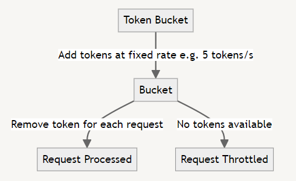
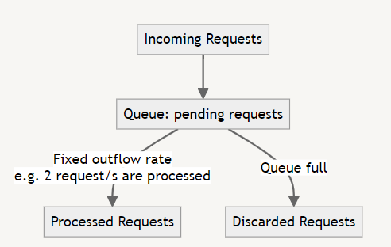
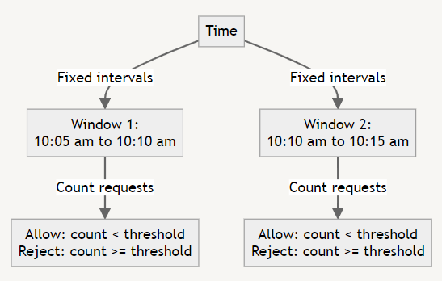
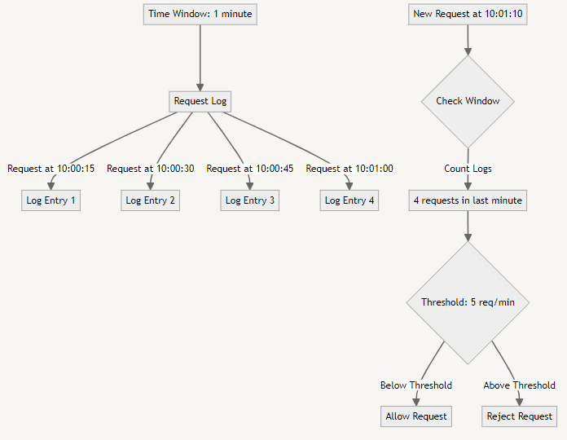
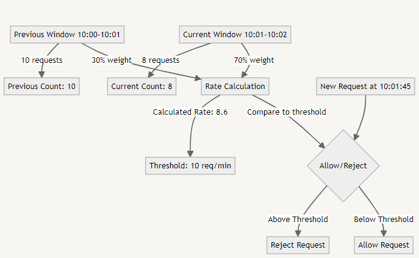
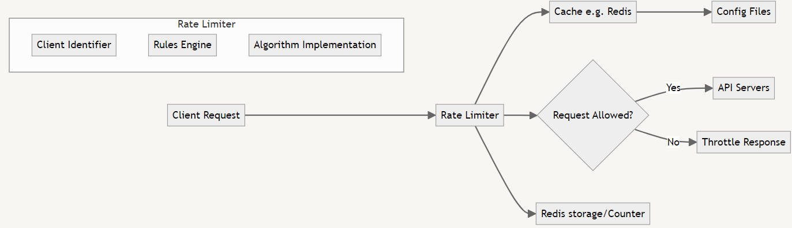

# API Rate Limiter

Today's question is API Rate limiter. First we will understand why we need it and what algorithms are used in rate limiter. Then, we will create a high level design of API rate limiter.

## DDoS Attack and Rate Limiting 🛡️

A Distributed Denial of Service (DDoS) attack is a malicious attempt to disrupt the normal traffic 🚦 of a targeted server, service, or network by overwhelming it with a flood 🌊 of internet traffic from multiple sources. 

Rate limiting is a strategy used to control the rate of requests sent or received by a network interface 💻. It's an essential technique for protecting APIs and services from abuse, whether intentional (like DDoS attacks) or unintentional. 🔒

## Rate Limiting Algorithms 🧮

### 1. Token Bucket Algorithm 🪣

The Token Bucket algorithm uses the analogy of a bucket that continuously fills with tokens at a fixed rate. Each request consumes a token. If the bucket is empty, requests are throttled.

*Fig: Token Bucket Algorithm*

**Advantages:**

- Allows for bursts of traffic 🚀
- Simple to implement and understand 🧠

**Disadvantages:**

- Memory intensive for high-volume traffic 💾
- Can be less predictable in high-concurrency scenarios 🔄

### 2. Leaking Bucket Algorithm 💧

The Leaking Bucket algorithm processes requests at a fixed rate, queuing excess requests. If the queue is full, additional requests are discarded.

*Fig: Leaking Bucket algorithm*

**Advantages:**

- Smooths out bursts of traffic 🏞️
- Provides a consistent outflow rate 📊

**Disadvantages:**

- Can lead to increased latency 🐢
- May not be suitable for systems requiring immediate responses 🚫⏱️

### 3. Fixed Window Counter Algorithm 🖼️

The Fixed Window Counter algorithm tracks the request count for fixed time windows. If the count exceeds a threshold, new requests are rejected until a new window begins.

*Fig: Fixed window counter algorithm*

**Advantages:**

- Simple to implement and understand 🧠
- Low memory footprint 🍃

**Disadvantages:**

- Can allow twice the rate limit at the edges of windows 🔄
- Less accurate for shorter time windows ⏳

### 4. Sliding Window Log Algorithm 📜

The Sliding Window Log algorithm keeps track of timestamps for each request. It checks if the number of logs in the time frame exceeds the threshold.

*Fig: Sliding window log algorithm*

This example provides a more concrete scenario of how the Sliding Window Log Algorithm might work in practice.

**Advantages:**

- Very accurate 🎯
- Works well for variable rate limits 📊

**Disadvantages:**

- High memory usage in storing the request entry log 💾 
- Computationally expensive for high traffic 🖥️

### 5. Sliding Window Counter Algorithm 🎚️

The Sliding Window Counter algorithm combines the Fixed Window Counter and Sliding Window Log approaches, providing a balance between accuracy and performance.

The Sliding Window Counter algorithm combines aspects of both the Fixed Window Counter and Sliding Window Log approaches in the following ways:

- **From Fixed Window Counter 🖼️**: It uses discrete time windows to count requests, which is computationally efficient.
- **From Sliding Window Log 📜**: It considers a sliding time frame by incorporating data from the previous window, providing more accurate rate limiting at the boundaries between windows.

The algorithm achieves this combination by:

1. Maintaining a **counter** for the current fixed window, similar to the Fixed Window Counter approach.
2. Keeping the **counter** from the previous window, which allows for a sliding window effect.
3. Using a weighted average of the current and previous window counters to calculate the request rate, creating a smooth transition between windows.

*Fig: Sliding widnow counter algorithm*

This hybrid approach offers a good balance between the simplicity and efficiency of Fixed Window Counter and the accuracy of Sliding Window Log, while avoiding the high memory usage of storing individual request timestamps.

**Advantages:**

- More accurate than Fixed Window Counter 📊
- Less resource-intensive than Sliding Window Log 🍃

**Disadvantages:**

- More complex to implement than simpler algorithms 🧩
- May not be as precise as Sliding Window Log for all scenarios ⚖️

## Designing a Rate Limiter 🏗️

Let's consider the components of our API rate limiter:

- **Client Identifier** 🆔: Mechanism to identify clients (e.g., API key, IP address)
- **Rate Limiter Rules Engine** 📏: Defines and manages rate limiting rules
- **Counter/State Storage** 🗄️: Stores request counts or timestamps (e.g., Redis)
- **Algorithm Implementation** 🧮: Chosen rate limiting algorithm (e.g., Sliding Window Counter)

Here's a high-level diagram of the rate limiter design:

*Fig: HLD of API Rate Limiter*

This design uses Redis 🗄️ for its fast, in-memory data structure store, making it ideal for tracking request counts or timestamps. Redis can also be used to implement cache for config file values.

The rate limiter sits between the API Gateway and the API Servers, ensuring all requests are checked before reaching the application logic. 🚀🔒