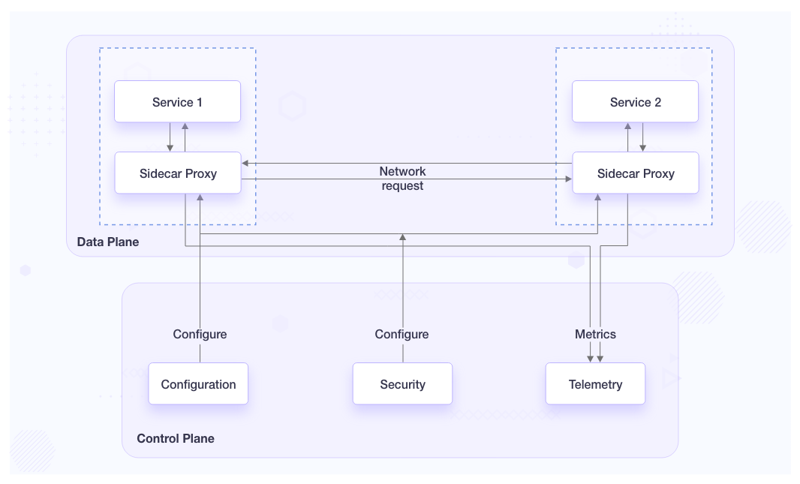

# Microservices Architecture 🧩

Microservices architecture is an approach where an application is built as a collection of small, independent services that communicate through APIs. 🌐

### Advantages

- Easier to scale individual services 🚀
- Greater flexibility in technology choices for each service 🛠️
- Improved fault isolation 🛡️
- Enables continuous deployment and faster updates 🔄

### Disadvantages

- Increased complexity in managing multiple services 🤯
- Potential for increased latency due to network communication 🐢
- More challenging to maintain data consistency across services 📊

Both architectures have their place in modern software development, with the choice depending on the specific needs and scale of the application. 🤔

# Converting a monolithic into microservices architecture

Converting a monolithic into microservices architecture requires careful evaluation of the business requirements. It involves different phases and each phase can have different patterns to create a micro services.

1. Decomposition
2. Refactoring
3. Database communication

# Decomposition Pattern 🧩

Decomposition patterns are used to break down a monolithic application into smaller, more manageable services. There are three main approaches to decomposition:

1. **Domain-Driven Decomposition 🏢**: This pattern involves breaking down services based on business domains. It aligns the microservices structure with the organization's business capabilities.

    Example: In an e-commerce application 🛒, you might have separate microservices for user management, product catalog, order processing, and inventory management. Each of these represents a distinct business domain.

2. **Subdomain Decomposition 🧩**: This is a further refinement of domain-driven decomposition, where domains are divided into smaller subdomains. This allows for even more granular service definition.

    Example: Within the order processing domain 📦, you could further break it down into subdomains like order creation, payment processing, and shipping management.

3. **Functional Decomposition 🔧**: In this approach, services are separated based on business capabilities. Each microservice is responsible for a specific function or feature of the application.

    Example: For a social media platform 🤳, you might have microservices for user authentication, post creation and retrieval, friend management, and notification services. Each of these represents a specific function or feature of the application.

These decomposition patterns help in creating a more modular and scalable microservices architecture. They allow teams to develop, deploy, and scale services independently, improving overall system flexibility and maintainability. 🚀

# Strangler Pattern

The Strangler pattern, also known as the Strangler Fig pattern 🌳, is a design pattern used in the gradual migration of legacy systems to microservices architecture. 

The Strangler pattern involves incrementally replacing specific pieces of functionality with new applications and services. The new system slowly grows around the old one, eventually replacing it entirely. This approach allows for a gradual transition, reducing risks associated with a complete rewrite. 🔄

Key aspects of the Strangler pattern:

- Gradual Migration: It allows for piece-by-piece migration rather than a complete overhaul. 🧩
- Risk Reduction: By replacing small parts at a time, it reduces the risk of system-wide failures. 🛡️
- Coexistence: The old and new systems can run side by side during the transition period. 🤝
- Incremental Value: Each replaced component can start providing value immediately. 📈

# Data Management in Microservices

In microservices architecture, data management can be approached in two main ways: database per service and shared database. Let's explore both approaches along with their advantages and disadvantages.

## 1. Database per Service 🏗️

In this approach, each microservice has its own dedicated database.

### Advantages
- Improved data encapsulation and isolation 🔒 
- Independent scalability of each service 🚀 
- Freedom to choose the most suitable database type for each service
- Easier to update and maintain individual services

### Disadvantages
- Complexity in managing distributed transactions or ACID properties across databases 🔗 - SAGA to rescue
- Challenging to perform queries across multiple services (Join queries) - CQRS to rescue 🔍
- Increased storage requirements 💾 
- Higher operational costs 💰 

## 2. Shared Database 🤝

In this approach, multiple microservices share a common database.

### Advantages
- Easier data consistency management (ACID Properties)
- Simpler querying across services (Join Queries)
- Lower operational costs 💰 
- Faster development initially 🚀 

### Disadvantages
- Reduced data isolation 
- Potential for a monolithic database
- Schema changes can affect multiple services 🚧 
- Scalability limitations ⚖️ 

The choice between these approaches depends on factors such as the specific requirements of your microservices, scalability needs, data consistency requirements, and operational considerations. Some systems may even use a hybrid approach, combining both strategies where appropriate.

# SAGA Pattern 🧩

The SAGA pattern is a design pattern used in distributed systems to maintain data consistency across multiple services, each with its own database. It's particularly useful in microservices architectures where each service has its own database (DB per service approach). 🏗️

### How SAGA Maintains Consistency 🔄

SAGA breaks down a distributed transaction into a sequence of local transactions, each performed by a single service. If a step fails, the pattern executes compensating transactions to undo the changes made by the preceding steps. This ensures eventual consistency across all services. 🔁

## Types of SAGA 📊

## 1. Choreography-based SAGA 💃

In this approach, each service publishes domain events that trigger local transactions in other services.

### Advantages 🚀
- Simple to implement for simple workflows
- Loose coupling between services
- Good for simple scenarios with few steps

### Disadvantages 🤯
- Can be hard to understand and debug in complex scenarios 
- Risk of cyclic dependencies between services 🔄
- Difficult to implement for complex workflows 

Example: Online shopping system with three services: Order, Payment, and Inventory.


*Fig: Sequence of DB update events*

## 2. Orchestration-based SAGA 🎭

This approach uses a central orchestrator to manage the transaction and compensating actions.

### Advantages 🚀
- Easier to implement complex workflows 
- Centralized point of control and monitoring 
- Avoids cyclic dependencies between services 🚫🔄

### Disadvantages 🤯
- Introduces a single point of failure (the orchestrator) 💥
- Can lead to tighter coupling if not designed carefully 
- May become a performance bottleneck 

Example: Online shopping system with three services: Order, Payment, and Inventory.


*Fig: DB Events handled by Orchestrator*

In both cases, if any step fails (e.g., payment declined or out of stock), the SAGA pattern ensures that all previous steps are reversed, maintaining consistency across all services. 🔄✅

# CQRS Pattern

CQRS (Command Query Responsibility Segregation) is a design pattern that separates read and write operations for a data store. This pattern is particularly useful in microservices architecture, especially when dealing with database-per-service approach. 📊🔍

By command we mean, Create, Update and Delete operations. Query means read operations. Since in Database-per-service approach, querying across different databases is difficult. We use separate the data-models along with databases that are used for command and query.


*Fig: CQRS Design Pattern [Credit](https://www.geeksforgeeks.org/cqrs-command-query-responsibility-segregation/)*

Because of using a single database for querying, we can query data of all services. The Read database is updated whenever there is change in write storage with the help of procedure events.

### Pros:

- Improved Performance: Optimized read and write operations. ⚡
- Scalability: Independent scaling of read and write services. 📈
- Flexibility: Allows for different data models for read and write operations. 🔀

### Cons:

- Increased Complexity: Maintaining separate read and write models adds complexity. 🧩
- Eventual Consistency: May lead to temporary data inconsistencies. ⏳
- Development Overhead: Requires more code and careful design. 👨‍💻

### Example

Consider an e-commerce system with separate microservices for Orders and Inventory:

- Order Service: Handles order creation and management. 📦
- Inventory Service: Manages product stock levels. 🏭

In a CQRS pattern:

- Write Model: Order Service writes new orders to its database. Inventory Service updates stock levels in its database. ✍️
- Read Model: A separate read-optimized database combines data from both services, updated asynchronously. This allows for efficient querying of order status along with current stock levels. 📚

This approach allows for efficient order processing and inventory management while providing a denormalized view for complex queries across both domains. 🎯

# API Gateways

An API Gateway is a server that acts as an API front-end, receiving API requests, enforcing throttling and security policies, passing requests to the back-end service and then passing the response back to the requester. It is a critical component in microservices architecture.


API gateways helps in following cases:

- Simplify client-side development
- Improve security
- Enhance performance
- Provide centralized management
- Enable API versioning

## Features of API Gateways 🚀

### 🛣️ Request routing

Request routing is a crucial feature of API Gateways that directs incoming API requests to the appropriate microservices based on predefined rules. This allows for efficient management of complex microservices architectures. Here's an example of how request routing might work:

Let's say we have an e-commerce application with the following microservices:

- Products Service: Handles product information
- Orders Service: Manages order processing
- Users Service: Handles user accounts and authentication

The API Gateway might route requests as follows:

- GET /products/* → Products Service
- POST /orders/* → Orders Service
- GET /users/* → Users Service

For example:

- https://api.example.com/products/1234 → routed to Products Service
- https://api.example.com/orders/create → routed to Orders Service
- https://api.example.com/users/profile → routed to Users Service

This routing is transparent to the client, which only needs to know the main API endpoint. The API Gateway handles the complexity of directing requests to the appropriate microservices.


### 🔐 Authentication and security

Verifies user identity and applies security policies before forwarding requests.

Example -> It can authenticate the access token with Auth Service before routing it to the application.


### 🚦 Rate limiting

Controls the number of requests a client can make in a given timeframe to prevent overload. Rate limiting algorithms can be used here.


### API Throttling

Throttling is a technique used to control the rate at which requests are processed or resources are consumed. It's similar to rate limiting but often refers to slowing down the processing of requests rather than outright rejecting them. Here's how throttling works:

- 🐢 Slows down processing: Instead of rejecting requests, it may delay their processing to maintain a steady rate
- ⏱️ Time-based: Often implemented with a "leaky bucket" algorithm, allowing a certain number of requests per unit of time
- 🔄 **Queue management**: May use a queue to hold requests that exceed the current processing capacity
- 🎚️ Adaptive: Can dynamically adjust based on server load or other factors

Throttling helps prevent system overload while still allowing all requests to be processed eventually, albeit at a controlled pace.

This helps in preventing thundering herd effect.

### 🔍 Service discovery

Automatically detects and registers available microservices for seamless scaling and management.


### 💾 Caching

Stores frequently accessed data to reduce backend load and improve response times. This cache will be applied at an application layer.


- 📊 Monitoring and analytics

    Collects and analyzes API usage data for insights and performance optimization.


- 🔄 Protocol translation
    
    Converts between different protocols to ensure compatibility between client and server.
    
    ```mermaid
    graph LR
        A[Client] -->|REST| B[API Gateway]
        B -->|gRPC| C[Microservice A]
        B -->|SOAP| D[Microservice B]
    ```
    
- IP based blocking can be implemented.

## API Gateways vs Load Balancers:

While both API gateways and load balancers distribute traffic, they serve different purposes. 

Generally Load Balancer simply distribute the traffic to the multiple instances of a microservice based on various factors like health, traffic load etc. While API gateways distributes traffic among different services (can be passed through a Load balancer) based on defined routing rules.

| API Gateway | Load Balancer |
| --- | --- |
| Operates at application layer (L7) | Typically operates at network/transport layer (L4) |
| Provides complex routing based on content | Distributes traffic based on server health and load |
| Offers authentication, rate limiting, caching | Focuses on distributing load evenly |
| Can transform and aggregate requests | Does not modify request content |


In this setup, the API Gateway handles high-level routing and processing, while Load Balancers distribute traffic among multiple instances of each service.

### How it maintains Availability:

To ensure high availability and prevent the API Gateway from becoming a single point of failure, we can implement a distributed architecture across multiple Availability Zones and Regions. 


Until Github support latest mermaid syntax, use below image as reference.


A region can have multiple availability zone. Each availability zone have multiple load balancers according to number of microservices.

# How two microservices communicate with each other 

## Without Service Mesh Architecture 🏗️

When microservices communicate without a service mesh, they need to implement various capabilities themselves:

**1. Service Discovery 🔍:** 

If one microservice wants to communicate with another, then it needs its IP address and port number.  Services use tools like Consul or Eureka to register and discover other services.

**2. Load Balancing ⚖️**

Client side load balancing is also required to equally distribute traffic from one service to another. Implemented using client-side load balancing libraries or through a separate load balancer.

**3. Authorization 🔐**

Each service must implement its own authorization logic or integrate with an external auth service.

### 4. Circuit Breaker 🔌 

Circuit breaker is a design pattern used in distributed systems to prevent cascading failures. It works by **temporarily disabling calls** to a failing service, allowing it time to recover. Key aspects include:

- **Failure detection**: Monitors for repeated failures in service calls
- **Tripping**: Switches to an open state after a threshold of failures, rejecting further calls
- **Fallback**: Provides alternative responses or graceful degradation when the circuit is open
- **Reset**: Allows periodic attempts to close the circuit and resume normal operation

This pattern improves system resilience and prevents overloading already stressed services.

Libraries like Hystrix are used to implement circuit breaking logic within each service.

**5. Retry Mechanism 🔁**

Custom retry logic is implemented within each service or using libraries.

### 6. Deployment Strategy 🚀

Deployment strategies are methods used to roll out new versions of software applications with minimal downtime and risk. Here are some common deployment strategies:

- **Canary Deployment 🐤:** A small subset of users or servers receive the new version while the majority continue with the old version. This allows for real-world testing and gradual rollout.

- **Blue-Green Deployment 🔵🟢:** Two identical production environments (blue and green) are maintained. New versions are deployed to the inactive environment, then traffic is switched over once testing is complete.

- **Rolling Update 🔄:** The new version is gradually rolled out to a subset of nodes in the production environment, replacing the old version incrementally.

- **A/B Testing 🆎:** Two versions run simultaneously, with users randomly assigned to each. This allows for comparing performance and user experience between versions.

- **Shadow Deployment 👥:** The new version receives real-world traffic in parallel with the old version, but its responses are discarded. This allows for testing under real conditions without affecting users.

- **Feature Toggles 🔛:** New features are deployed but kept disabled, then gradually enabled for different user groups or environments.

Each strategy has its own benefits and use cases, allowing teams to choose the most appropriate method based on their specific requirements and risk tolerance. Managed through CI/CD pipelines and orchestration tools like Kubernetes.

### 7. Telemetry 📊:

Telemetry refers to the **automated process of collecting**, transmitting, and measuring data from remote or inaccessible sources. In the context of microservices and distributed systems, telemetry encompasses:

- **Logging**: Recording events and errors for debugging and auditing purposes
- **Metrics**: Quantitative measurements of system performance and behavior
- **Tracing**: Tracking the flow of requests through multiple services
- **Health monitoring**: Checking the status and availability of services

Telemetry data is crucial for understanding system behavior, troubleshooting issues, and optimizing performance in complex distributed environments.

Services implement their own logging, tracing, and monitoring, often using different tools.


*Fig: Inter-microservices communication [Credit](https://www.youtube.com/watch?v=eIxdHepOeHw&list=PL6W8uoQQ2c63W58rpNFDwdrBnq5G3EfT7&index=30)*

This approach can lead to code duplication and increased complexity in each service.

## With Service Mesh Architecture 🕸️

A service mesh simplifies microservice communication by offloading these capabilities to a **dedicated infrastructure layer**:

- **Sidecar Proxy 🛵:** Deployed alongside each service instance, handling network communication.
- **Data Plane 🛣️:** Comprises all sidecar proxies, managing actual traffic between services.
- **Control Plane 🎛️:** Configures and manages the data plane, providing centralized control.

Example using Istio service mesh:



*Fig: Service mesh architecture [Credit](https://www.infracloud.io/blogs/service-mesh-101/)*


Benefits of using a service mesh:

- Centralized management of service-to-service communication 🎯
- Consistent implementation of cross-cutting concerns 🔄
- Improved observability and traffic control 👀
- Easier implementation of security policies 🔒

While service meshes add complexity to the overall system, they significantly simplify individual service development and management in large, complex microservice architectures. 🚀

### **Popular Service Mesh Implementations:**

- **Istio**: An open-source service mesh that integrates well with Kubernetes3.
- **Linkerd**: Another open-source option known for its simplicity and performance2.
- **Consul**: Provides service mesh capabilities along with service discovery and configuration2.