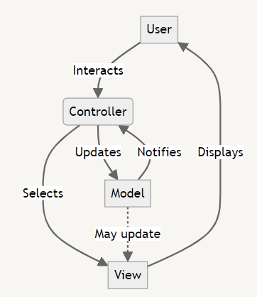

# Architectural Design Patterns 🏛️

Architectural design patterns are high-level strategies that concern the overall structure and organization of a software system. They provide a template for solving recurring design problems and help in creating scalable, maintainable, and efficient software architectures. 🔧🏗️

Types of Architectural Design Patterns:

- **Layered (n-tier) Architecture 🎂:** Organizes the system into layers with specific roles and responsibilities.
- **Client-Server Pattern 🖥️↔️📱:** Separates the system into two main components - the client (user interface) and the server (data storage and processing).
- **Master-Slave Pattern 👑👨‍👧‍👦:** Distributes work between a master component and several slave components.
- **Pipe-Filter Architecture 🚰🔍:** Processes data through a series of independent processing steps (filters) connected by pipes.
- **Broker Pattern 🤝:** Coordinates communication, such as requests, replies, and distributions, between objects.
- **Peer-to-Peer Pattern 🔄:** Distributes workloads among peers without the need for central coordination.
- **Event-Bus Pattern 🚌:** Handles communication between different parts of an application through events.
- **Model-View-Controller (MVC) 🧩:** Separates the application logic into three interconnected components.
- **Blackboard Pattern 📋:** Useful for problems for which no deterministic solution strategies are known.
- **Interpreter Pattern 🗣️:** Implements a specialized language to solve a well-defined set of problems.

These patterns help in creating robust, scalable, and maintainable software architectures by providing proven solutions to common architectural challenges. 🚀💡

# MVC Design Pattern 🧩

The Model-View-Controller (MVC) is an architectural pattern that separates an application into three main logical components: the Model, the View, and the Controller. Each of these components are built to handle specific development aspects of an application.

## Components:

- **Model:** Represents the data and business logic of the application.
- **View:** Displays the data to the user (UI).
- **Controller:** Handles the user input and mediates between Model and View.

## Advantages:

- Separation of Concerns: Clear division of responsibilities.
- Easier to Maintain: Changes in one component don't affect others.
- Parallel Development: Teams can work on different components simultaneously.
- Reusability: Components can be reused in other projects.

## Disadvantages:

- Complexity: Can be overkill for small applications.
- Learning Curve: Requires understanding of the pattern.
- Potential Performance Overhead: Due to the layered structure.

## Flow Chart:

In this flow:

1. User interacts with the Controller (e.g., clicks a button).
2. Controller updates the Model based on the user's action.
3. Model notifies the Controller of changes.
4. Controller selects appropriate View.
5. View displays updated information to the User.
6. Optionally, the Model may update the View directly in some implementations.