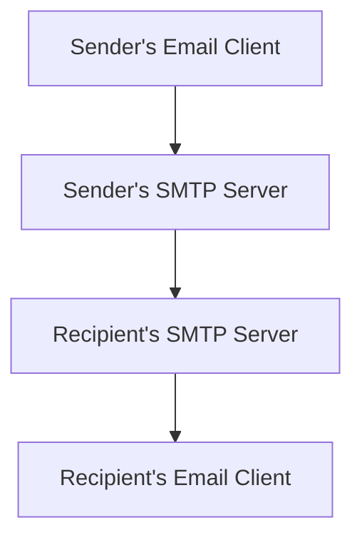
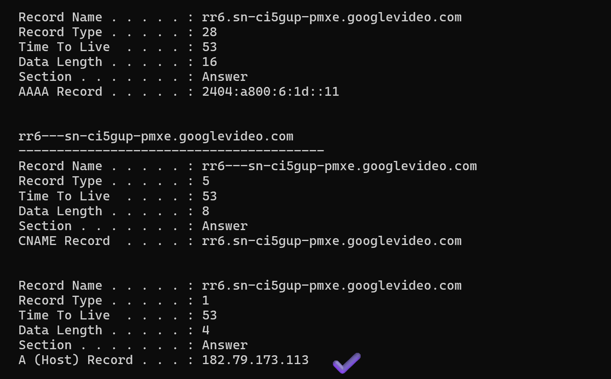
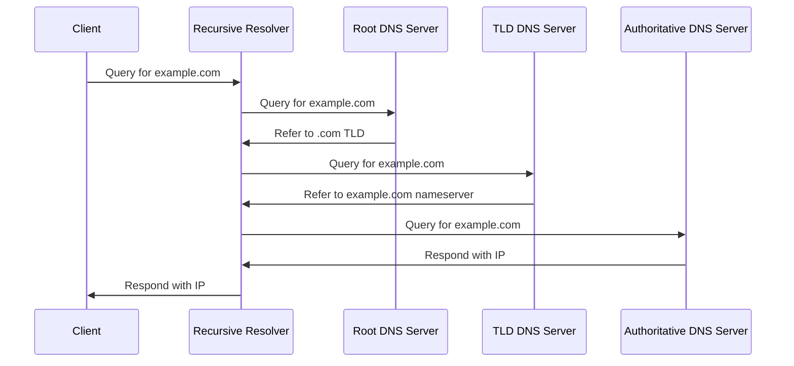
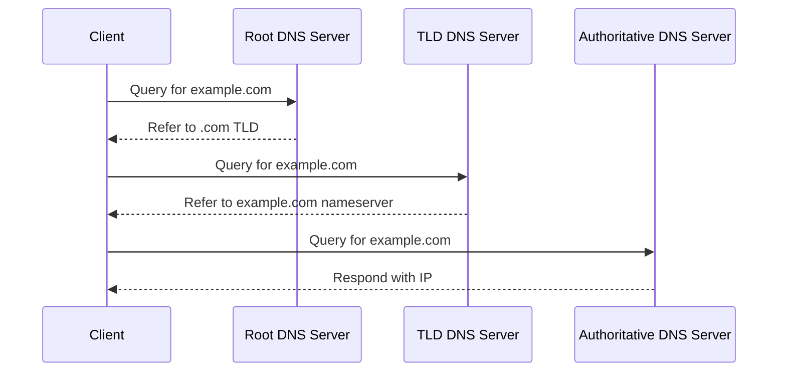
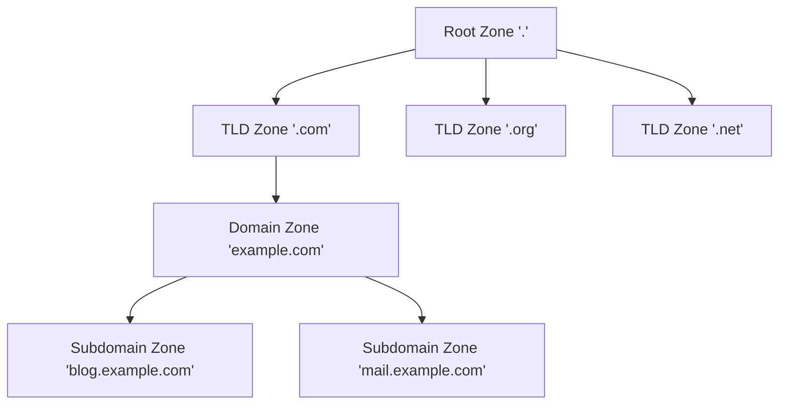

# Communication Systems

In this page, we talk about the different ways of communication and the services used in this.

# Network protocols

Network protocols are sets of rules that govern how data is transmitted over a network. They are essential for communication between different devices and systems. 📡

The OSI (Open Systems Interconnection) model is a conceptual framework that describes how data communication occurs between devices in a network. It consists of 7 layers: 🏗️

1. Physical Layer 🔌: Deals with the physical connection between devices.
2. Data Link Layer 🔗: Handles the reliable transfer of data between adjacent network nodes.
3. Network Layer 🌍: Manages addressing, routing, and traffic control.
4. Transport Layer 🚚: Ensures end-to-end communication and data integrity.
5. Session Layer 🤝: Establishes, manages, and terminates sessions between applications.
6. Presentation Layer 🎭: Translates data between the application layer and the network format.
7. Application Layer 📱: Provides network services directly to end-users or applications.

# Application Layer

## Client-Server Model 🖥️🔗📱

In the client-server model, clients (such as computers or mobile devices) request services or resources from centralized servers. The servers process these requests and send back responses. 🔄

Protocols commonly used in this model include:

### HTTP/HTTPS 🌐: For web browsing and data transfer
    
HTTP (Hypertext Transfer Protocol) and HTTPS (Hypertext Transfer Protocol Secure) are protocols used for communication on the web:

- **HTTP**: The standard protocol for transmitting data over the internet. It's unencrypted, making it vulnerable to interception.
- **HTTPS**: A secure version of HTTP that uses encryption (SSL/TLS) to protect data in transit, ensuring privacy and integrity.

Properties:
- Handshake
- Open connection
- Close connection

HTTPS is now widely used to secure web communications, especially for sensitive data transfers like login credentials or financial transactions.

Example: Fetching facebook page

### FTP 📂: For file transfers
    
FTP Uses two types of connections.

1. Control connection - always present
2. Data connection - used for sending data. Can be closed when not used.
    
### SMTP 📧: For email transmission
    
SMTP (Simple Mail Transfer Protocol) is a protocol used for sending email messages between servers. It is responsible for the transmission of emails from the sender's mail server to the recipient's mail server.

POP (Post Office Protocol) and IMAP (Internet Message Access Protocol) are two different protocols used for retrieving emails from a mail server:

- **POP**: Downloads emails from the server to the client device and typically deletes them from the server. It's suitable for users who primarily access their email from a single device. (Not used now a days because it deletes from server).
- **IMAP**: Keeps emails stored on the server and synchronizes them across multiple devices. It allows users to access their emails from various devices while maintaining a consistent view of their mailbox.

Both POP and IMAP work in conjunction with SMTP to provide a complete email communication system.

    
### WebSockets

WebSockets 🔌 are a communication protocol that enables full-duplex, bidirectional communication between a client and a server over a single TCP connection. 🔄

Key features of WebSockets:

- 🚀 Persistent connection: Allows real-time data exchange without repeated HTTP requests
- 📡 Full-duplex: Both client and server can send messages independently
- ⚡ Low latency: Reduces overhead compared to traditional polling methods
- 🔒 Secure: Can be used with encryption (WSS) for secure communication

WebSockets are ideal for applications requiring real-time updates, such as chat applications 💬, live sports scores 🏆, or financial trading platforms 📈. They provide a more efficient alternative to techniques like HTTP long-polling or server-sent events for real-time data transmission. 🚀

### Other types of Connections

| Connection | Properties | Example |
| --- | --- | --- |
| HTTP Polling | Regular interval, Empty Responses, Unnecessary Network calls, Drain battery of Mobile Device, Delay in message, Empty Response | Not used, but can be used in WhatsApp, food tracking |
| HTTP Long-Polling | Client waits, Long Time Open Connection, Timeout | Not used, but can be in WhatsApp |
| Server-Send Events(SSEs) | Server can send data to client, But Client can’t send data to Server | It is used in WhatsApp, CMC server, Instagram for most of applications. |

SSEs is a server push technology enabling a client to receive automatic updates from a server.
    

## Peer-to-Peer (P2P) Model 🔄🔀

In the peer-to-peer model, all nodes (peers) have equal capabilities and can act as both clients and servers. Each peer can request services from other peers and provide services to others. 🤝

Protocols often used in P2P networks include:

- BitTorrent 🧩: For distributed file sharing

### WebRTC 🎥: For real-time communication between browsers
    
WebRTC (Web Real-Time Communication) 🌐🗨️ is a powerful technology that enables real-time, peer-to-peer communication between web browsers or applications without the need for plugins or additional software. 🚀

Key features of WebRTC include:

- 🎥 Video and audio communication: Allows for high-quality video and voice calls directly in the browser
- 💬 Data channels: Enables peer-to-peer exchange of arbitrary data
- 🔒 Built-in security: Includes encryption and authentication mechanisms
- 📱 Cross-platform compatibility: Works across different devices and operating systems

WebRTC is ideal for applications like video conferencing 🤝, online gaming 🎮, and file sharing 📂, providing a seamless and interactive user experience directly in the web browser. 🌟
    
Both models have their advantages and are used in different scenarios depending on the requirements of the system. 🔧🔍

# Transport Layer

### TCP/IP Protocol 🌐

TCP/IP (Transmission Control Protocol/Internet Protocol) is the foundation of internet communication. It's a suite of protocols that work together to ensure reliable data transmission across networks. 🔒

**Advantages:**

- Reliable and ordered data delivery 📬
- Error checking and correction ✅
- Flow control to prevent overwhelming receivers 🚦
- Congestion control to manage network traffic 🚗

**Disadvantages:**

- Higher overhead due to connection establishment and maintenance 🏗️
- Slightly slower than UDP for small data transfers ⏳

**Use cases:**

- Web browsing (HTTP/HTTPS) 🌍
- Email (SMTP, POP, IMAP) 📧
- File transfers (FTP) 📁

### UDP Protocol 🚀

UDP (User Datagram Protocol) is a simpler, connectionless protocol that prioritizes speed over reliability.

**Advantages:**

- Faster data transmission due to less overhead 💨
- Suitable for real-time applications 🎮
- Lower latency compared to TCP ⚡

**Disadvantages:**

- No guarantee of data delivery or order 🔀
- No error checking or correction ❌
- No flow control or congestion control 🌊

**Use cases:**

- Video streaming 🎥
- Online gaming 🎮
- Voice over IP (VoIP) 📞
- DNS queries 🔍

Both protocols have their place in modern networking, with TCP/IP providing reliable communication for most internet applications, while UDP offers speed and efficiency for time-sensitive tasks. 🔄

---
# DNS (Domain Name System) 🌐

The Domain Name System (DNS) is like the phonebook of the internet 📞. It translates human-readable domain names into IP addresses that computers use to identify each other. Let's dive into the key components and processes of DNS:

## Domain Name Structure 🏗️

A domain name is hierarchical and read from right to left:

- **Root Domain:** The highest level of the domain name hierarchy, represented by a dot (.) 🌳
- **Top-Level Domain (TLD):** The rightmost part (e.g., .com, .org, .net) 🔝
- **Second-Level Domain:** The next part to the left (e.g., example in [example.com](http://example.com)) 🏢
- **Subdomain:** Any additional levels to the left (e.g., blog in [blog.example.com](http://blog.example.com)) 🔹

Example: In the fully qualified domain name "[blog.example.com](http://blog.example.com).", the trailing dot represents the root domain, "com" is the TLD, "example" is the second-level domain, and "blog" is a subdomain.

## DNS Records 📄

DNS records are instructions that live in authoritative DNS servers and provide information about a domain, including what IP address is associated with that domain and how to handle requests for that domain. Common record types include:

- **A (Address) Record:** Maps a domain name to the IP address of the computer hosting the domain. 🏠
Example: [example.com](http://example.com) -> 93.184.216.34
- **AAAA (Quad-A) Record:** Maps a domain name to the IPv6 address of the computer hosting the domain. 🌐6️⃣
Example: [example.com](http://example.com) -> 2001:0db8:85a3:0000:0000:8a2e:0370:7334
- **CNAME (Canonical Name) Record:** Aliases one domain to another. 🔄
Example: [www.example.com](http://www.example.com) -> [example.com](http://example.com)
- **MX (Mail Exchanger) Record:** Specifies the mail servers responsible for handling email for the domain. 📧
Example: [example.com](http://example.com) -> [mail.example.com](http://mail.example.com)
- **NS (Name Server) Record:** Specifies the authoritative name servers for the domain. 🖥️
Example: [example.com](http://example.com) -> [ns1.dnsprovider.com](http://ns1.dnsprovider.com)
- **PTR (Pointer) Record:** Maps an IP address to a domain name, used for reverse DNS lookups. 🔄
Example: 93.184.216.34 -> [example.com](http://example.com)

You can check the DNS records present in your computer using `ipconfig/displaydns`.

*Fig: DNS records*

## DNS Query Resolution 🔍

There are two main types of DNS query resolution:

### 1. Recursive Query Resolution 🔄

In a recursive query, the DNS client requires that the DNS server (typically the ISP's DNS server) will respond to the client with either the requested resource record or an error message if the resolver can't find the record.

The two main components in the process are:

#### Root DNS Server 

There are 13 root name server systems in the world, operated by 12 organizations. 
For example:
- a.root-servers.net (operated by Verisign)
- f.root-servers.net (operated by Internet Systems Consortium)

#### TLD DNS Server

These manage top-level domains. Examples include:
- a.gtld-servers.net (for generic TLDs like .com, .org)
- a.nic.uk (for country-code TLD .uk)

#### Recursive DNS (Resolver DNS)
    
It acts as a mediator between the application program at the host computer and Authoritative DNS. It also temporarily stores the IP address in cache.

These are typically provided by ISPs or public DNS services. Examples include:

- 8.8.8.8 (Google Public DNS)
- 1.1.1.1 (Cloudflare DNS)
- [8.8.8.8.in](http://8.8.8.8.in) (BSNL DNS)
- 103.198.192.11 (Jio DNS)
- 103.94.227.70 (Airtel DNS)

#### Authoritative DNS (domain provider or registrar)
    
It answers the DNS query by translating the domain name into IP address. These are specific to each domain means depend on from where you purchase the domain. 

For example:

- [ns1.hostinger.com](http://ns1.hostinger.com) (for domains hosted on Hostinger)
- [ns65.domaincontrol.com](http://ns65.domaincontrol.com) (for domains hosted on GoDaddy)

These authoritative DNS servers are specific to the domain registrar or hosting provider, and they contain the definitive DNS records for domains managed by that provider.
    

### 2. Iterative Query Resolution 🔁

In this iterative approach, the client is responsible for following each referral and making subsequent queries, unlike in recursive DNS where a recursive resolver handles this process on behalf of the client.

- The client would directly query each DNS server in turn
- Each server would respond with a referral to the next server to query, rather than querying on behalf of the client
- The client would be responsible for following these referrals until it reaches the authoritative server

The key difference is who performs the series of queries: in recursive DNS, it's the resolver; in iterative DNS, it's the client itself.

Here's a diagram illustrating an iterative DNS query:

## DNS Zones 🗺️

A DNS zone is a logical partition of the DNS namespace, allowing organizations to have granular control over the DNS records for a specific domain or subdomain. Zones are used to delegate the responsibility of managing different parts of the domain name space.

Let's visualize this concept:

In this diagram:

- The root zone '.' is at the top of the DNS hierarchy.
- TLD zones like '.com', '.org', and '.net' are managed by registry operators.
- Domain zones (e.g., '[example.com](http://example.com)') are typically managed by domain owners or their designated administrators.
- Subdomain zones can be further delegated for specific purposes (e.g., '[blog.example.com](http://blog.example.com)' for a blog section).

Each zone contains DNS records for the domains within its purview, allowing for distributed management of the DNS namespace.

| Aspect | DNS Server | DNS Zone |
| --- | --- | --- |
| Definition | Physical or virtual machine running DNS software | Logical division of DNS namespace |
| Function | Responds to DNS queries from clients | Contains DNS records for a specific domain or subdomain |
| Scope | Can host multiple DNS zones | Managed by an administrator or organization |
| Examples | BIND, Windows DNS Server | example.com zone, subdomain.example.com zone |

In summary, a DNS server is the infrastructure that hosts and serves DNS zones, while a DNS zone is an administrative boundary for a portion of the DNS namespace.

Understanding DNS is crucial for system designers, as it plays a vital role in the scalability, performance, and reliability of distributed systems. 🚀