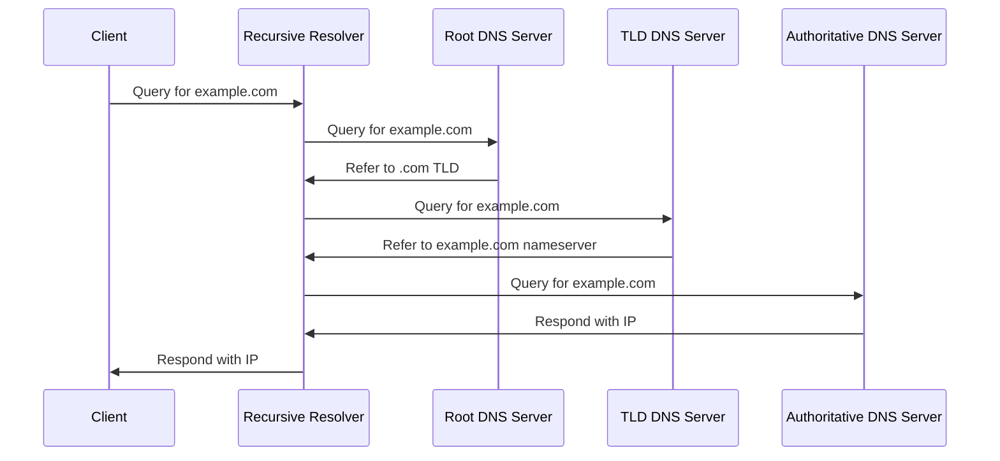
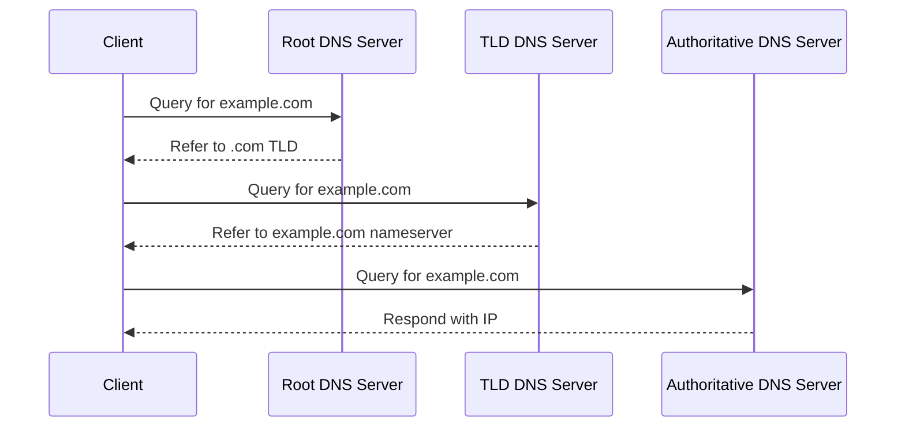
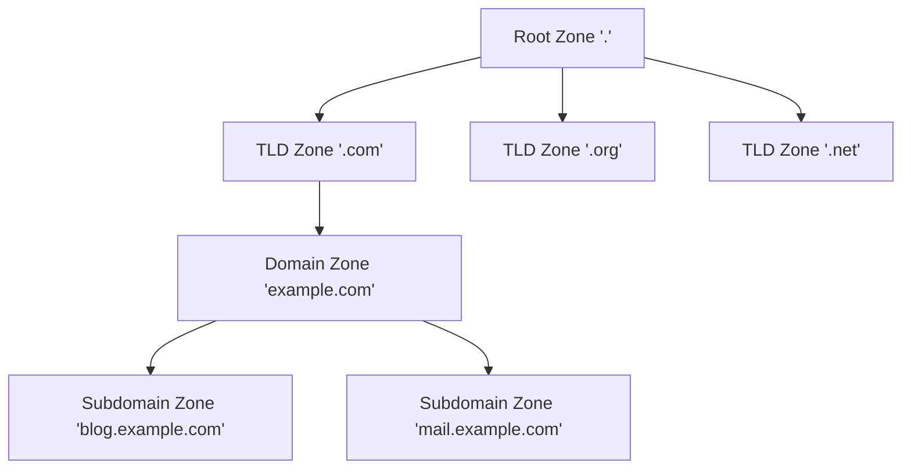

# Communication Systems

In this page, we talk about the different ways of communication and the services used in this.

# DNS (Domain Name System) 🌐

The Domain Name System (DNS) is like the phonebook of the internet 📞. It translates human-readable domain names into IP addresses that computers use to identify each other. Let's dive into the key components and processes of DNS:

## Domain Name Structure 🏗️

A domain name is hierarchical and read from right to left:

- **Root Domain:** The highest level of the domain name hierarchy, represented by a dot (.) 🌳
- **Top-Level Domain (TLD):** The rightmost part (e.g., .com, .org, .net) 🔝
- **Second-Level Domain:** The next part to the left (e.g., example in [example.com](http://example.com)) 🏢
- **Subdomain:** Any additional levels to the left (e.g., blog in [blog.example.com](http://blog.example.com)) 🔹

Example: In the fully qualified domain name "[blog.example.com](http://blog.example.com).", the trailing dot represents the root domain, "com" is the TLD, "example" is the second-level domain, and "blog" is a subdomain.

## DNS Records 📄

DNS records are instructions that live in authoritative DNS servers and provide information about a domain, including what IP address is associated with that domain and how to handle requests for that domain. Common record types include:

- **A (Address) Record:** Maps a domain name to the IP address of the computer hosting the domain. 🏠
Example: [example.com](http://example.com) -> 93.184.216.34
- **AAAA (Quad-A) Record:** Maps a domain name to the IPv6 address of the computer hosting the domain. 🌐6️⃣
Example: [example.com](http://example.com) -> 2001:0db8:85a3:0000:0000:8a2e:0370:7334
- **CNAME (Canonical Name) Record:** Aliases one domain to another. 🔄
Example: [www.example.com](http://www.example.com) -> [example.com](http://example.com)
- **MX (Mail Exchanger) Record:** Specifies the mail servers responsible for handling email for the domain. 📧
Example: [example.com](http://example.com) -> [mail.example.com](http://mail.example.com)
- **NS (Name Server) Record:** Specifies the authoritative name servers for the domain. 🖥️
Example: [example.com](http://example.com) -> [ns1.dnsprovider.com](http://ns1.dnsprovider.com)
- **PTR (Pointer) Record:** Maps an IP address to a domain name, used for reverse DNS lookups. 🔄
Example: 93.184.216.34 -> [example.com](http://example.com)

You can check the DNS records present in your computer using `ipconfig/displaydns`.

*Fig: DNS records*

## DNS Query Resolution 🔍

There are two main types of DNS query resolution:

### 1. Recursive Query Resolution 🔄

In a recursive query, the DNS client requires that the DNS server (typically the ISP's DNS server) will respond to the client with either the requested resource record or an error message if the resolver can't find the record.

The two main components in the process are:

#### Root DNS Server 

There are 13 root name server systems in the world, operated by 12 organizations. 
For example:
- a.root-servers.net (operated by Verisign)
- f.root-servers.net (operated by Internet Systems Consortium)

#### TLD DNS Server

These manage top-level domains. Examples include:
- a.gtld-servers.net (for generic TLDs like .com, .org)
- a.nic.uk (for country-code TLD .uk)

#### Recursive DNS (Resolver DNS)
    
It acts as a mediator between the application program at the host computer and Authoritative DNS. It also temporarily stores the IP address in cache.

These are typically provided by ISPs or public DNS services. Examples include:

- 8.8.8.8 (Google Public DNS)
- 1.1.1.1 (Cloudflare DNS)
- [8.8.8.8.in](http://8.8.8.8.in) (BSNL DNS)
- 103.198.192.11 (Jio DNS)
- 103.94.227.70 (Airtel DNS)

#### Authoritative DNS (domain provider or registrar)
    
It answers the DNS query by translating the domain name into IP address. These are specific to each domain means depend on from where you purchase the domain. 

For example:

- [ns1.hostinger.com](http://ns1.hostinger.com) (for domains hosted on Hostinger)
- [ns65.domaincontrol.com](http://ns65.domaincontrol.com) (for domains hosted on GoDaddy)

These authoritative DNS servers are specific to the domain registrar or hosting provider, and they contain the definitive DNS records for domains managed by that provider.
    

### 2. Iterative Query Resolution 🔁

In this iterative approach, the client is responsible for following each referral and making subsequent queries, unlike in recursive DNS where a recursive resolver handles this process on behalf of the client.

- The client would directly query each DNS server in turn
- Each server would respond with a referral to the next server to query, rather than querying on behalf of the client
- The client would be responsible for following these referrals until it reaches the authoritative server

The key difference is who performs the series of queries: in recursive DNS, it's the resolver; in iterative DNS, it's the client itself.

Here's a diagram illustrating an iterative DNS query:

## DNS Zones 🗺️

A DNS zone is a logical partition of the DNS namespace, allowing organizations to have granular control over the DNS records for a specific domain or subdomain. Zones are used to delegate the responsibility of managing different parts of the domain name space.

Let's visualize this concept:

In this diagram:

- The root zone '.' is at the top of the DNS hierarchy.
- TLD zones like '.com', '.org', and '.net' are managed by registry operators.
- Domain zones (e.g., '[example.com](http://example.com)') are typically managed by domain owners or their designated administrators.
- Subdomain zones can be further delegated for specific purposes (e.g., '[blog.example.com](http://blog.example.com)' for a blog section).

Each zone contains DNS records for the domains within its purview, allowing for distributed management of the DNS namespace.

| Aspect | DNS Server | DNS Zone |
| --- | --- | --- |
| Definition | Physical or virtual machine running DNS software | Logical division of DNS namespace |
| Function | Responds to DNS queries from clients | Contains DNS records for a specific domain or subdomain |
| Scope | Can host multiple DNS zones | Managed by an administrator or organization |
| Examples | BIND, Windows DNS Server | example.com zone, subdomain.example.com zone |

In summary, a DNS server is the infrastructure that hosts and serves DNS zones, while a DNS zone is an administrative boundary for a portion of the DNS namespace.

Understanding DNS is crucial for system designers, as it plays a vital role in the scalability, performance, and reliability of distributed systems. 🚀