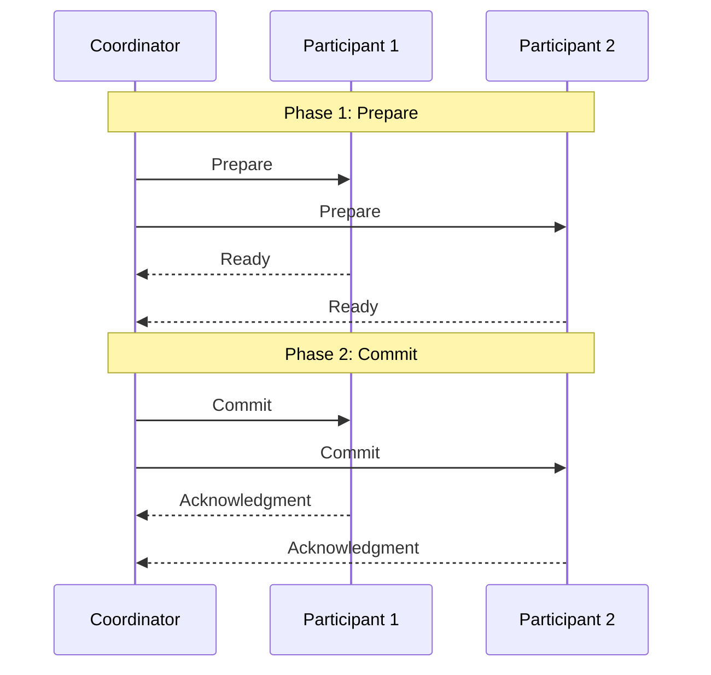
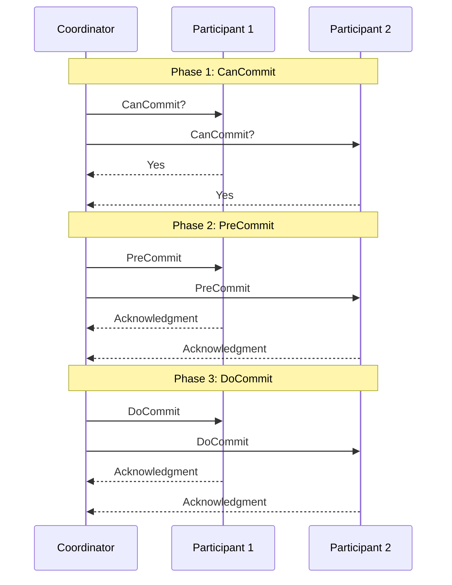

In this page, we will learn about distributed systems and various algorithms uses in this approach of server.

# Distributed System

A distributed system is a system whose components are located on different networked computers, which communicate and coordinate their actions by passing messages to one another. 

This allows for efficient resource sharing and improved fault tolerance, as well as the ability to handle large amounts of data and traffic. However, it also introduces challenges such as network latency, data consistency, and security.

| **Aspect** | **Distributed Systems** | **Microservices Architecture** |
| --- | --- | --- |
| **Definition** | A broader concept where components are spread across multiple computers or nodes | A specific architectural style within distributed systems |
| **Scope** | Can include various architectural patterns | Focuses on breaking down applications into small, independent services |
| **Focus** | How components communicate and coordinate across a network | Running services in separate processes and communicating via lightweight mechanisms |

In essence, microservices architecture is a **way of implementing a distributed system**, but not all distributed systems use microservices architecture. Microservices is a more specific approach to building distributed applications.

**Example of Distributed System**

- Distributed database system (e.g., Apache Cassandra or Google's Spanner)
- Distributed file system (e.g., Hadoop Distributed File System). 

These systems distribute data and processing across multiple nodes, working together as a cohesive system.

### Advantages of Distributed Network

- Efficient resource sharing
- Improved fault tolerance
- Ability to handle large amounts of data and traffic
- Scalability
- Availability
- Faster response time
- Reduced data loss

### Disadvantages of Distributed Network

- Network latency
- Data consistency
- Security
- Increased complexity
- Higher costs
- Difficulty in debugging and testing

# Distributed databases

In distributed systems, handling transactions across multiple nodes presents unique challenges. Three common approaches for managing distributed transactions are the Two-Phase Commit (2PC), Three-Phase Commit (3PC) protocols and SAGA Pattern. Let's explore these in detail: 🔒

## Two-Phase Commit (2PC) Protocol 🔄🔄

The Two-Phase Commit protocol is a distributed algorithm that coordinates all the processes that participate in a distributed atomic transaction on whether to commit or abort (roll back) the transaction. 🤝

### How it works:

**Phase 1 (Prepare Phase) 🔍:**

- The coordinator sends a query to commit message to all participants. 📤
- Each participant executes the transaction up to the point where they will be asked to commit. 🔄
- Each participant replies with an agreement message (if the participant can commit) or an abort message (if the participant cannot commit). ✅❌

**Phase 2 (Commit Phase) ✍️:**

- If all participants replied "agreement", the coordinator sends a commit message to all participants. 🟢
- Otherwise, the coordinator sends a rollback message to all participants. 🔴
- Each participant completes the operation and releases all locks and resources held during the transaction. 🔓
- Each participant sends an acknowledgment to the coordinator. 📩
- The coordinator completes the transaction when all acknowledgments have been received. ✅

### Advantages 👍

- Ensures atomicity in distributed transactions. ⚛️
- Relatively simple to implement. 🛠️

### Disadvantages 👎

- Blocking protocol: Participants may have to wait for a decision from the coordinator. ⏳
- Single point of failure: If the coordinator fails, the system can be left in an uncertain state. 💥
- Performance overhead due to multiple rounds of communication. 🐢

## Three-Phase Commit (3PC) Protocol 🔄🔄🔄

The Three-Phase Commit protocol is an extension of the 2PC protocol designed to eliminate some of its drawbacks, particularly the blocking problem. 🚀

### How it works:

**Phase 1 (CanCommit) 🤔:**

- The coordinator sends a CanCommit? query to all participants. 📤
- Each participant replies with Yes or No. ✅❌

**Phase 2 (PreCommit) 📝:**

- If all participants voted Yes, the coordinator sends a PreCommit message. 🟢
- Participants acknowledge the PreCommit message. 📩
- If any participant voted No, the coordinator sends an Abort message. 🔴

**Phase 3 (DoCommit) ✍️:**

- The coordinator sends a DoCommit message to all participants. 🏁
- Participants acknowledge the commit. ✅

### Advantages 👍

- Non-blocking: Resolves the blocking problem of 2PC. 🚫
- Better failure recovery: System can often continue to make progress even if some participants fail. 🛠️

### Disadvantages 👎

- More complex to implement than 2PC. 🧩
- Higher message overhead due to an additional phase. 📨📨📨
- Still vulnerable to certain types of failures. ⚠️

Both 2PC and 3PC protocols play crucial roles in maintaining data consistency across distributed systems, with 3PC offering improved reliability at the cost of increased complexity. The choice between them depends on the specific requirements of the system, including factors like performance needs, fault tolerance, and implementation complexity. 🌟🔧

If you don't want to implement 2PC or 3PC protocols you can use SAGA pattern to handle consistency issues in distributed systems, as explained below.

## SAGA Pattern

SAGA breaks down a distributed transaction into a sequence of local transactions, each performed by a single service. If a step fails, the pattern executes compensating transactions to undo the changes made by the preceding steps. This ensures eventual consistency across all services. 🔁

It has two types:
1. Choreography-based SAGA
2. Orchestration-based SAGA

Read in more detail here, [Microservices - SAGA Pattern](https://github.com/DS-Meena/Learn-LLD-HLD/tree/main/HLD/Architectural%20Patterns/Microservices#saga-pattern-)
