# Design Secured systems

In this page, we will learn about security features that we put in our architecture like OAuth2.0, encryption, etc.

# Cryptography

Cryptography is the practice and study of techniques for secure communication in the presence of adversaries. It involves encryption (converting plaintext into ciphertext) and decryption (converting ciphertext back to plaintext).

## Types of Encryption

## 1. Symmetric Encryption

In symmetric encryption, the same key is used for both encryption and decryption.

**Advantages:** 

- Fast and less computation is required compared to Asymmetric encryption.
- Efficient for large amounts of data

**Disadvantages:** 

- Key distribution can be challenging

Common symmetric algorithms:

- AES (Advanced Encryption Standard)
- DES (Data Encryption Standard)
- 3DES (Triple DES)

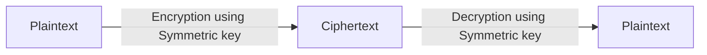

### DES (Not recommended)

DES (Data Encryption Standard) is a symmetric-key block cipher that was once widely used but is now considered insecure due to its small key size.

**Key features of DES:**

- Block size: 64 bits
- Key size: 56 bits (technically 64 bits, but 8 bits are used for parity)
- Number of rounds: 16

**How DES works:**

1. Initial permutation of the input block
2. 16 rounds of a Feistel network structure
3. Final permutation (inverse of the initial permutation)

DES is vulnerable to brute-force attacks due to its small key size. It has been largely replaced by more secure algorithms like AES. However, Triple DES (3DES), which applies DES three times with different keys, is still used in some legacy systems.

### AES

AES (Advanced Encryption Standard) is a symmetric encryption algorithm widely used for secure data transmission. It was established by the U.S. National Institute of Standards and Technology (NIST) in 2001 to replace the older DES algorithm.

**Key features of AES:**

- Block cipher: AES encrypts data in fixed-size blocks of 128 bits
- Variable key sizes: 128, 192, or 256 bits
- Multiple rounds of encryption: 10, 12, or 14 rounds depending on key size

**Types of AES based on key size:**

- AES-128: Uses a 128-bit key and 10 rounds of encryption
- AES-192: Uses a 192-bit key and 12 rounds of encryption
- AES-256: Uses a 256-bit key and 14 rounds of encryption

#### Algorithm 🔍

The AES algorithm operates on a 4x4 matrix of bytes called the **state array**. Each element in this matrix is a byte (8 bits). 🔢

**Word:** A group of 4 bytes that are processed as a unit. The AES key is divided into words. 🔤

**Round Key:** A key derived from the main key, used in each round of encryption. 🔑

**Key Expansion 🗝️**

The AES key expansion process generates the round keys from the initial cipher key:

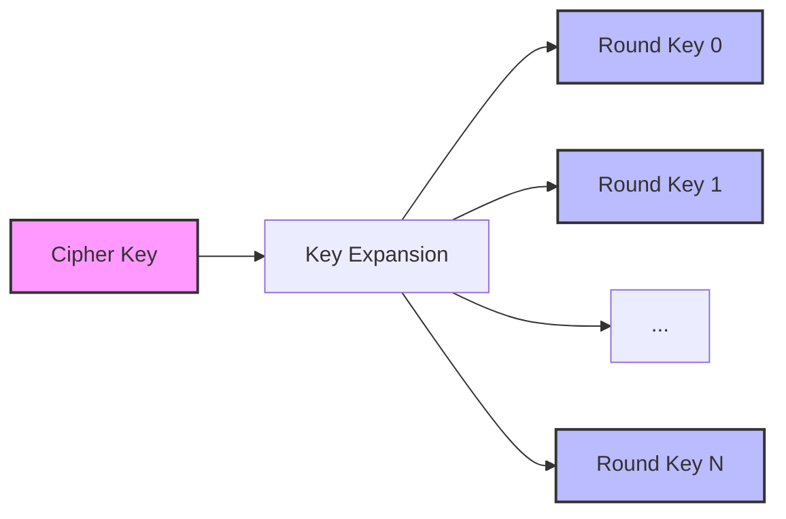

This process ensures that each round uses a different key, enhancing the security of the encryption. 🛡️

Here's a more detailed look at the AES encryption process: 🔐🧠

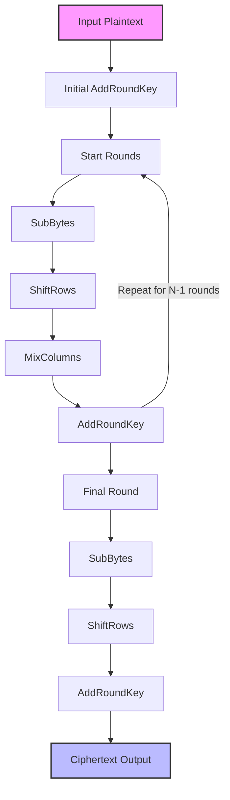

Let's break down each step: 🧩

1. **Initial AddRoundKey:** The input block is XORed with the initial round key. 🔀
2. **SubBytes:** Each byte in the state is replaced with a corresponding byte in a fixed 8-bit lookup table (S-box). This provides non-linearity. 🔄
3. **ShiftRows:** The bytes in each row of the state are cyclically shifted left. The number of places each byte is shifted differs for each row. 👈
4. **MixColumns:** Each column of the state is multiplied with a fixed polynomial. This step ensures diffusion. 🔢
5. **AddRoundKey:** The state is combined with the round key using bitwise XOR. 🔑

These steps are repeated for a number of rounds (10 for 128-bit keys, 12 for 192-bit keys, and 14 for 256-bit keys), with the final round skipping the MixColumns step. 🔁

AES's strength lies in its simplicity, speed, and resistance to various cryptographic attacks, making it the go-to choice for secure data encryption in modern systems. 💪🔒

AES is considered highly secure and efficient, making it suitable for a wide range of applications, from securing internet communications to protecting sensitive government information.

## 2. Asymmetric Encryption

Asymmetric encryption uses a pair of keys: a public key for encryption and a private key for decryption.

**Advantages:** 

- Solves key distribution problem, because each user uses a secret (private) key, which is not shared over network.
- Provide key exchange protocols like Diffie-Hellman.
- enables digital signatures

**Disadvantages:** 

- Slower than symmetric encryption & computation intensive
- Not suitable for bulk data.

Common asymmetric algorithms:

- RSA (Rivest-Shamir-Adleman)
- DSA
- ECC (Elliptic Curve Cryptography)
- Diffie-Hellman
- ECDHE

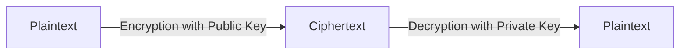

### Diffie Hellman

The Diffie-Hellman key exchange is a method of securely exchanging cryptographic keys over a public channel. It was one of the first public-key protocols, invented by Whitfield Diffie and Martin Hellman in 1976. Here's how it works:

1. Alice and Bob agree on a large prime number p and a base g (usually a small prime number like 2, 3, or 5).
2. Alice chooses a secret integer a and computes A = g^a mod p. She sends A to Bob.
3. Bob chooses a secret integer b and computes B = g^b mod p. He sends B to Alice.
4. Alice computes the shared secret s = B^a mod p.
5. Bob computes the same shared secret s = A^b mod p.

Both Alice and Bob now have the same shared secret s, which can be used as a symmetric encryption key.

**How it solves the key distribution problem:**

- No need to share secret keys: The beauty of Diffie-Hellman is that Alice and Bob never need to share their secret numbers (a and b) with each other.
- Public channel safety: Even if an eavesdropper intercepts all the communications (p, g, A, and B), they cannot easily determine the shared secret s.
- Perfect forward secrecy: Each session can use a different set of parameters, ensuring that if one session is compromised, past and future sessions remain secure.
- Scalability: It can be extended to work with multiple parties, making it suitable for group key agreement in various network protocols.

However, it's important to note that while Diffie-Hellman solves the key distribution problem, it doesn't provide authentication. To prevent man-in-the-middle attacks, it's often used in conjunction with digital signatures or other authentication methods.

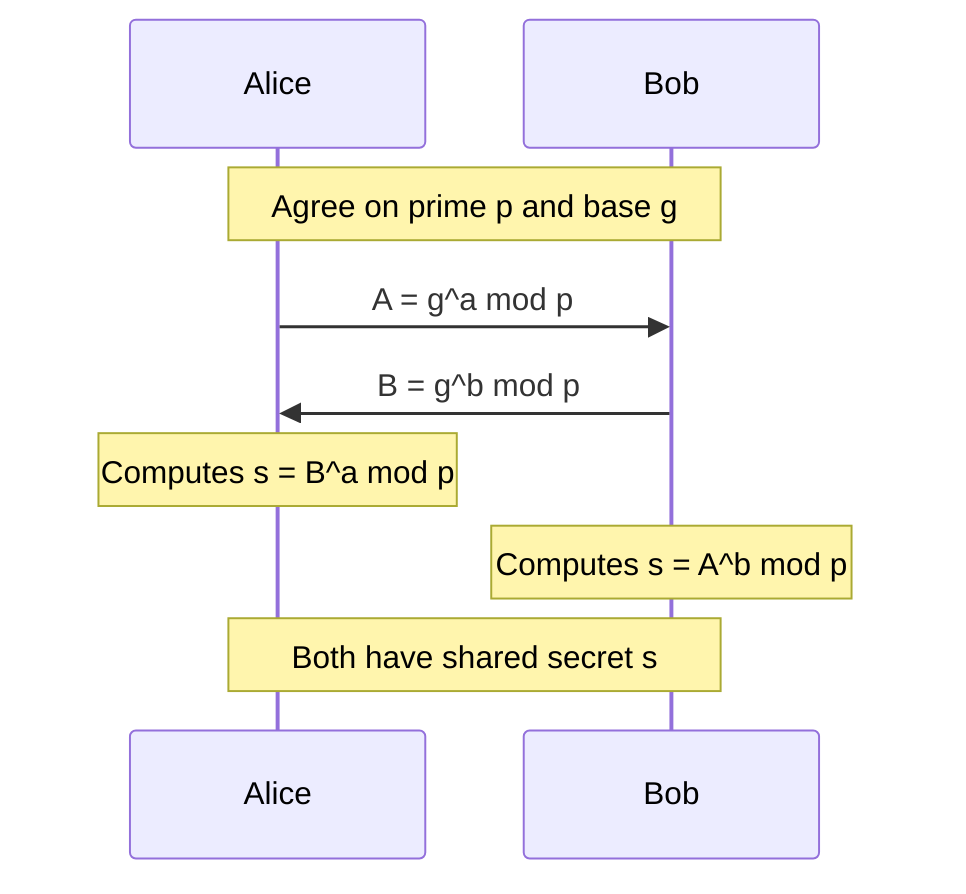

This algorithm forms the basis for many secure communication protocols used today, including in SSL/TLS for secure web browsing.

### Digital signature

A digital signature is a cryptographic mechanism used to verify the authenticity and integrity of digital messages or documents. 🔏✍️

Here's how digital signatures work: 🛠️

1. **Key Generation:** The signer creates a pair of keys - a private key (kept secret) and a public key (shared openly). 🔑🔓
2. **Signing Process:** The signer creates a hash of the message and encrypts it with their private key. This encrypted hash is the digital signature. 
3. **Attaching the Signature:** The digital signature is attached to the message or document. 📎
4. **Verification:** The recipient uses the signer's public key to decrypt the signature, revealing the original hash. They also independently hash the received message. 🕵️‍♀️
5. **Comparison:** If the decrypted hash matches the independently generated hash, the signature is valid, confirming the message's integrity and the signer's identity. ✅🎉

Let's visualize the digital signature process with a diagram:

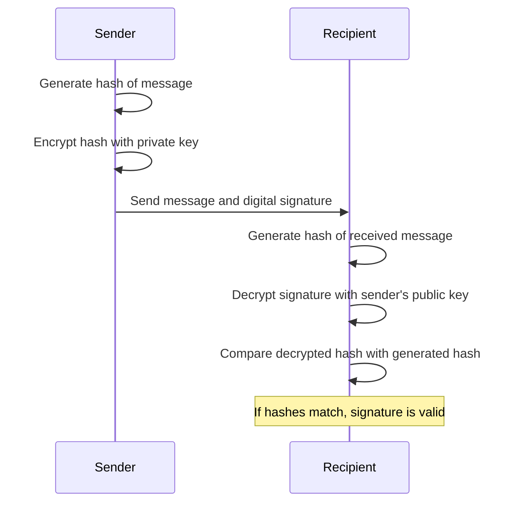

This process ensures the authenticity, integrity, and non-repudiation of the message, making digital signatures a crucial component of secure digital communications. 🔐🌐


#### Hash Function in Digital Signatures:

A cryptographic hash function is a crucial component of the digital signature process. 🧮 It's agreed upon and known to both the signer and verifier beforehand. 🤝

Example -> Common hash functions include SHA-256, SHA-3, and BLAKE2. 🔢

By using a standardized, secure hash function, both parties can independently compute the same hash for a given message, which is essential for the signature verification process. 🔍✅

Digital signatures provide several benefits:

- **Authentication:** Verifies the identity of the signer. 🆔
- **Integrity:** Ensures the message hasn't been altered. 🛡️
- **Non-repudiation:** The signer can't deny signing the document. 🚫🙅‍♂️

Digital signatures are widely used in various applications, including email, software distribution, financial transactions, and legal documents, providing a secure way to conduct business in the digital world. 🌐💼

# OAuth 2.0 🔐

OAuth 2.0 is an authorization framework that enables applications to obtain limited access to user accounts on an HTTP service. 🌐

### Why is OAuth 2.0 used? 🤔

- Secure delegated access 🛡️
- Separates authentication from authorization 🔑
- Allows third-party applications to access user data without exposing credentials 🔒
- Provides a standardized way for applications to request user permissions 📜

### Actors involved in OAuth 2.0 👥

- **Resource Owner** 👤: The user who owns the protected resources
- **Client 📱**: The application requesting access to the protected resources
- **Authorization Server 🏛️**: Issues access tokens to the client after authenticating the resource owner
- **Resource Server 💾**: Hosts the protected resources and accepts access tokens

**Example** → Scenario: A third-party email management app wants to access your Gmail inbox.

- Resource Owner : You, the Gmail user
- Client : The third-party email management app
- Authorization Server: Google's OAuth server
- Resource Server: Gmail's API

Flow:

1. You click "Connect with Gmail" in the email management app
2. The app redirects you to Google's login page
3. After logging in, Google asks if you want to grant the app access to your Gmail
4. If you approve, Google provides the app with an access token
5. The app uses this token to access your Gmail data through the Gmail API

OAuth 2.0 allows these third-party services to access your data without you having to share your login credentials, enhancing security and giving you control over what data you share. 🔒🔑

## Authorization Grant Types 🎟️

OAuth 2.0 defines four grant types, each suited for different scenarios:

1. Authorization Code Grant
2. Refresh token Grant
3. Implicit Grant
4. Resource Owner Password Credentails Grant
5. Client Credentials Grant

### 1. Authorization Code Grant 📋

The Authorization Code Grant is a secure OAuth 2.0 flow where a client application obtains an **authorization code** from the authorization server with user consent, then exchanges this code for an access token to access protected resources on behalf of the user.

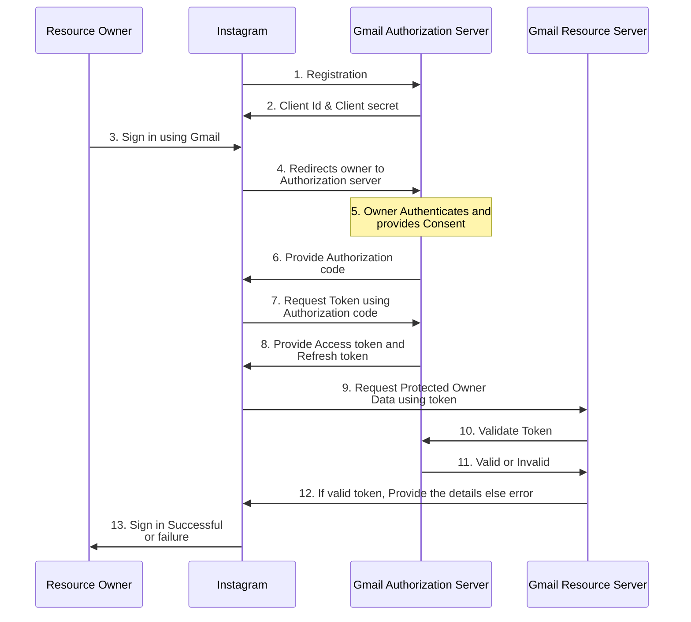

Example -> A user (Resource owner) wants to access Instagram app (client). He decided to login with Gmail (Auth server & Resource server).


Let's break down the request and response examples for the Authorization Code Grant flow:

1. **Registration Process:**

    In this step, the client registers itself to Authroization server. After this client application can provide the user to login via Gmail or other Authorization server.
    
    Request (`step 1`):
    
    ```python
    POST/register
    body: {
    	"client_name": {"instagram"},
    	"redirect_uris": {"instagram.com", "instagram1.com", "instagram2.com"}
    }
    ```

    Query parameters:
    
    - **client_id**: Your application's unique identifier
    - **redirect_uri or callback**: Where the auth server should send the user after authorization
    
    Response (`step 2`): Client gets client_id and client_secret, which are used for authentication of the client.
    
    ```python
    Response body: {
    	"client_name": {"instagram"},
    	"client_id": {"cool_client_id"},
    	"client_secret": {"cool_client_secret"}
    }
    ```
    
2. **Fetch Authorization Code**
    
    This is the initial request from the client to the authorization server to get an authorization code.
    
    Request (`step 4`):
    
    ```js
    GET /authorize?
        response_type=code
        &client_id=YOUR_CLIENT_ID
        &redirect_uri=https://your-app.com/callback
        &scope=read_user_profile
        &state=random_string
    HTTP/1.1
    Host: authorization-server.com
    ```
    
    Query parameters:
    
    - **response_type=code**: Indicates that we're using the Authorization Code flow
    - **scope**: What permissions your app is requesting
    - **state**: A random string to prevent CSRF attacks
    
    CSRF attack is done at this step, we will learn about this below.
    
    After the user approves, they're redirected back to your app with an authorization code:
    
    Response (`step 6`):
    ```js
    HTTP/1.1 302 Found
    Location: https://coolapp.com/oauth-callback?code=AUTH_CODE_HERE&state=xcoiv98y2kd
    ```

3. **Fetch Token**
        
    Your app then exchanges the authorization code for an access token:
    
    Request (`step 7`):
    
    ```js
    POST /token HTTP/1.1
    Host: authorization-server.com
    Content-Type: application/x-www-form-urlencoded
    
    grant_type=authorization_code
    &code=AUTH_CODE_HERE
    &redirect_uri=https://coolapp.com/oauth-callback
    &client_id=coolapp123
    &client_secret=APP_SECRET
    ```
    
    Parameters explained:
    
    - **grant_type=authorization_code**: Specifies we're using the Authorization Code flow
    - **code**: The authorization code received in step 2
    - **redirect_uri or callback**: Must match the one used in step 1
    - **client_id** and **client_secret**: Your app's credentials
    
    Response (`step 8`): The authorization server responds with an access token.
    
    ```js
    {
        "access_token": "ACCESS_TOKEN",
        "token_type": "Bearer",
        "expires_in": 3600,
        "refresh_token": "REFRESH_TOKEN",
        "scope": "profile email"
    }
    ```
    
    This response includes:
    
    - **access_token**: Used to make authenticated requests to the API. It can be a plain string or JWT token.
    - **token_type**: Almost always "Bearer" for OAuth 2.0
    - **expires_in**: How long until the access token expires (in seconds). After expiry Refresh token should be used to get new Tokens without need of authentication or user consent.
    - **refresh_token**: Used to get a new access token when it expires
    - **scope**: The permissions granted to your application
    
    **Bearer** is a security mechanism, and it means that client should add the TOKEN in the authorization header, whenever it want to access the protected resources.

**Advantages:**

- Most secure for server-side applications 🔒
- Supports refresh tokens for long-term access 🔄

**Disadvantages:**

- More complex flow 🔀
- Requires server-side code 💻

#### CSRF Attack

The attacker gives his unused auth token in `step 6`, so when user uses this attacker's auth token, he get attackers access token. With this, he will get attackers resource values and user might be on banking site and he could send the money to attacker's account.

To prevent this **state value** is used while asking for Authorization code, so that client can validate if this auth code is coming from intended authorization server.

A more generic CSRF attack is given below.

A CSRF attack occurs when a malicious website tricks a user's browser into making an unwanted request to a trusted website where the user is already authenticated. This can lead to unauthorized actions being performed on the user's behalf.

**Example scenario 👨‍💻**

1. Alice is logged into her bank's website ([bank.com](http://bank.com)) in one tab.
2. Alice visits a malicious website ([evil.com](http://evil.com)) in another tab.
3. The malicious website contains a hidden form that automatically submits a request to transfer money from Alice's account to the attacker's account.
4. When the form is submitted, Alice's browser includes her authentication cookies for [bank.com](http://bank.com).
5. The bank processes the request as if it came directly from Alice, potentially transferring funds to the attacker.

Here's a diagram illustrating this CSRF attack:

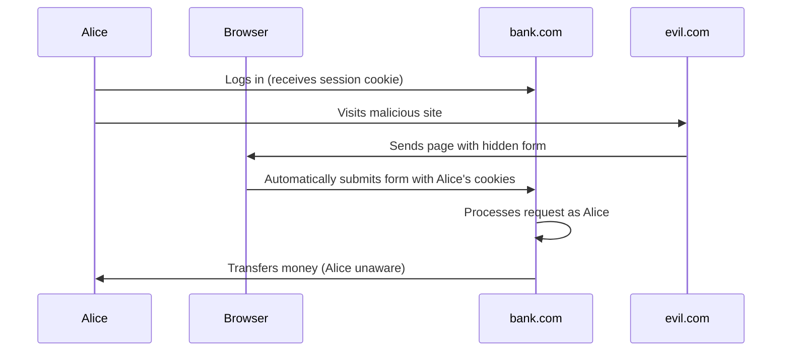

**Prevention methods 🛡️**

- Use anti-CSRF tokens: Unique tokens sent with each form that the server validates
- SameSite cookie attribute: Restricts how cookies are sent with cross-site requests
- Check Referer header: Verify that requests come from your own domain
- Use POST instead of GET for sensitive actions

Understanding CSRF attacks is crucial for implementing proper security measures in web applications, especially when dealing with sensitive operations like financial transactions or user data modifications. 🔒🌐


### 2. Refresh token grant

The Refresh Token Grant is used to obtain a new access token when the current one expires, without requiring the user to re-authenticate. Here's a sequence diagram illustrating the flow:

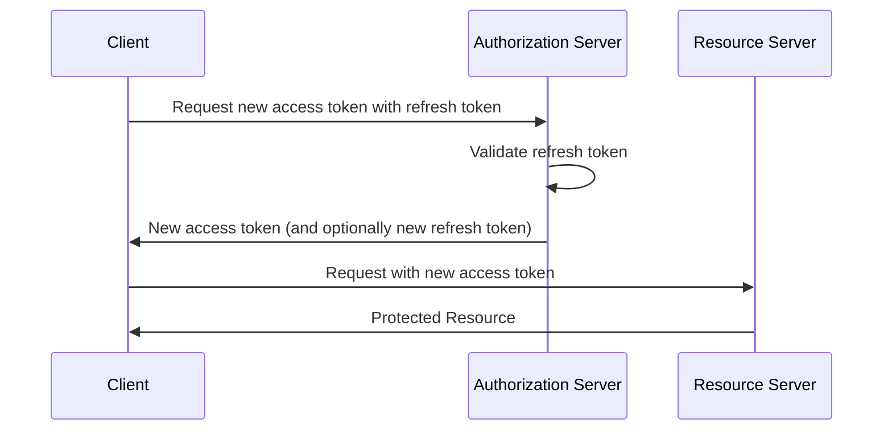

**API Examples**

Client requests for new access token using Refresh token:

```js
POST /token HTTP/1.1
Host: authorization-server.com
Content-Type: application/x-www-form-urlencoded

grant_type=refresh_token
&refresh_token=REFRESH_TOKEN
&client_id=CLIENT_ID
&client_secret=CLIENT_SECRET
```

Response:

```json
{
  "access_token": "NEW_ACCESS_TOKEN",
  "token_type": "Bearer",
  "expires_in": 3600,
  "refresh_token": "NEW_REFRESH_TOKEN"
}
```

**Advantages:**

- Improves user experience by avoiding frequent re-authentication 🔄
- Enhances security by allowing short-lived access tokens 🔒

**Disadvantages:**

- Requires secure storage of refresh tokens 💾
- Adds complexity to token management 🔧

The Refresh Token Grant is crucial for maintaining long-term access to resources while keeping the security benefits of short-lived access tokens. 🔐

### 3. Implicit Grant 🏃‍♂️

The Implicit Grant is a simplified OAuth 2.0 flow designed for client-side applications, typically running in a web browser. In this flow, the *access token is returned directly to the client* after user authorization, without an intermediate authorization code exchange.  While simpler to implement, it's less secure as the access token is exposed to the browser and potentially to malicious scripts. 

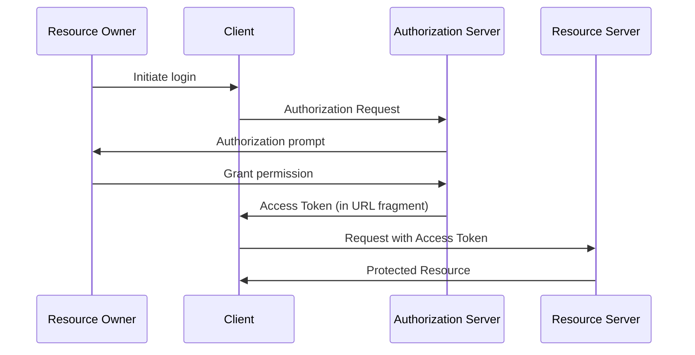

Here's an explanation of the Implicit Grant flow with API requests and responses:

1. **Authorization Request**
    
    The client redirects the user to the authorization server.
    
    ```
    GET /authorize?
        response_type=token
        &client_id=YOUR_CLIENT_ID
        &redirect_uri=https://your-app.com/callback
        &scope=read_profile
        &state=random_string
    HTTP/1.1
    Host: authorization-server.com
    ```
    
2. **Authorization Response**

    After user approval, the authorization server redirects back to the client with the access token in the URL fragment:
    
    ```
    HTTP/1.1 302 Found
    Location: https://your-app.com/callback#access_token=ACCESS_TOKEN_HERE&token_type=Bearer&expires_in=3600&state=random_string
    ```

This flow doesn't support refresh tokens and is generally not recommended for new applications due to security concerns. It's best suited for scenarios where the client can't securely store client secrets, such as single-page applications (SPAs).

**Advantages:**

- Simpler flow for client-side applications 🌐
- No server-side code required 🚫💻

**Disadvantages:**

- Less secure, token exposed to browser 🔓
- No refresh tokens 🚫🔄

### 4. Resource Owner Password Credentials Grant 🔑

The Resource Owner Password Credentials Grant is a simple OAuth 2.0 flow where the client directly collects the **user's credentials** and exchanges them for an access token.

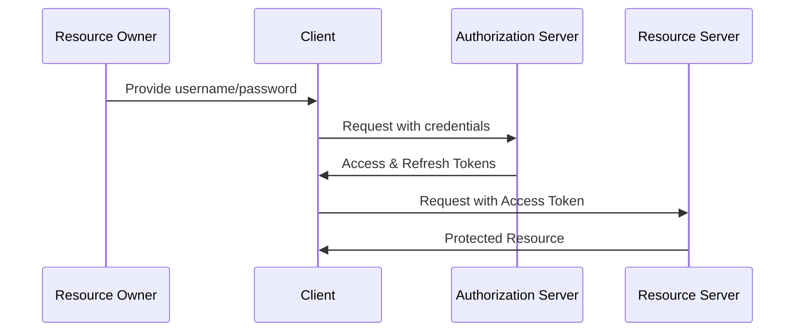

Here's an explanation of the Resource Owner Password Credentials Grant flow with API examples:

1. **Token Request** 
    
    The client sends a POST request to the token endpoint with the user's credentials:
    
    ```jsx
    POST /token HTTP/1.1
    Host: authorization-server.com
    Content-Type: application/x-www-form-urlencoded
    
    grant_type=password
    &username=user@example.com
    &password=1234password
    &client_id=CLIENT_ID
    &client_secret=CLIENT_SECRET
    &scope=read write
    ```
    
2. **Token Response** 

    The authorization server responds with an access token and refresh token:
    
    ```json
    {
      "access_token": "ACCESS_TOKEN",
      "token_type": "Bearer",
      "expires_in": 3600,
      "refresh_token": "REFRESH_TOKEN",
      "scope": "read write"
    }
    ```

This flow allows the client to directly exchange user credentials for an access token, which is why it should only be used by highly trusted applications.

**Advantages:**

- Simple flow for trusted first-party clients 👍

**Disadvantages:**

- Requires handling of user credentials 🚨
- Not recommended for third-party applications 🚫

### 5. Client Credentials Grant 🤖

The Client Credentials Grant is an OAuth 2.0 flow designed for machine-to-machine authentication where a client application directly authenticates with the authorization server using its **own credentials** (client ID and secret) to obtain an access token, without any user involvement.

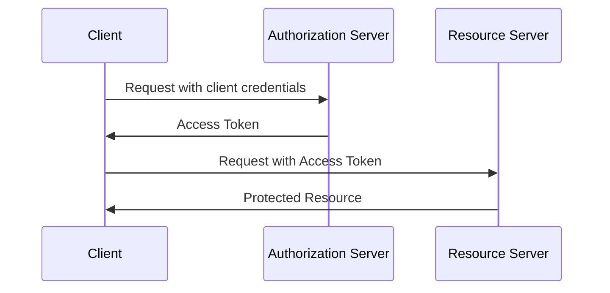

Here's an explanation of the Client Credentials Grant flow with API examples:

1. **Token Request**

    The client sends a POST request to the token endpoint with its credentials:
    
    ```jsx
    POST /token HTTP/1.1
    Host: authorization-server.com
    Content-Type: application/x-www-form-urlencoded
    
    grant_type=client_credentials
    &client_id=CLIENT_ID
    &client_secret=CLIENT_SECRET
    &scope=read write
    ```
    
2. **Token Response** 

    The authorization server responds with an access token:
    
    ```json
    {
      "access_token": "ACCESS_TOKEN",
      "token_type": "Bearer",
      "expires_in": 3600,
      "scope": "read write"
    }
    ```

This flow is typically used for server-to-server authentication where no user interaction is required.

**Advantages:**

- Simplest flow, suitable for machine-to-machine communication 🔧

**Disadvantages:**

- No user involvement, only for trusted clients 🤖

Understanding these flows and choosing the appropriate grant type is crucial for implementing secure and efficient OAuth 2.0 authentication in your system design. 🏗️🔒

# JSON Web Tokens (JWT) 🔐

JSON Web Tokens (JWT) are a compact and self-contained way of securely transmitting information between parties as a JSON object. 📜✉️

The main purposes of JWT tokens are:

- **Authentication**: JWTs can be used to verify the identity of a user after they've logged in
- **Authorization**: JWTs can contain claims about what resources or actions a user is allowed to access
- **Information Exchange**: JWTs can securely transmit information between parties as a JSON object
- **Stateless Sessions**: JWTs allow for stateless authentication, reducing the need for server-side session storage
- **Single Sign-On (SSO)**: JWTs facilitate single sign-on across multiple systems or domains (using single set of login credentials)

These tokens provide a secure, compact, and self-contained method for managing user sessions and permissions in modern web applications. 🔒🔑

## Structure of JWT 🏗️

A JWT consists of three parts separated by dots (.): Header, Payload, and Signature. 🧩

```
header.payload.signature
```

- **Header 📋:** Contains metadata about the token (like the type of token and the hashing algorithm used)
- **Payload 📦:** Contains claims (statements about the user and additional metadata)
- **Signature 🖋️:** Ensures the token hasn't been altered

Let's break down the structure of a JWT in more detail:

### Header 📋

The header typically consists of two parts:

- **typ (Type)**: Specifies that the token is a JWT
- **alg (Algorithm)**: Indicates the hashing algorithm used, such as HMAC SHA256 or RSA

Example header:

```json
{
  "alg": "HS256",
  "typ": "JWT"
}
```

### Payload 📦

The payload contains claims. Claims are statements about the user and additional metadata. Some common claims are:

- **iss (Issuer)**: Who issued the token
- **sub (Subject)**: The subject of the token (often the user ID)
- **exp (Expiration Time)**: When the token expires
- **iat (Issued At)**: When the token was issued
- **aud (Audience)**: The intended recipient of the token

Example payload:

```json
{
  "sub": "1234567890",
  "name": "John Doe",
  "iat": 1516239022,
  "exp": 1516242622
}
```

### Signature 🖋️

The signature is created by combining the encoded header, encoded payload, and a secret key. It's used to verify that the token hasn't been altered. The signature is created using the algorithm specified in the header.

Pseudo-code for creating the signature:

```jsx
HMACSHA256(
  base64UrlEncode(header) + "." +
  base64UrlEncode(payload),
  secret
)
```

Note the signature is not encrypted after applying hash. The final JWT is the combination of these three parts, each Base64Url encoded and separated by dots:

```
encodedHeader.encodedPayload.signature
```

## How JWT Works 🔄

Here's a step-by-step explanation of how JWT works:

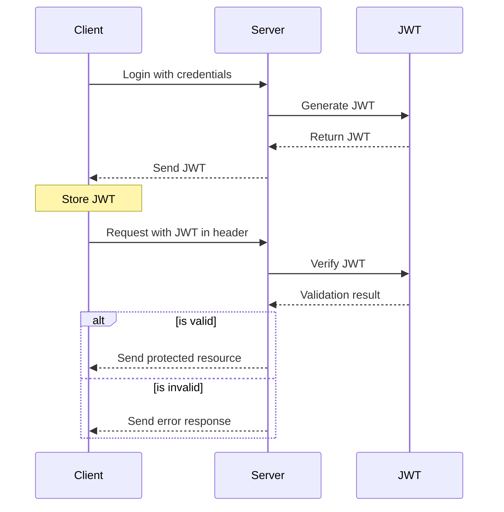

1. User logs in with their credentials 🔑
2. Server verifies the credentials and generates a JWT 🏭
3. Server sends the JWT back to the client 📤
4. Client stores the JWT (usually in local storage) 💾
5. Client sends the JWT in the Authorization header for subsequent requests 🚀
6. Server verifies the JWT signature for each request 🕵️

    1. Decoding the JWT header and payload
    2. Recreating the signature using the appropriate key (secret key or public key)
    3. Comparing the recreated signature with the one in the token

7. If valid, the server processes the request; if not, it returns an error ✅❌

### Advantages of JWT 🌟

- **Stateless**: No need to store session information on the server 🧘‍♂️
- **Scalability**: Easy to scale across different domains and services 📈
- **Security**: Can be encrypted and signed for integrity 🛡️
- **Efficiency**: Compact size for quick transmission 🚀

### Security Considerations 🔒

- Store JWTs securely (e.g., HttpOnly cookies) 🍪
- Use HTTPS to prevent token interception 🔐
- Set appropriate expiration times ⏳
- Implement token refresh mechanisms 🔄
- Validate and sanitize all user inputs 🧹

JWTs provide a robust and efficient method for authentication and information exchange in modern web applications, especially in microservices architectures. 🌐🔧

## Challenges with JWT Tokens 🚧

While JWT tokens offer many advantages, they also come with some challenges:

- **Token size:** JWTs can become large, especially with many claims, increasing bandwidth usage 📦
- **Statelessness:** Once issued, tokens can't be easily revoked before expiration ⏳
- **Secret key management:** Compromised secret keys can lead to security breaches 🔑
- **Token storage:** Secure client-side storage can be challenging, especially in browsers 💾
- **Lack of visibility:** Server can't track active sessions without additional mechanisms 👁️
- **Payload limitations:** Sensitive data shouldn't be stored in the payload as it's only encoded, not encrypted 🔒
- **Clock skew:** Time-based claims can cause issues if server and client clocks are not synchronized ⏰

Addressing these challenges requires careful implementation and additional security measures. 🛠️

JWS (JSON Web Signature) and JWE (JSON Web Encryption) are two **important extensions** of the JWT standard:

### JWS (JSON Web Signature) 🖋️

JWS is a way to digitally sign or create a MAC (Message Authentication Code) of content. It provides integrity protection for JWT claims. The payload in a JWS can be any content, not just JWT claims.

### JWE (JSON Web Encryption) 🔒

JWE is a way to encrypt the content of a JWT. It provides confidentiality protection for JWT claims. JWE allows sensitive information to be included in the JWT payload without risk of unauthorized access.

Both JWS and JWE enhance the security of JWTs, with JWS focusing on integrity and authenticity, while JWE focuses on confidentiality. They can be used separately or together, depending on the security requirements of the application. 🛡️

## Access token vs JWT

While JWT and OAuth 2.0 access tokens are both used for authentication and authorization, they serve different purposes and have distinct characteristics:

- **JWT (JSON Web Tokens):**
    - Self-contained: Contains claims about the user and can be verified independently
    - Stateless: The server doesn't need to store session information
    - Can be used for authentication and authorization
    - Often used in single sign-on (SSO) scenarios
- **OAuth 2.0 Access Tokens:**
    - Opaque: The contents are not meant to be read by the client
    - Can be revoked by the authorization server
    - Typically used for authorization, not authentication
    - Often used to grant access to specific resources or APIs

While JWTs can be used in OAuth 2.0 flows (e.g., as ID tokens in OpenID Connect), they are not the same as OAuth 2.0 access tokens. JWTs are more commonly used for authentication, while OAuth 2.0 access tokens are primarily for authorization. The choice between them depends on the specific security requirements and architecture of your application. 🔒🔑