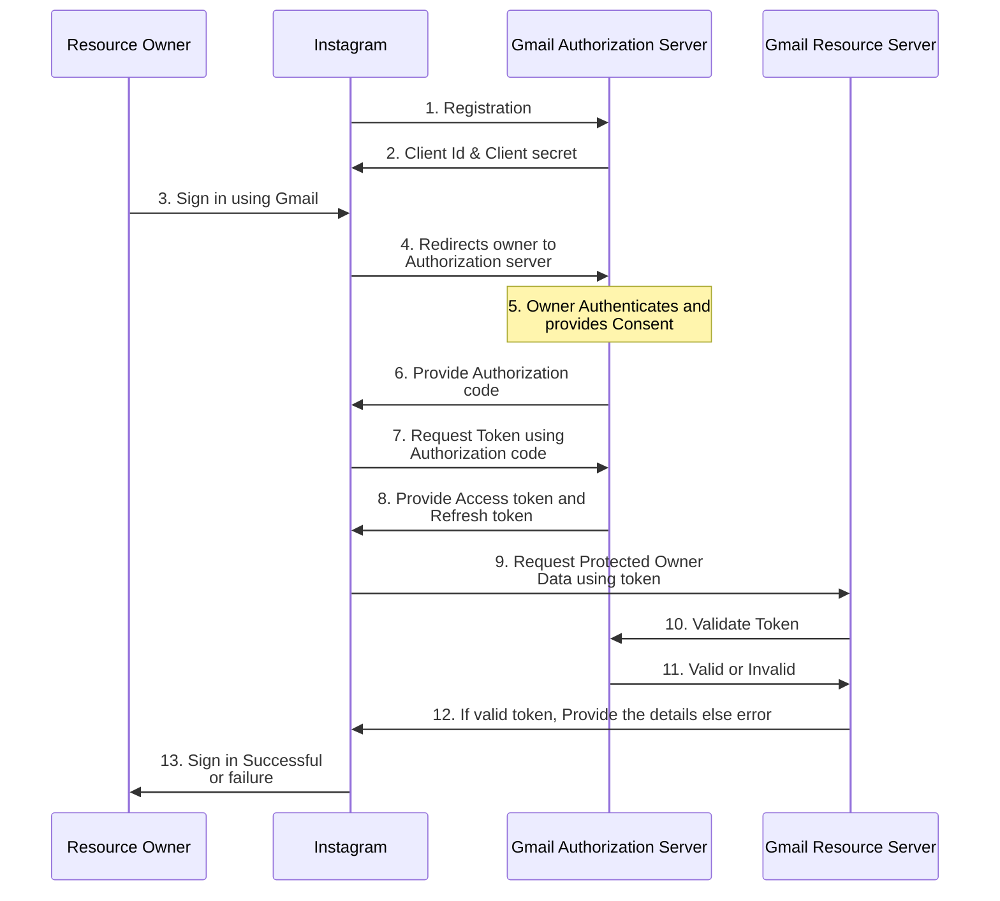
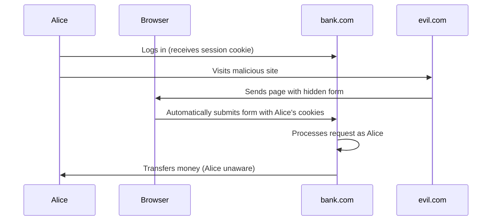
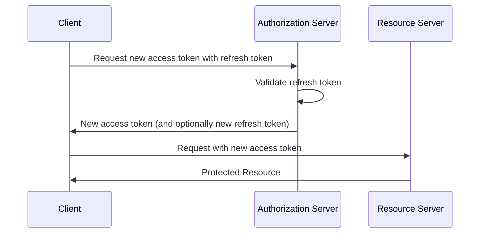
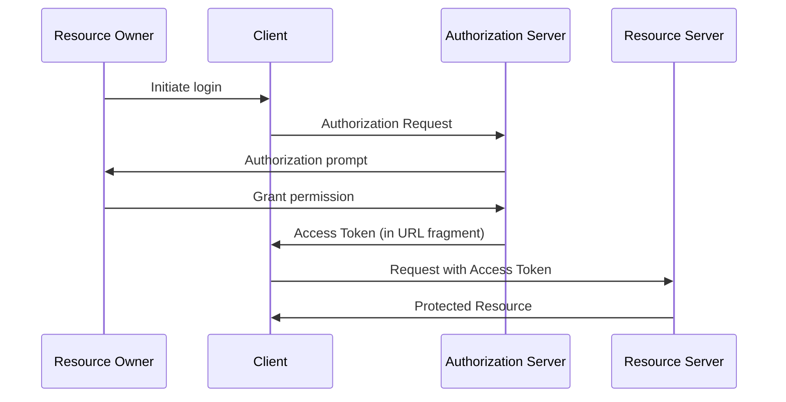
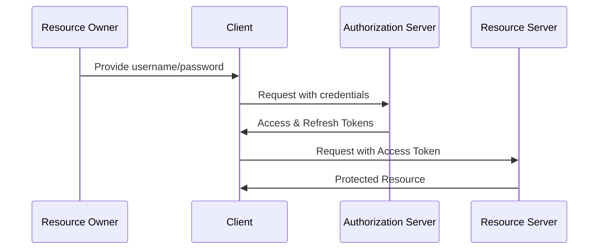
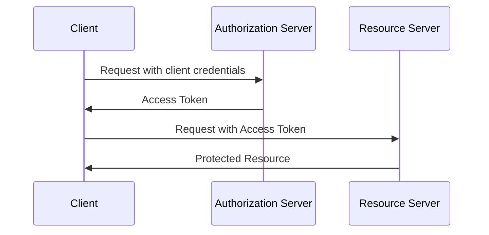

# Design Secured systems

In this page, we will learn about security features that we put in our architecture like OAuth2.0, encryption, etc.

# OAuth 2.0 🔐

OAuth 2.0 is an authorization framework that enables applications to obtain limited access to user accounts on an HTTP service. 🌐

### Why is OAuth 2.0 used? 🤔

- Secure delegated access 🛡️
- Separates authentication from authorization 🔑
- Allows third-party applications to access user data without exposing credentials 🔒
- Provides a standardized way for applications to request user permissions 📜

### Actors involved in OAuth 2.0 👥

- **Resource Owner** 👤: The user who owns the protected resources
- **Client 📱**: The application requesting access to the protected resources
- **Authorization Server 🏛️**: Issues access tokens to the client after authenticating the resource owner
- **Resource Server 💾**: Hosts the protected resources and accepts access tokens

**Example** → Scenario: A third-party email management app wants to access your Gmail inbox.

- Resource Owner 👤: You, the Gmail user
- Client 📱: The third-party email management app
- Authorization Server 🏛️: Google's OAuth server
- Resource Server 💾: Gmail's API

Flow:

1. You click "Connect with Gmail" in the email management app
2. The app redirects you to Google's login page
3. After logging in, Google asks if you want to grant the app access to your Gmail
4. If you approve, Google provides the app with an access token
5. The app uses this token to access your Gmail data through the Gmail API

OAuth 2.0 allows these third-party services to access your data without you having to share your login credentials, enhancing security and giving you control over what data you share. 🔒🔑

## Authorization Grant Types 🎟️

OAuth 2.0 defines four grant types, each suited for different scenarios:

1. Authorization Code Grant
2. Refresh token Grant
3. Implicit Grant
4. Resource Owner Password Credentails Grant
5. Client Credentials Grant

### 1. Authorization Code Grant 📋

The Authorization Code Grant is a secure OAuth 2.0 flow where a client application obtains an **authorization code** from the authorization server with user consent, then exchanges this code for an access token to access protected resources on behalf of the user.



Example -> A user (Resource owner) wants to access Instagram app (client). He decided to login with Gmail (Auth server & Resource server).


Let's break down the request and response examples for the Authorization Code Grant flow:

1. **Registration Process:**

    In this step, the client registers itself to Authroization server. After this client application can provide the user to login via Gmail or other Authorization server.
    
    Request (`step 1`):
    
    ```python
    POST/register
    body: {
    	"client_name": {"instagram"},
    	"redirect_uris": {"instagram.com", "instagram1.com", "instagram2.com"}
    }
    ```
    
    Response (`step 2`): Client gets client_id and client_secret, which are used for authentication of the client.
    
    ```python
    Response body: {
    	"client_name": {"instagram"},
    	"client_id": {"cool_client_id"},
    	"client_secret": {"cool_client_secret"}
    }
    ```
    
2. **Fetch Authorization Code**
    
    This is the initial request from the client to the authorization server to get an authorization code.
    
    Request (`step 4`):
    
    ```js
    GET /authorize?
        response_type=code
        &client_id=YOUR_CLIENT_ID
        &redirect_uri=https://your-app.com/callback
        &scope=read_user_profile
        &state=random_string
    HTTP/1.1
    Host: authorization-server.com
    ```
    
    Query parameters:
    
    - **response_type=code**: Indicates that we're using the Authorization Code flow
    - **client_id**: Your application's unique identifier
    - **redirect_uri**: Where the auth server should send the user after authorization
    - **scope**: What permissions your app is requesting
    - **state**: A random string to prevent CSRF attacks
    
    CSRF attack is done at this step, we will learn about this below.
    
    After the user approves, they're redirected back to your app with an authorization code:
    
    Response (`step 6`):
    ```js
    HTTP/1.1 302 Found
    Location: https://coolapp.com/oauth-callback?code=AUTH_CODE_HERE&state=xcoiv98y2kd
    ```

3. **Fetch Token**
        
    Your app then exchanges the authorization code for an access token:
    
    Request (`step 7`):
    
    ```js
    POST /token HTTP/1.1
    Host: authorization-server.com
    Content-Type: application/x-www-form-urlencoded
    
    grant_type=authorization_code
    &code=AUTH_CODE_HERE
    &redirect_uri=https://coolapp.com/oauth-callback
    &client_id=coolapp123
    &client_secret=APP_SECRET
    ```
    
    Parameters explained:
    
    - **grant_type=authorization_code**: Specifies we're using the Authorization Code flow
    - **code**: The authorization code received in step 2
    - **redirect_uri**: Must match the one used in step 1
    - **client_id** and **client_secret**: Your app's credentials
    
    Response (`step 8`): The authorization server responds with an access token.
    
    ```js
    {
        "access_token": "ACCESS_TOKEN",
        "token_type": "Bearer",
        "expires_in": 3600,
        "refresh_token": "REFRESH_TOKEN",
        "scope": "profile email"
    }
    ```
    
    This response includes:
    
    - **access_token**: Used to make authenticated requests to the API. It can be a plain string or JWT token.
    - **token_type**: Almost always "Bearer" for OAuth 2.0
    - **expires_in**: How long until the access token expires (in seconds). After expiry Refresh token should be used to get new Tokens without need of authentication or user consent.
    - **refresh_token**: Used to get a new access token when it expires
    - **scope**: The permissions granted to your application
    
    **Bearer** is a security mechanism, and it means that client should add the TOKEN in the authorization header, whenever it want to access the protected resources.

**Advantages:**

- Most secure for server-side applications 🔒
- Supports refresh tokens for long-term access 🔄

**Disadvantages:**

- More complex flow 🔀
- Requires server-side code 💻

#### CSRF Attack

The attacker gives his unused auth token in `step 6`, so when user uses this attacker's auth token, he get attackers access token. With this, he will be logged into attackers account, instead of his own.

A CSRF attack occurs when a malicious website tricks a user's browser into making an unwanted request to a trusted website where the user is already authenticated. This can lead to unauthorized actions being performed on the user's behalf.

**Example scenario 👨‍💻**

1. Alice is logged into her bank's website ([bank.com](http://bank.com)) in one tab.
2. Alice visits a malicious website ([evil.com](http://evil.com)) in another tab.
3. The malicious website contains a hidden form that automatically submits a request to transfer money from Alice's account to the attacker's account.
4. When the form is submitted, Alice's browser includes her authentication cookies for [bank.com](http://bank.com).
5. The bank processes the request as if it came directly from Alice, potentially transferring funds to the attacker.

Here's a diagram illustrating this CSRF attack:



**Prevention methods 🛡️**

- Use anti-CSRF tokens: Unique tokens sent with each form that the server validates
- SameSite cookie attribute: Restricts how cookies are sent with cross-site requests
- Check Referer header: Verify that requests come from your own domain
- Use POST instead of GET for sensitive actions

Understanding CSRF attacks is crucial for implementing proper security measures in web applications, especially when dealing with sensitive operations like financial transactions or user data modifications. 🔒🌐


### 2. Refresh token grant

The Refresh Token Grant is used to obtain a new access token when the current one expires, without requiring the user to re-authenticate. Here's a sequence diagram illustrating the flow:



**API Examples**

Client requests for new access token using Refresh token:

```js
POST /token HTTP/1.1
Host: authorization-server.com
Content-Type: application/x-www-form-urlencoded

grant_type=refresh_token
&refresh_token=REFRESH_TOKEN
&client_id=CLIENT_ID
&client_secret=CLIENT_SECRET
```

Response:

```json
{
  "access_token": "NEW_ACCESS_TOKEN",
  "token_type": "Bearer",
  "expires_in": 3600,
  "refresh_token": "NEW_REFRESH_TOKEN"
}
```

**Advantages:**

- Improves user experience by avoiding frequent re-authentication 🔄
- Enhances security by allowing short-lived access tokens 🔒

**Disadvantages:**

- Requires secure storage of refresh tokens 💾
- Adds complexity to token management 🔧

The Refresh Token Grant is crucial for maintaining long-term access to resources while keeping the security benefits of short-lived access tokens. 🔐

### 3. Implicit Grant 🏃‍♂️

The Implicit Grant is a simplified OAuth 2.0 flow designed for client-side applications, typically running in a web browser. In this flow, the *access token is returned directly to the client* after user authorization, without an intermediate authorization code exchange.  While simpler to implement, it's less secure as the access token is exposed to the browser and potentially to malicious scripts. 



Here's an explanation of the Implicit Grant flow with API requests and responses:

1. **Authorization Request**
    
    The client redirects the user to the authorization server.
    
    ```
    GET /authorize?
        response_type=token
        &client_id=YOUR_CLIENT_ID
        &redirect_uri=https://your-app.com/callback
        &scope=read_profile
        &state=random_string
    HTTP/1.1
    Host: authorization-server.com
    ```
    
2. **Authorization Response**

    After user approval, the authorization server redirects back to the client with the access token in the URL fragment:
    
    ```
    HTTP/1.1 302 Found
    Location: https://your-app.com/callback#access_token=ACCESS_TOKEN_HERE&token_type=Bearer&expires_in=3600&state=random_string
    ```

This flow doesn't support refresh tokens and is generally not recommended for new applications due to security concerns. It's best suited for scenarios where the client can't securely store client secrets, such as single-page applications (SPAs).

**Advantages:**

- Simpler flow for client-side applications 🌐
- No server-side code required 🚫💻

**Disadvantages:**

- Less secure, token exposed to browser 🔓
- No refresh tokens 🚫🔄

### 4. Resource Owner Password Credentials Grant 🔑

The Resource Owner Password Credentials Grant is a simple OAuth 2.0 flow where the client directly collects the **user's credentials** and exchanges them for an access token.



Here's an explanation of the Resource Owner Password Credentials Grant flow with API examples:

1. **Token Request** 
    
    The client sends a POST request to the token endpoint with the user's credentials:
    
    ```jsx
    POST /token HTTP/1.1
    Host: authorization-server.com
    Content-Type: application/x-www-form-urlencoded
    
    grant_type=password
    &username=user@example.com
    &password=1234password
    &client_id=CLIENT_ID
    &client_secret=CLIENT_SECRET
    &scope=read write
    ```
    
2. **Token Response** 

    The authorization server responds with an access token and refresh token:
    
    ```json
    {
      "access_token": "ACCESS_TOKEN",
      "token_type": "Bearer",
      "expires_in": 3600,
      "refresh_token": "REFRESH_TOKEN",
      "scope": "read write"
    }
    ```

This flow allows the client to directly exchange user credentials for an access token, which is why it should only be used by highly trusted applications.

**Advantages:**

- Simple flow for trusted first-party clients 👍

**Disadvantages:**

- Requires handling of user credentials 🚨
- Not recommended for third-party applications 🚫

### 5. Client Credentials Grant 🤖

The Client Credentials Grant is an OAuth 2.0 flow designed for machine-to-machine authentication where a client application directly authenticates with the authorization server using its **own credentials** (client ID and secret) to obtain an access token, without any user involvement.



Here's an explanation of the Client Credentials Grant flow with API examples:

1. **Token Request**

    The client sends a POST request to the token endpoint with its credentials:
    
    ```jsx
    POST /token HTTP/1.1
    Host: authorization-server.com
    Content-Type: application/x-www-form-urlencoded
    
    grant_type=client_credentials
    &client_id=CLIENT_ID
    &client_secret=CLIENT_SECRET
    &scope=read write
    ```
    
2. **Token Response** 

    The authorization server responds with an access token:
    
    ```json
    {
      "access_token": "ACCESS_TOKEN",
      "token_type": "Bearer",
      "expires_in": 3600,
      "scope": "read write"
    }
    ```

This flow is typically used for server-to-server authentication where no user interaction is required.

**Advantages:**

- Simplest flow, suitable for machine-to-machine communication 🔧

**Disadvantages:**

- No user involvement, only for trusted clients 🤖

Understanding these flows and choosing the appropriate grant type is crucial for implementing secure and efficient OAuth 2.0 authentication in your system design. 🏗️🔒