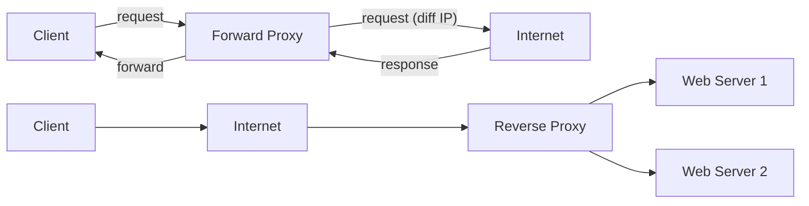
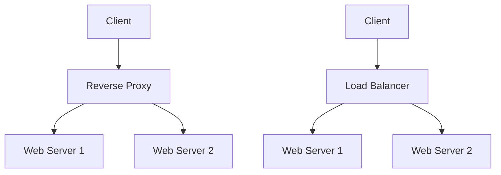
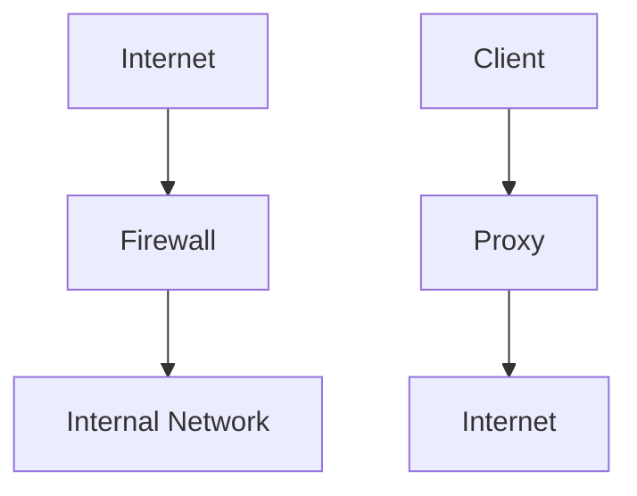

Let's learn about proxy servers.

## Proxy Server 🌐

A proxy server **acts as an intermediary** between a client and a server, forwarding requests and responses between them. It can provide various benefits such as improved security, performance, and anonymity. 🛡️🚀

How does a proxy server work?
1. User makes a request to any web server.
2. It's request first goes to proxy server.
3. Proxy server makes a request to destination server on behalf of user/client (with changed IP).
4. Proxy server collects the response and forward it to client. 

### Types of Proxy Servers

- **Forward Proxy 🔜:** Sits between client devices and the internet, forwarding client requests to web servers.
    
    This can be further divided into other types based on purpose:
    - Anonymous proxy: hides original IP
    - High anonymity Proxy: Periodically changes the IP. e.g. ToR network.
    - Transparent proxy server -> Pass original IP, mainly used in public libraries and schools for content filtering.

- **Reverse Proxy 🔙:** Sits in front of web servers, forwarding client requests to the appropriate backend server.
    
    Example → CDN
    

### Advantages of Proxy Servers 👍

- Enhanced privacy and anonymity 🕵️‍♀️
- Improved security  🛡️
- Caching for faster access to frequently requested content 🚀
- Load balancing capabilities (for reverse proxies) ⚖️
- Ability to bypass geo-restrictions 🌍

### Disadvantages of Proxy Servers 👎

- Potential single point of failure 🚧
- May introduce latency 🐢
- Can be bypassed by determined attackers 🦹‍♂️
- Works on application layer - need to setup for every app individually 🔧

## VPN (Virtual Private Network) 🔒

A VPN creates a secure, encrypted tunnel between a device and a VPN server, routing all internet traffic through this tunnel. It provides privacy, security, and the ability to access geographically restricted content. 🌐🔐

```mermaid
graph LR
    subgraph User Device
        A[User] -->|Initiates connection| B[VPN Client]
        style A fill:#f9f,stroke:#333,stroke-width:2px
        style B fill:#bbf,stroke:#333,stroke-width:2px
    end
    subgraph Internet
        C[Encrypted VPN Tunnel]
        style C fill:#dfd,stroke:#333,stroke-width:2px
    end
    subgraph VPN Server
        D[VPN Server]
        style D fill:#fbb,stroke:#333,stroke-width:2px
    end
    subgraph Destination
        E[Website/Service]
        style E fill:#bfb,stroke:#333,stroke-width:2px
    end
    B -->|Encrypts data| C
    C -->|Sends encrypted data| D
    D -->|Decrypts data| E
    E -->|Responds| D
    D -->|Encrypts response| C
    C -->|Sends encrypted response| B
    B -->|Decrypts response| A
    
    classDef default fill:#f9f,stroke:#333,stroke-width:2px;
    linkStyle default stroke-width:2px,fill:none,stroke:black;
    linkStyle 1,7 stroke:#f66,stroke-width:3px;
    linkStyle 2,3,5,6 stroke:#6f6,stroke-width:3px;
    linkStyle 0,4 stroke:#66f,stroke-width:3px;
```

### How does VPN works?
1. You initiate a connection to a website or online service.
2. The VPN client on your device encrypts your data before it leaves your device.
3. The encrypted data is then encapsulated in a new packet with a new IP header (your VPN server's IP address). This is called **tunneling**.
4. This encapsulated, encrypted data travels through a secure VPN tunnel to the VPN server.
5. The VPN server decrypts your data and sends it to the intended online destination.
6. The website or service responds, sending data back to the VPN server.
7. The VPN server encrypts this response and sends it back through the secure tunnel to your device.
8. Your VPN client decrypts the data so you can use it.

Example: Remote Work VPN

## Firewall

A firewall is a software program or a hardware device that acts as a filter for the data entering and leaving the network.

How does a firewall work?
- A firewall inspects all the incoming and outgoing packets of the network.
- It inspects on the basis of predetermined security rules.

It consists of 3 actions: -
1. Accept
2. Reject/block
3. Drop

Types of firewall:
1. Packet-filtering firewall - It is deployed at network layer.
2. Circuit level Gateway firewall - It is deployed at session layer.
3. Stateful Inspection firewall - These are dynamic packet filtering firewalls.
4. Appliction firewall - These are deployed at application layer. These 
5. Next generation firewall
6. Software firewall - like windows firewall
7. Hardware firewall - like Cisco ASA 5540 series firewall

A firewall is important when:
1. You havea 'always on' connection.
2. You connect to an open wifi.
3. Your organization need to be isolated from outside network.

Example: Corporate Network Security

## Differences 

Now, let's see the differences between some of the confusing terms.

### Differences between Proxy and VPN

VPN works on lower layers (transport, network or data layer), while proxy works on application layer.

| Aspect | VPN | Proxy |
| --- | --- | --- |
| **Encryption 🔐** | Encrypts all traffic | Typically doesn't encrypt |
| **Scope 🌐** | Routes all device traffic | Usually handles specific applications or protocols |
| **Speed 🚀** | Slower due to encryption overhead | Often faster |
| **Security 🛡️** | Generally better security and privacy | Less secure than VPNs |
| **Layer** 🦥 | Works on lower layers of network (transport, network or data layer) | Monitors and controls incoming and outgoing network traffic based on predetermined security rules. It acts as a filter for the data. |

### Reverse Proxy vs. Load Balancer

While both can distribute traffic across multiple servers, they have distinct purposes:

| Feature | Reverse Proxy 🔙 | Load Balancer ⚖️ |
| --- | --- | --- |
| **Primary Function** | Forwards client requests to appropriate backend servers | Distributes incoming traffic across multiple servers |
| **Caching** | Often includes caching capabilities | Typically does not cache content |
| **SSL Termination** | Commonly handles SSL termination | May handle SSL termination, but not always |
| **Content Modification** | Can modify content (e.g., headers, compression) | Usually does not modify content |
| **Traffic Distribution Algorithms** | May have basic algorithms | Often includes more sophisticated algorithms |
| **Security Features** | Often includes security features like WAF | May have basic security features, but not as comprehensive |

A reverse proxy can include load balancing features, but a dedicated load balancer typically offers more advanced traffic distribution algorithms and health checking capabilities.

### Proxy vs. Firewall

- **Proxy 🌐:** Acts as an intermediary for requests, can provide caching and anonymity.
- **Firewall 🧱:** Monitors and controls incoming and outgoing network traffic based on predetermined security rules. It acts as a filter for the data.

While both can enhance security, firewalls are primarily focused on network security, whereas proxies are more about managing and optimizing traffic flow. Some advanced firewalls may include proxy functionality, and some proxy servers may include firewall-like features. 🛡️🔄

## References
- VSCode Mermaid extention: [Markdown Preview Mermaid Support](https://marketplace.visualstudio.com/items?itemName=bierner.markdown-mermaid)
- Mermaid documentation: [Mermaid](https://mermaid.js.org/syntax/flowchart.html)