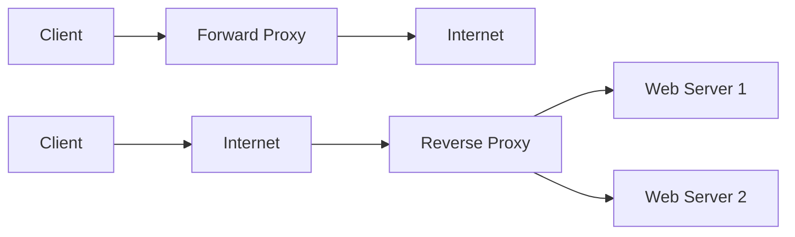
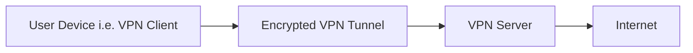
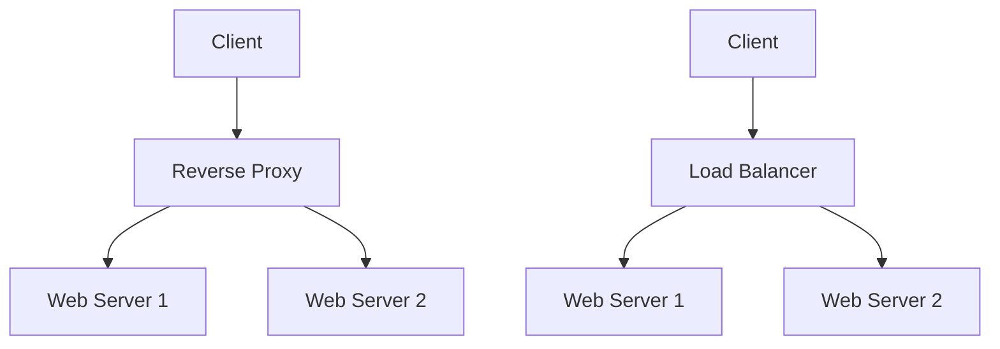
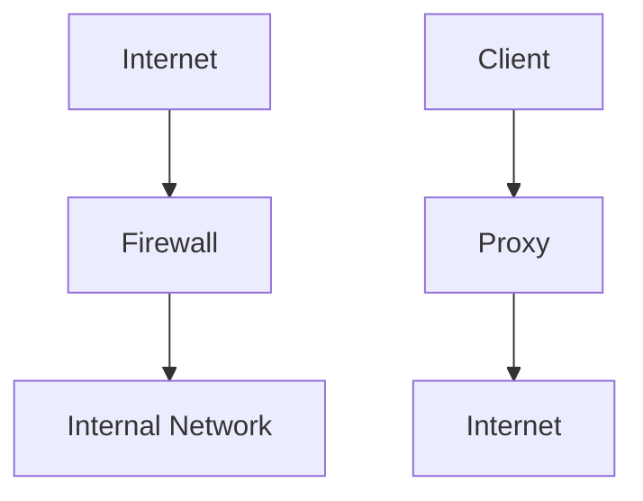

Let's learn about proxy servers.

## Proxy Server 🌐

A proxy server **acts as an intermediary** between a client and a server, forwarding requests and responses between them. It can provide various benefits such as improved security, performance, and anonymity. 🛡️🚀

### Types of Proxy Servers

- **Forward Proxy 🔜:** Sits between client devices and the internet, forwarding client requests to web servers.
- **Reverse Proxy 🔙:** Sits in front of web servers, forwarding client requests to the appropriate backend server.
    
    Example → CDN
    

### Advantages of Proxy Servers 👍

- Enhanced privacy and anonymity 🕵️‍♀️
- Improved security  🛡️
- Caching for faster access to frequently requested content 🚀
- Load balancing capabilities (for reverse proxies) ⚖️
- Ability to bypass geo-restrictions 🌍

### Disadvantages of Proxy Servers 👎

- Potential single point of failure 🚧
- May introduce latency 🐢
- Can be bypassed by determined attackers 🦹‍♂️
- Works on application layer - need to setup for every app individually 🔧

Example: Caching Proxy

## VPN (Virtual Private Network) 🔒

A VPN creates a secure, encrypted tunnel between a device and a VPN server, routing all internet traffic through this tunnel. It provides privacy, security, and the ability to access geographically restricted content. 🌐🔐

## Differences 

Now, let's see the differences between some of the confusing terms.

### Differences between Proxy and VPN

VPN works on lower layers (transport, network or data layer), while proxy works on application layer.

- **Encryption 🔐:** VPNs encrypt all traffic, while proxies typically don't.
- **Scope 🌐:** VPNs route all device traffic, proxies usually only handle specific applications or protocols.
- **Speed 🚀:** Proxies are often faster due to less encryption overhead.
- **Security 🛡️:** VPNs generally offer better security and privacy.

Example: Remote Work VPN

### Reverse Proxy vs. Load Balancer

While both can distribute traffic across multiple servers, they have distinct purposes:

- **Reverse Proxy 🔙:** Primarily focuses on forwarding client requests to the appropriate backend server, can handle caching, SSL termination, and security functions.
- **Load Balancer ⚖️:** Specifically designed to distribute incoming traffic across multiple servers to ensure no single server becomes overwhelmed.

A reverse proxy can include load balancing features, but a dedicated load balancer typically offers more advanced traffic distribution algorithms and health checking capabilities.

Example: E-commerce Website

### Proxy vs. Firewall

- **Proxy 🌐:** Acts as an intermediary for requests, can provide caching and anonymity.
- **Firewall 🧱:** Monitors and controls incoming and outgoing network traffic based on predetermined security rules. It acts as a filter for the data.

While both can enhance security, firewalls are primarily focused on network security, whereas proxies are more about managing and optimizing traffic flow. Some advanced firewalls may include proxy functionality, and some proxy servers may include firewall-like features. 🛡️🔄

Example: Corporate Network Security

## References
- VSCode Mermaid extention: [Markdown Preview Mermaid Support](https://marketplace.visualstudio.com/items?itemName=bierner.markdown-mermaid)
- Mermaid documentation: [Mermaid](https://mermaid.js.org/syntax/flowchart.html)