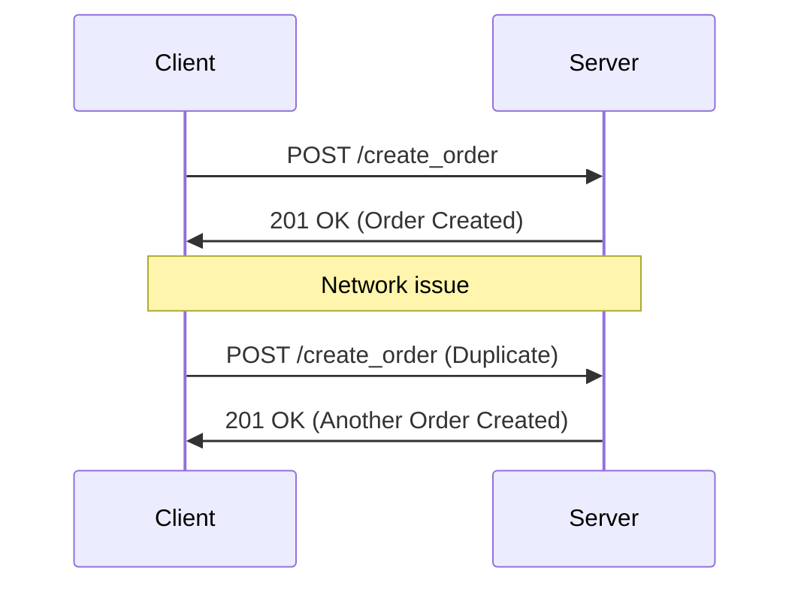
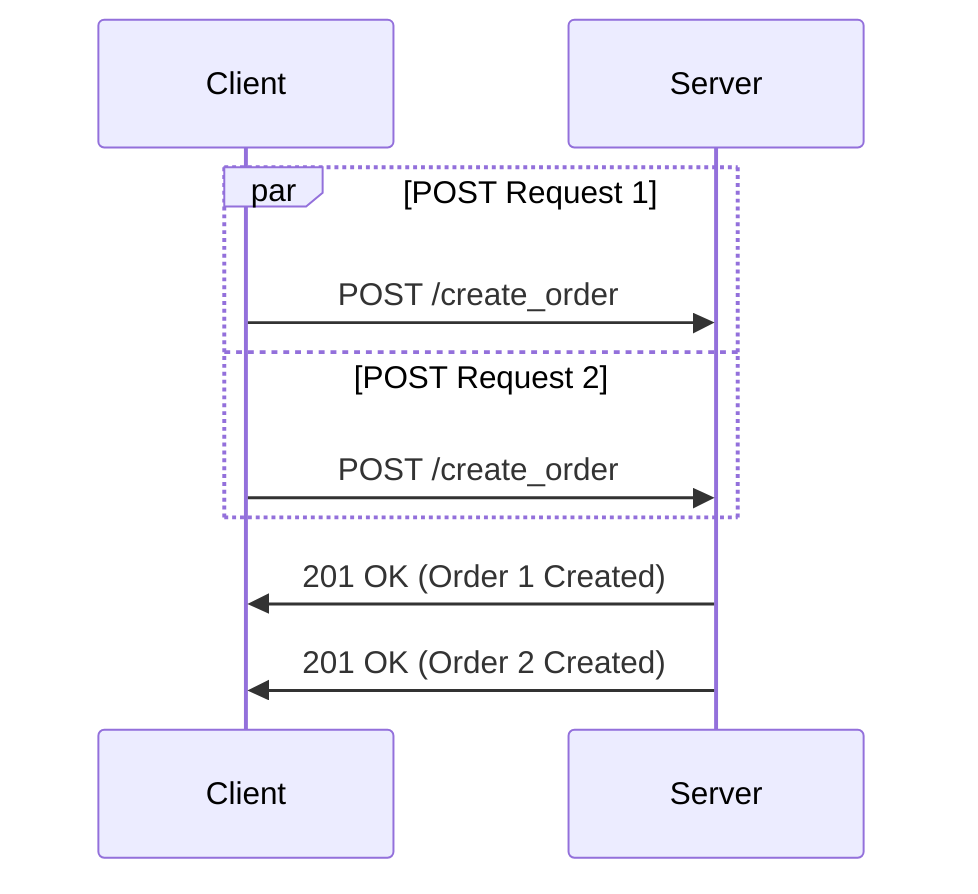
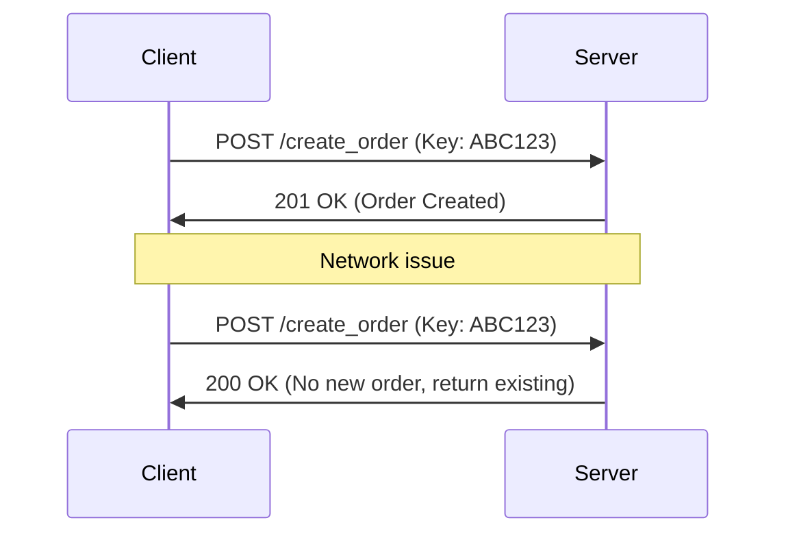
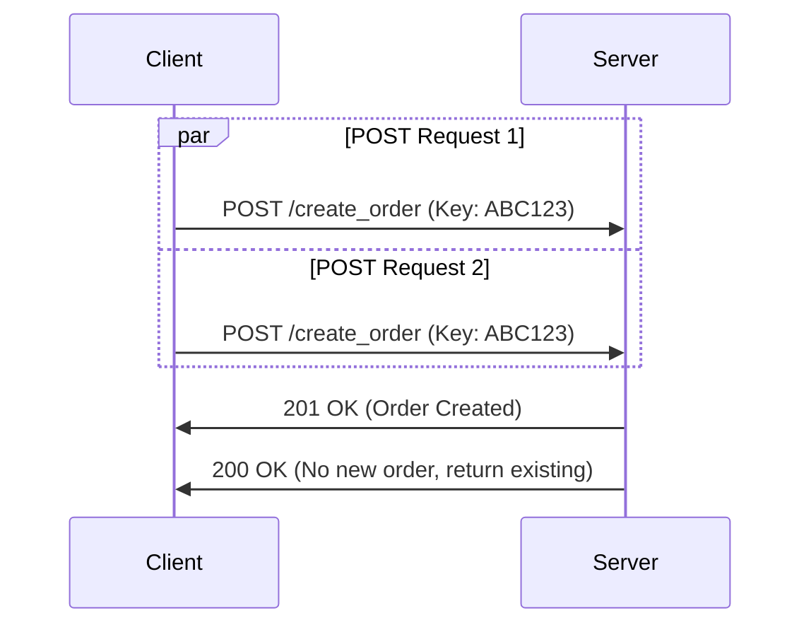

# Request Handling

In this page we will learn about how to handle some special request scenarios that might cause errors in your system.

# Idempotent POST API

Idempotency is a crucial concept in API design, especially for POST requests. Let's explore the problem and its solutions! 🔍

## The Idempotency Problem 🔄

POST requests are not naturally idempotent, meaning repeated identical requests can have additional side effects. This can lead to issues in various scenarios:

### 1. Sequential Duplicate Requests 📊

In this scenario, a Network issue causes the client to resend the request, potentially creating duplicate orders.

### 2. Parallel Duplicate Requests 🔀

Here, multiple requests are sent simultaneously, potentially due to user action or client-side issues, leading to duplicate orders.

## Solving with Idempotent Keys 🔑

To solve this, we can use idempotent keys. Here's how it works:

### 1. Sequential Case Solution

- The server stores the idempotent key (e.g., ABC123) in a database along with the associated order details.
- When a request initially arrives, its status is marked as **“created”** in the database.
- When a request is processed, its status is changed to **“consumed”** in the database.
- If a duplicate request with the same key arrives, the server checks the database and returns the existing response.
- Idempotent keys are typically stored for a limited time, often 24-48 hours, to balance between reliability and database efficiency.
- After the storage period, keys are usually removed to free up space and allow reuse.

This approach ensures that even if multiple requests are sent, only one order is created, maintaining data consistency.

**Example**: Correlation id and tags are used as Idempotent keys.

### 2. Parallel Case Solution

In the parallel case, mutual exclusion is crucial to prevent race conditions and ensure data consistency. Here's how it works:

- When multiple requests with the same idempotent key arrive simultaneously, the server uses a **locking mechanism** to process them one at a time.
- The first request to acquire the lock proceeds with creating the order, while others wait.
- Once the first request completes, it releases the lock and stores the result.
- Subsequent requests, upon acquiring the lock, check if a result already exists for their idempotent key.
- If a result exists, they return that result without creating a new order.
- If no result exists (due to an error in the first request), the current request proceeds with order creation.

This mutual exclusion ensures that only one order is created even when multiple parallel requests are made, maintaining data integrity and preventing duplicates.

## Client-Server Agreement 🤝

For this system to work effectively, clients and servers must agree on certain principles:

1. Clients generate unique idempotent keys for each distinct operation 🔢
2. Servers store these keys and associated responses 💾
3. Servers return the stored response for duplicate keys ♻️
4. Keys have a defined lifespan (e.g., 24 hours) ⏳
5. Clients handle both successful responses and error states consistently 🛠️

By implementing these practices, we can make POST requests effectively idempotent, preventing unintended duplicates and enhancing system reliability. 🚀

## Handling Eventual Consistency in Distributed Databases for Idempotent APIs

When dealing with distributed databases that have eventual consistency, additional considerations are needed for implementing idempotent APIs. Here's how we can address this challenge:

### Use a Centralized Idempotency Store

Implement a separate, centralized database or cache (e.g., Redis) specifically for storing idempotency keys and their states. This store should be strongly consistent and quickly 

By implementing these strategies, we can maintain idempotency in distributed systems with eventual consistency, ensuring reliable and consistent API behavior.

