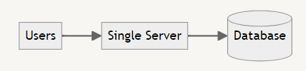
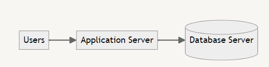
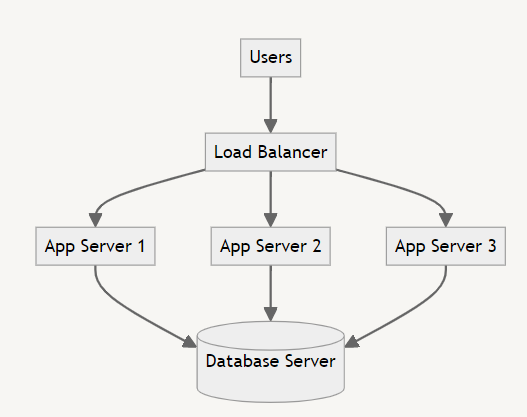
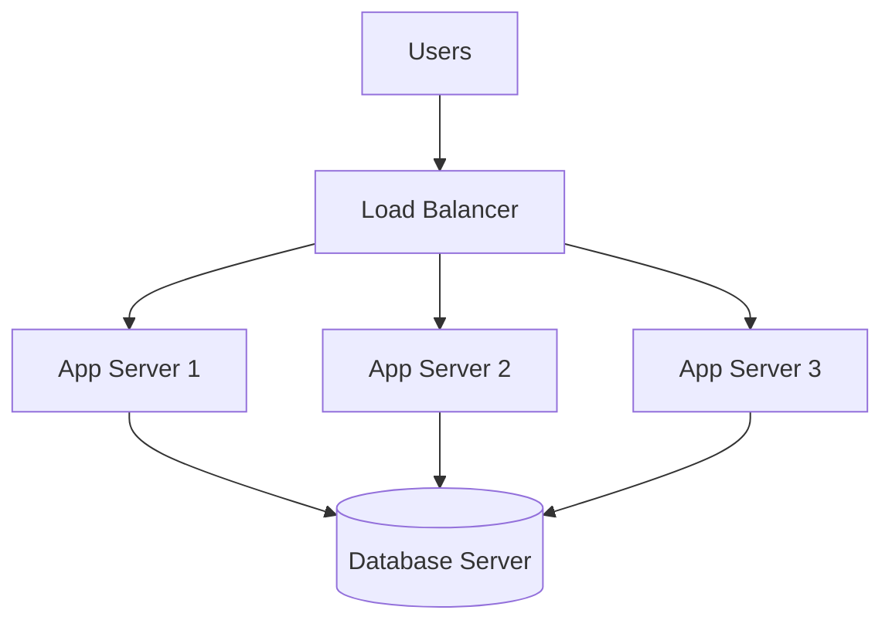
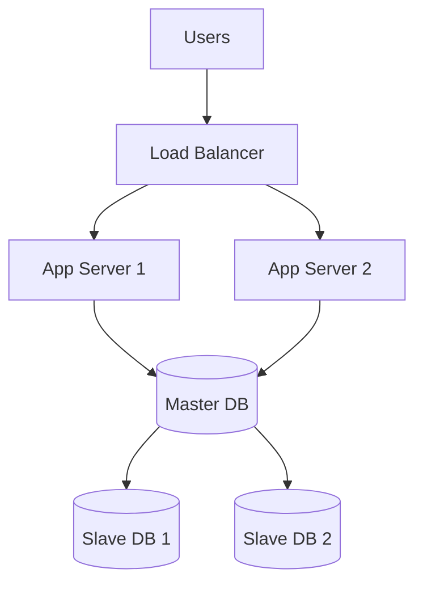
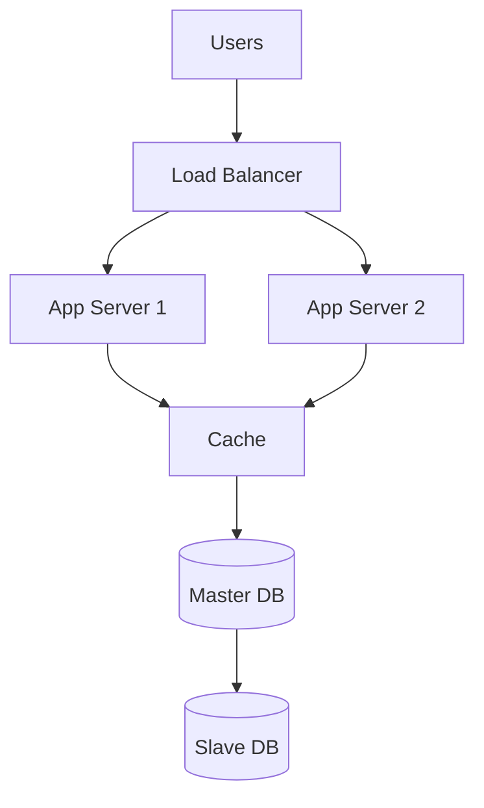
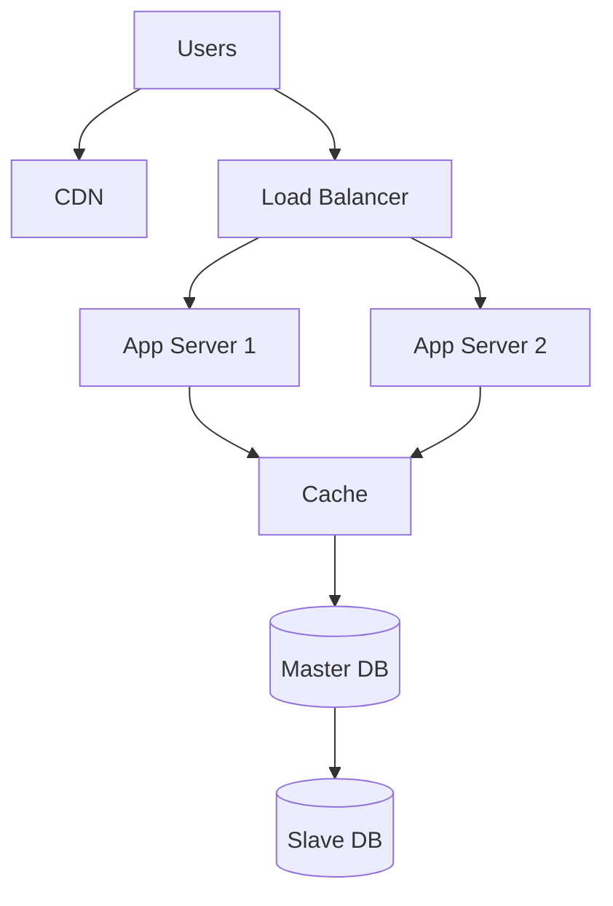
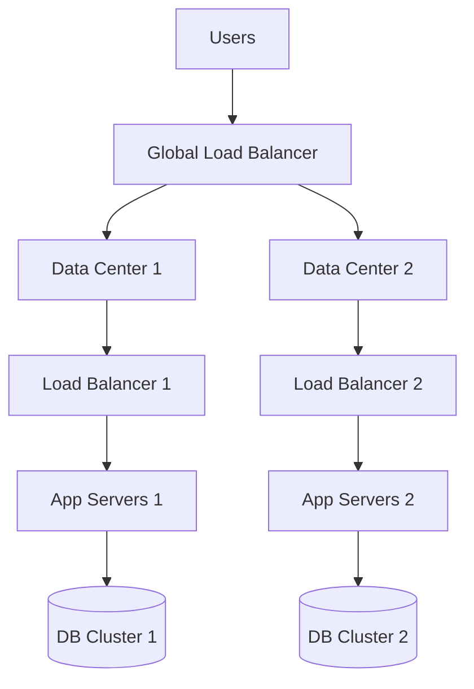
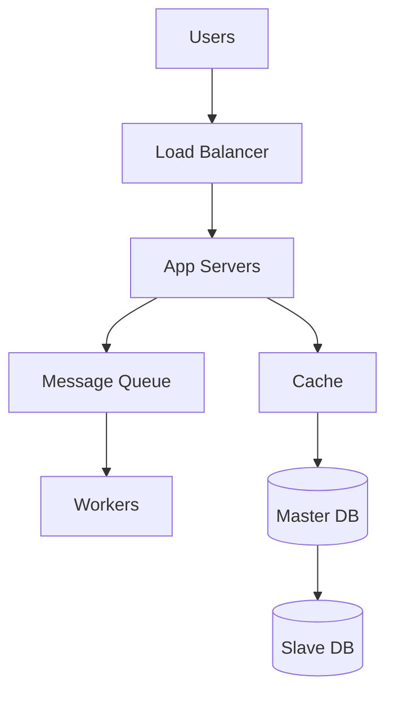
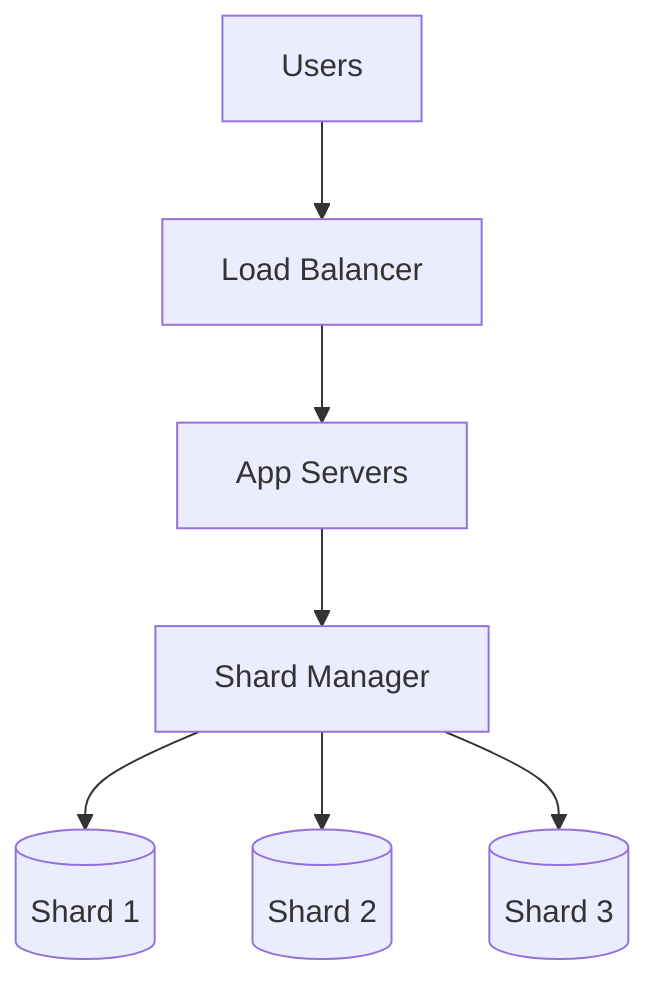

# Scale from 0 to Million Users

In this problem, we will try to scale a single application server so that it is able to handle million requests per second.

## 1. Single Server 🖥️

Initially, we start with a single server that handles everything: the application, database, and web server.

**Pros:**
- Simple to set up and manage
- Cost-effective for small-scale applications

**Cons:**
- Limited scalability
- Single point of failure
- Performance issues as user base grows

## 2. Application & DB Server Separation 🔀

Next, we separate the application and database into different servers to improve performance and scalability.

**Pros:**
- Improved performance
- Better resource allocation
- Easier to scale components independently

**Cons:**
- Increased complexity
- Higher infrastructure costs
- Potential network latency between servers

### 3. Load Balancer + Multiple App Servers ⚖️

To handle more users, we introduce a load balancer and multiple application servers.

**Pros:**
• Improved availability and fault tolerance
• Better performance under high load
• Easier horizontal scaling

**Cons:**
• Increased complexity in configuration and management
• Need for session management across servers
• Higher infrastructure costs

### 4. Database Replication 🔄

To improve database performance and reliability, we implement database replication.

**Pros:**
• Improved read performance
• Better fault tolerance and data redundancy
• Load distribution for read operations

**Cons:**
• Complexity in maintaining data consistency
• Potential replication lag
• Increased storage costs

### 5. Cache 💾

Introducing a caching layer to reduce database load and improve response times.

**Pros:**
• Faster data retrieval for frequently accessed data
• Reduced database load
• Improved application performance

**Cons:**
• Cache invalidation challenges
• Potential data inconsistency
• Additional complexity in application logic

### 6. Content Delivery Network (CDN) 🌐

Implementing a CDN to serve static content faster and reduce load on application servers.

**Pros:**
• Faster content delivery for geographically distributed users
• Reduced load on origin servers
• Improved user experience

**Cons:**
• Additional cost for CDN services
• Complexity in managing content updates
• Potential issues with content freshness

### 7. Multiple Data Centers 🏢🏢

Expanding to multiple data centers for improved availability and disaster recovery.

**Pros:**
• Improved global availability and performance
• Better disaster recovery capabilities
• Reduced latency for geographically distributed users

**Cons:**
• Significantly increased infrastructure costs
• Complex data synchronization across data centers
• Challenges in maintaining consistency across locations

### 8. Message Queue 📨

Introducing a message queue for asynchronous processing and improved system decoupling.

**Pros:**
• Improved system reliability and fault tolerance
• Better handling of traffic spikes
• Decoupling of system components

**Cons:**
• Increased system complexity
• Potential message processing delays
• Need for careful queue management

### 9. Database Scaling 📊

Implementing database sharding for horizontal scaling of the database layer.

**Pros:**
• Improved database performance and scalability
• Better handling of large datasets
• Potential for more efficient queries

**Cons:**
• Increased complexity in data management and querying
• Challenges in maintaining data consistency across shards
• Potential need for application-level changes

By implementing these steps, you can scale a single application server to support millions of users. Each step addresses specific scalability challenges, but also introduces new complexities. The key is to implement these solutions incrementally based on your application's growth and specific requirements. 🚀