# Scale from 0 to Million Users

In this problem, we will try to scale a single application server so that it is able to handle million requests per second.

## 1. Single Server 🖥️

Initially, we start with a single server that handles everything: the application, database, and web server.

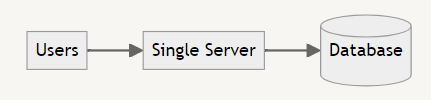

### Pros
- Simple to set up and manage
- Cost-effective for small-scale applications

### Cons
- Limited scalability
- Single point of failure
- Performance issues as user base grows

## 2. Application & DB Server Separation 🔀

Next, we separate the application and database into different servers to improve performance and scalability.

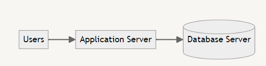

Here, we have a 2-tier architecture: 🎭

- Tier 1: Application Server (Presentation and Application Logic) 🖥️
- Tier 2: Database Server (Data Management) 🗄️

### Pros 🚀
- Improved performance
- Better resource allocation
- Easier to scale components independently
- Flexibility in the system design.

### Cons
- Increased complexity
- Higher infrastructure costs
- Potential network latency between servers

## 3. Load Balancer + Multiple App Servers ⚖️

To handle more users, we introduce a load balancer and multiple application servers.

## Load Balancing 🔀

Load balancing is the process of distributing network traffic across multiple servers to ensure that no single server becomes overloaded. This helps to improve the performance, availability, and scalability of a system, as well as prevent downtime and service disruptions. 🚀

In a load-balanced system, incoming requests are distributed among a group of servers that work together to handle the traffic. This can be achieved using a variety of algorithms, such as round-robin, least connections, and IP hash. Load balancers can also perform health checks on servers to ensure that they are available and functioning properly before sending traffic to them. 🔍

### Load Balancing using Hashing 🔢

In load balancing using hashing, a hash function is used to map incoming requests to a particular server based on a key value, such as the client's IP address or session ID. This ensures that all requests from a particular client are sent to the same server, which can help to improve performance and reduce the likelihood of errors due to inconsistent data. 🔐

However, it can also lead to uneven load distribution if the key values are not evenly distributed. To address this, some load balancing algorithms use a combination of hashing and other factors, such as server load and response time, to determine which server to send requests to. ⚖️

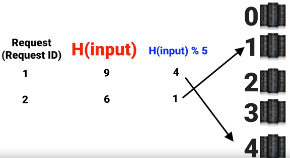

*Fig: Distributing load using hash ([credit](https://afteracademy.com/))* 

### Consistent Hashing 🔄

Consistent hashing is a technique used in load balancing that ensures that the distribution of requests among servers remains stable even when servers are added or removed from the system. 🛠️

In consistent hashing, each server is assigned a unique identifier or "hash" value, which is used to map incoming requests to a particular server. The hash function used to generate these values ensures that each server is evenly distributed across the hash space, allowing for efficient and consistent load balancing even as the system scales up or down. 🌐

When a new server is added to the system, only a small portion of the requests need to be remapped, as the majority of requests will still be directed to the same servers as before. This can help to reduce the impact of adding or removing servers on the system's performance and availability. 🔧

However, consistent hashing can also introduce some challenges, such as "hot spots" where a single server receives a disproportionate amount of traffic, or the need to rebalance the system periodically to ensure that servers are evenly distributed. 🔥

**Case 1: Scale down 📉**

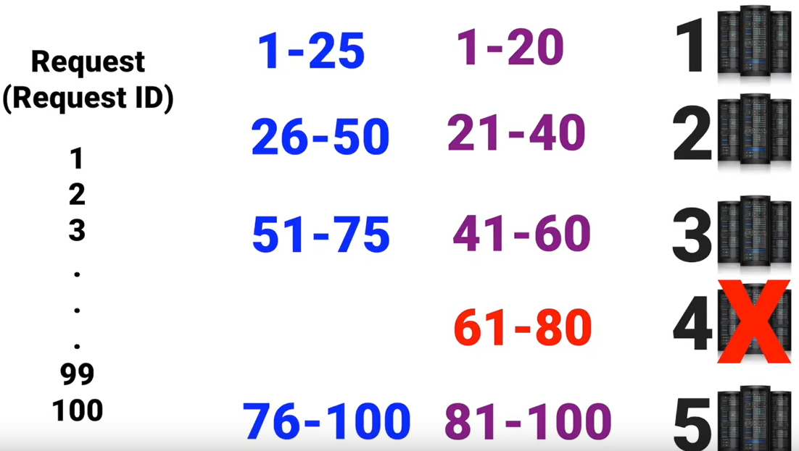

*Fig: In case of scale down, we need to redistribute load ([credit](https://afteracademy.com/))*

**Case 2: Scale up 📈**

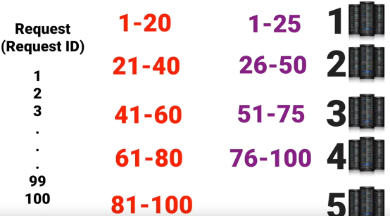

*Fig: In case of scale up, we need to redistribute load ([credit](https://afteracademy.com/))*

### Working ⚙️

In consistent hashing, a hash function is used to map each server to a point on a circle (usually using a 32-bit or 64-bit integer). The output of the hash function is a value between 0 and 2^32-1 or 2^64-1, represented as a point on the circle. 🔢

Similarly, each object or request that needs to be mapped to a server is also hashed to a point on the same circle using the same hash function. 🎯

To find which server should handle a particular request, the system looks for the first server that appears after the point representing the request on the circle **(in clockwise direction**). This server is responsible for handling the request. 🔄

If a server is added to or removed from the system, only the requests that fall between the new server and the next server on the circle need to be remapped. This means that most of the requests will still be directed to the same servers as before, minimizing the impact of adding or removing servers on the system's overall load. 🔀

In summary, consistent hashing works by mapping servers and requests to points on a circle using a hash function, and then using the circle to determine which server should handle each request. This allows for efficient and consistent load balancing even as the system scales up or down. 🌟

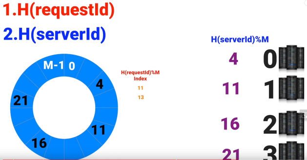

*Fig: Consistent hashing using circular array representing servers and requests ([credit](https://afteracademy.com/))*

### Virtual servers 💻

To handle the case of scale up and down, we use virtual servers. Using multiple hash functions for uniform distribution of load after adding or removing server from circular array.

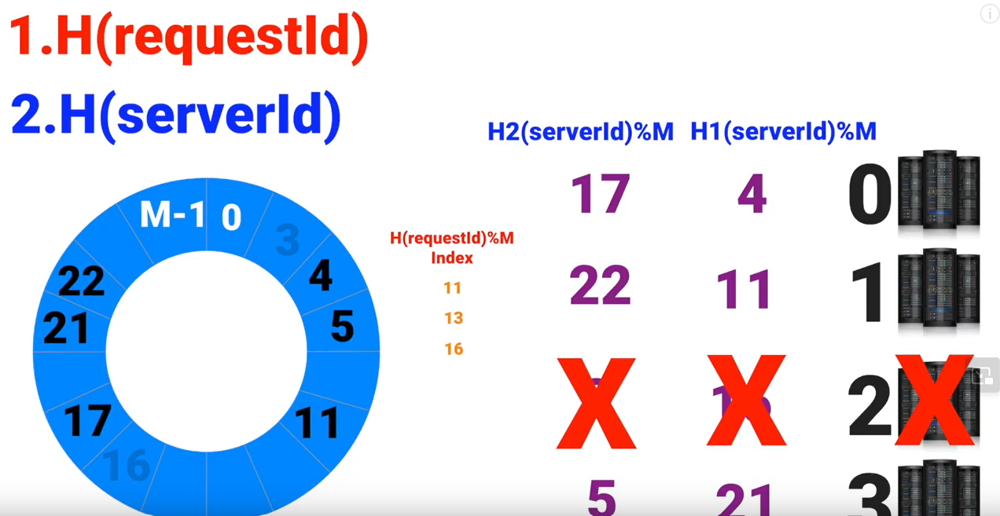

*Fig: Using virtual servers to handle scale up and down ([credit](https://afteracademy.com/))*

By using virtual servers, we make sure: -

- If a server is removed, it will we removed from multiple indexes on array. 🔽
- If a server is added, it will be added at multiple indexes on array. 🔼

This guarantee a uniform distribution of load. ⚖️

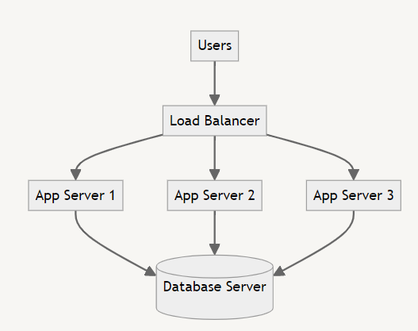

*Fig: Added load balancer before application servers*

### Pros
- Improved availability and fault tolerance
- Better performance under high load
- Easier horizontal scaling

### Cons
- Increased complexity in configuration and management
- Need for session management across servers
- Higher infrastructure costs

## 4. Database Replication 🔄

To improve database performance and reliability, we implement database replication.

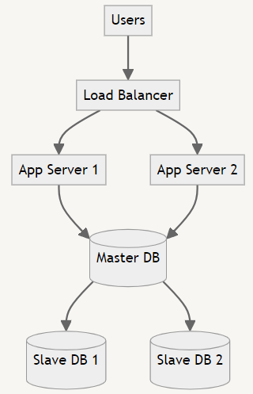

The **Master-slave database 💾 architecture design pattern** is a common approach in distributed systems for improving performance, scalability, and reliability. Here's how it works: 

We have 1 master database node and several slave database nodes. The data is replicated among these slave databases.

#### Master Database 🧑‍🏫
- Handles all write operations (INSERT, UPDATE, DELETE).
- Can handle read operations, but typically offloads them to slaves.
- Changes are asynchronously replicated to slave databases.

#### Slave Databases 🧑‍🎓
- Receive and apply updates from the master database.
- Read operatioins are distributed among slave databases, reducing load on the master.
- Can be scaled horizontally to handle increased read traffic.

Let's talk about the failure scenarios, to understand it's fault tolerance.
- **Master Failure**: A slave can be promoted to become the new master.
- **Slave Failure**: Reduces read capabity but other slaves can handle the load.

### Pros 💹
- Improved read performance
- Better fault tolerance and data redundancy
- Load distribution for read operations

### Cons 📉
- Complexity in maintaining data consistency
- Potential replication lag
- Increased storage costs

## 5. Cache 💾

Introducing a caching layer to reduce database load and improve response times.

 Caching 🚀 is the process of storing frequently accessed data in a temporary storage location, such as a **cache**, to reduce the time and resources needed to retrieve it from its original source. This improves system performance and responsiveness, especially for data that's frequently accessed or requires significant processing. 💾

Caching 🔄 can be implemented at various system levels, including application, web server, and **database layers**. It can store diverse data types like static files, database queries, and API responses. Caching is particularly useful for **expensive database operations**, acting as a buffer before accessing the database. 🗃️

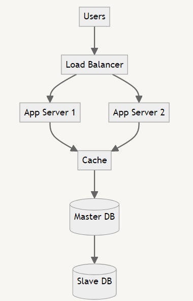

**Time-to-Live (TTL) ⏳** is a crucial concept in caching, determining how long data remains valid in the cache before needing refresh. This helps maintain data freshness and relevance. 🕒

Example: Redis 💡, an in-memory data structure store, is widely used as a database, cache, and message broker. It supports various data structures and provides features like persistence and high availability, making it an excellent choice for caching solutions. 🛠️

### Pros
- Faster data retrieval for frequently accessed data
- Reduced database load
- Improved application performance

### Cons 🚨
- Cache invalidation challenges 
- Maintaining data consistency across multiple cache instances challenges.
- Additional complexity in application logic

## 6. Content Delivery Network (CDN) 🌐

Implementing a CDN to serve static content faster and reduce load on application servers.

A Content Delivery Network (CDN) is a geographically distributed network of proxy servers and their data centers. The primary purpose of a CDN is to deliver content to end-users with high availability and performance. 🌍🏎️

### Key Concepts of CDNs 🗝️

- **Caching, but not just caching:** While CDNs do cache content, not all caching systems are CDNs. CDNs are specifically designed for content delivery across vast geographic areas. 🗺️
- **Latency reduction:** CDNs solve the problem of network latency by serving content from nodes closer to the end-user. ⚡
- **Static and dynamic content:** CDN nodes primarily cache static data (images, videos, CSS, JavaScript), but modern CDNs can also handle dynamic content. 🖼️🎥

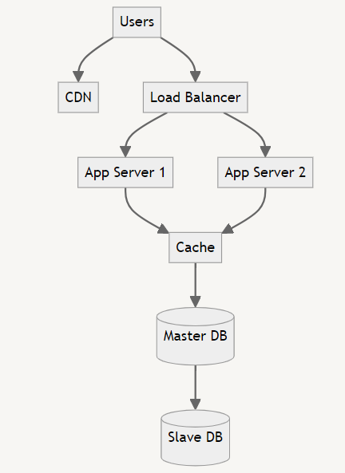

### How CDNs Work: An Example 🌟

Imagine a website's origin server is in USA, but it has users worldwide. Here's how a CDN helps:

1. A user in the Africa requests content from the website.
2. The request first goes to the nearest CDN node in the Europe. 🏙️
3. If the CDN node has the content cached, it serves it directly. ✅
4. If not, it requests the content from the origin server in USA.
5. The CDN node then caches this content for future requests. 💾

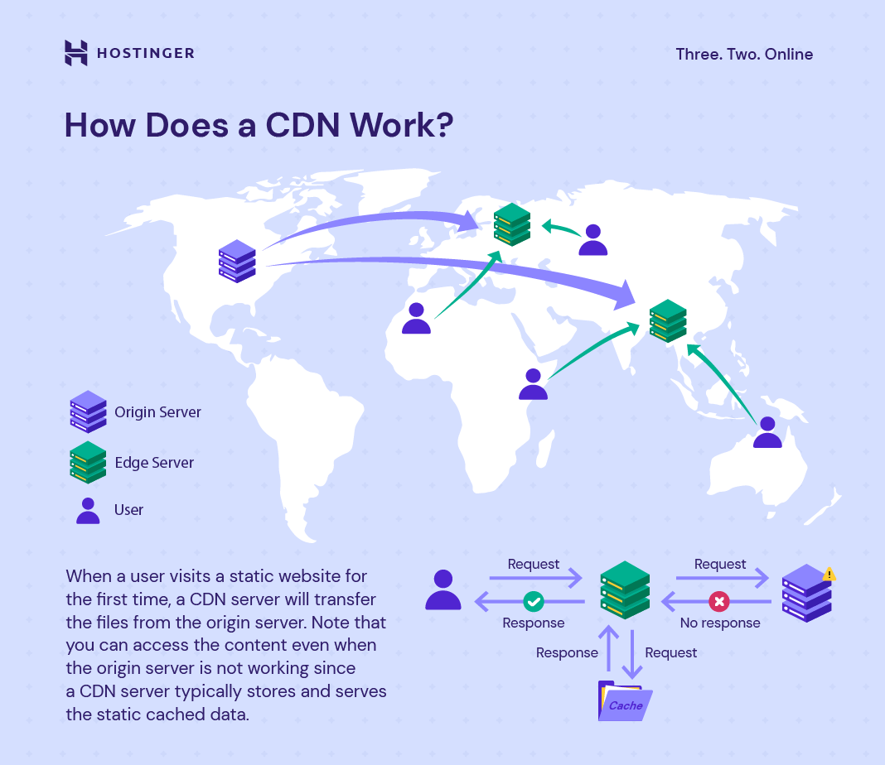

*Fig: CDN answering requests from CDN cache in case of no response from server*

In summary, CDNs are a crucial component of modern web infrastructure, enhancing user experience, security, and performance on a global scale. 🌐🚀

### Pros 📊
- **Performance:** Faster content delivery due to reduced distance between users and content. 🏎️
- **Security:** CDNs can provide DDoS protection and improve security with SSL/TLS certificates. 🛡️
- **Cost-cutting:** Reduces the load on origin servers, potentially lowering hosting costs. 💰
- **Reliability:** Improves availability by distributing content across multiple nodes. 🔄
- Improved user experience

### Cons
- Additional cost for CDN services
- Complexity in managing content updates
- Potential issues with content freshness

## 7. Multiple Data Centers 🏢🏢

Expanding to multiple data centers for improved availability and disaster recovery. Traffic is distributed among different centers based on geographical areas.

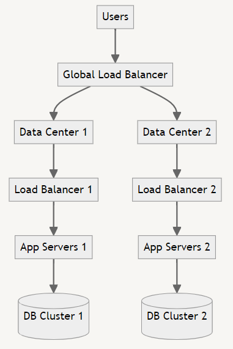

Managing data consistency across multiple data centers is a complex task, often involving trade-offs between consistency, availability, and partition tolerance (CAP theorem) 🔍

### Pros 💹
- **Redundancy**: Having data replicated across multiple data centers ensures that if one data center fails, the data is still accessible from other locations.
- **Performance**: Storing data closer to users in different geographic regions can reduce latency and improve access times.
- **Disaster recovery**: In case of a catastrophic event at one data center, having the data replicated elsewhere allows for quick recovery and business continuity.
- Improved global availability

### Cons 📉
- Significantly increased infrastructure costs (Redundant data)
- Complex data synchronization across data centers
- Challenges in maintaining consistency across locations

Following architecture designs are used while maintaing multiple data centers for your application.

### Active-Passive Architecture 🔵⚪

In an active-passive setup, one data center (the active site) handles all the traffic while the other (passive site) remains on standby, ready to take over if the active site fails. 🚦

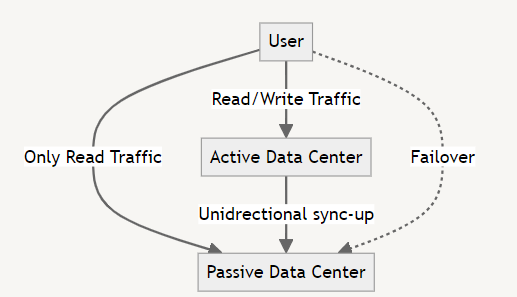

*Fig: Active-passive Architecture*

This architecture is used with databases that don't natively support **multi-master replication** 🔒 (only one node is allowed to perform write operations)

Examples: Traditional relational databases like MySQL (without group replication), PostgreSQL (without multi-master extensions) 🐘

**Advantages:**

- Simple configuration and management 🛠️
- Clear separation of concerns 🧩
- Reduced risk of data conflicts 🔒

**Disadvantages:**

- Underutilization of resources in the passive site 💤
- Potential for longer downtime during failover ⏱️

**Example:** A financial institution using a primary data center for all transactions, with a secondary site ready for disaster recovery. 🏦

### Active-Active Architecture 🔵🔵

In an active-active configuration, all data centers actively handle traffic simultaneously, distributing the load and providing redundancy. 🔄

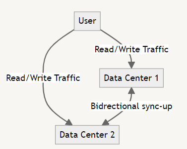

*Fig: Active-Active Architecture*

This architecture is used with databases that has multi-master support or conflict resolution mechanisms 🔀

**Examples**: Cassandra, CockroachDB, MongoDB (with sharding), MySQL (with group replication or Galera), PostgreSQL (with BDR) 🌟

**Advantages:**

- Better resource utilization 📈
- Improved performance and reduced latency 🚀
- Higher availability (99.999%) and fault tolerance 🛡️

**Disadvantages:**

- More complex to set up and manage 🧠
- Potential for data conflicts and synchronization issues 🔄
- Higher bandwidth requirements for inter-datacenter communication 🌐

**Example:** A global e-commerce platform using multiple data centers to serve customers in different regions with low latency. 🛍️

The choice between active-passive and active-active architectures depends on factors like application requirements, budget, geographical distribution of users, and the specific capabilities of your database system. 🤔

## 8. Message Queue 📨

Introducing a message queue for asynchronous processing and improved system decoupling.

Think of a message queue like a to-do list 📃 for your computer. When you have a big task that might take a while, instead of doing it right away, you write it down on your to-do list. This way, you can keep doing other things without getting stuck waiting for that big task to finish.

In the same way, message queues are mostly used for internal background tasks on the server, not for directly serving users. Here's how it works:

- When a user does something that needs a lot of work (like uploading a big video 📽️), the server quickly says "Got it!" to the user
- Then, instead of making the user wait, the server puts that big job on its to-do list (the message queue)
- The user can go do other things while waiting
- Meanwhile, other parts of the server (called workers 👷‍♀️) look at this to-do list and start working on these tasks one by one

This helps keep everything running smoothly 🧈, even when there's a lot going on. It's like having a team of helpers working on big tasks in the background while you keep talking to your users without making them wait.

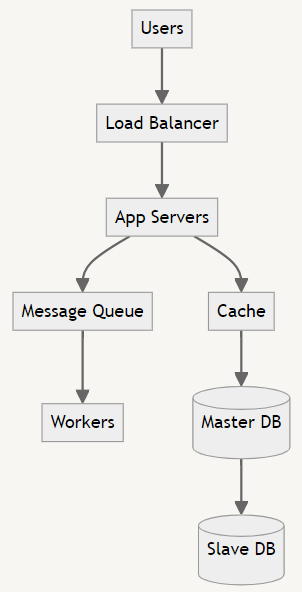

### Message Queue Components 🧩

**1. Producer 🏭:** The application or service that creates messages and sends them to the message queue.

**2. Message Queue 📬:** A buffer that stores messages until they are processed by a consumer.

**3. Consumer/Subscriber (Workers) 👥:** The application or service that receives and processes messages from the queue.

    Multipler workers can be set up to process messages in paralle, improving system's ability to handle high volume of tasks.

**4. Requeue ♻️:** The process of putting a message back into the queue if it wasn't processed successfully.

### Exchange 🚀

In systems like RabbitMQ, an exchange is responsible for routing messages to different queues based on rules.

- **Queue 📦:** The actual buffer where messages are stored.

- **Binding 🔗:** The relationship between an exchange and a queue.

- **Routing Key 🔑:** A message attribute the exchange looks at when deciding how to route the message.

- **Binding Key 🗝️:** The "filter" on a queue binding. The exchange will compare the routing key to the binding key when deciding where to send messages.

#### Types of Exchanges 🔄

**1. Direct Exchange 🎯:** Delivers messages to queues based on an exact match between routing key and binding key.

**2. Fanout Exchange 📢:** Broadcasts all messages to all bound queues, ignoring routing keys.

**3. Topic Exchange 🌐:** Routes messages to queues based on wildcard matches between the routing key and the binding key pattern.

### Examples📊

Let's look at some examples using RabbitMQ and Kafka:

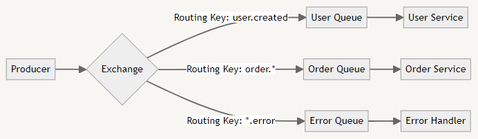

*Fig: RabbitMQ example*

- The Producer sends messages to the Exchange
- The Exchange routes messages to different queues based on the routing key
- Consumers process messages from their respective queues

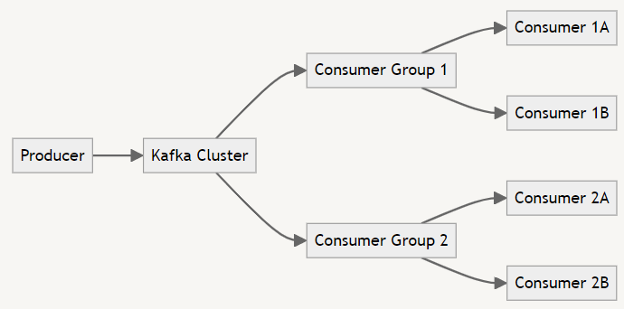

*Fig: Kafka example*

- The Producer sends messages to a Kafka topic in the Kafka Cluster
- Multiple Consumer Groups can read from the same topic
- Each message is delivered to one consumer within each subscribed consumer group

Both RabbitMQ and Kafka are powerful message queue systems, but they have different use cases:

**RabbitMQ 🐰:** Great for complex routing scenarios and when you need guaranteed message delivery.

**Kafka 🍃:** Excels in high-throughput scenarios and when you need to replay messages or store them for a long time.

By using message queues, you can create more resilient, scalable, and decoupled systems! 🚀💪

### Pros 🦾
- Improved system reliability and fault tolerance
- Better handling of traffic spikes
- Decoupling of system components

### Cons 🚧
- Increased system complexity
- Potential message processing delays
- Need for careful queue management

## 9. Database Scaling 📊

Implementing database sharding for horizontal scaling of the database layer.

### Database Scaling 📊

There are two main types of database scaling:

- **1. Vertical Scaling (Scale Up) 🏗️:** Increasing the resources (CPU, RAM, storage) of a single server.
- **2. Horizontal Scaling (Scale Out) 🌐:** Adding more servers to distribute the load.

While vertical scaling is simpler, it has limits and can be expensive. Horizontal scaling is generally preferred for large-scale systems as it offers better scalability and cost-effectiveness. 💰

### Database Sharding for Horizontal Scaling 🧩

Sharding involves partitioning data across multiple database instances, where each instance (shard 🍰) contains a subset of the total data. 

#### Types of Sharding 🔀

- **1. Horizontal Sharding:** Rows of a table are distributed across multiple databases.
- **2. Vertical Sharding:** Different tables or columns are distributed across multiple databases.

Consistent hashing can be used in horizontal scaling too. Here's a visual representation of horizontal vs vertical sharding:

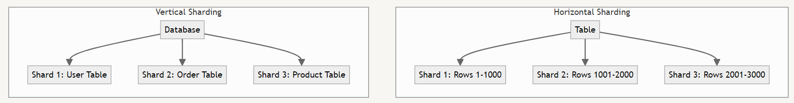

*Fig: Horizontal and vertical sharding*

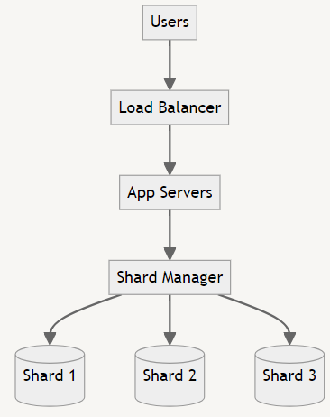

### Pros
- Improved database performance and scalability
- Better handling of large datasets
- Potential for more efficient queries

### Cons
- **Increased complexity** in data management and querying
- **Join Operations:** Joins across shards can be slow and complex. 🐢
- **Potential for Data Inconsistency:** Maintaining consistency across shards requires careful design. 🔄
- **Increased Hardware and Maintenance Costs:** More servers mean higher costs. 💸
- Potential need for application-level changes

Despite these challenges, sharding remains a powerful tool for scaling databases in large systems. The key is to carefully consider your specific needs and implement sharding strategically. 🔑

#### Difference between database replication and database sharding:

- **Data Distribution:** Replication duplicates all data, while sharding partitions data.
- **Write Performance:** Sharding can improve write performance, while replication doesn't.
- **Complexity:** Sharding is generally more complex to implement and manage.
- **Query Complexity:** Queries in a sharded system can be more complex, especially for operations across multiple shards.

By implementing these steps, you can scale a single application server to support millions of users. Each step addresses specific scalability challenges, but also introduces new complexities. The key is to implement these solutions incrementally based on your application's growth and specific requirements. 🚀

## References 👏

1. [AfterAcademy](https://afteracademy.com/)
2. [Concept && Coding](https://www.youtube.com/watch?v=rExh5cPMZcI&list=PL6W8uoQQ2c63W58rpNFDwdrBnq5G3EfT7&index=6&pp=iAQB)