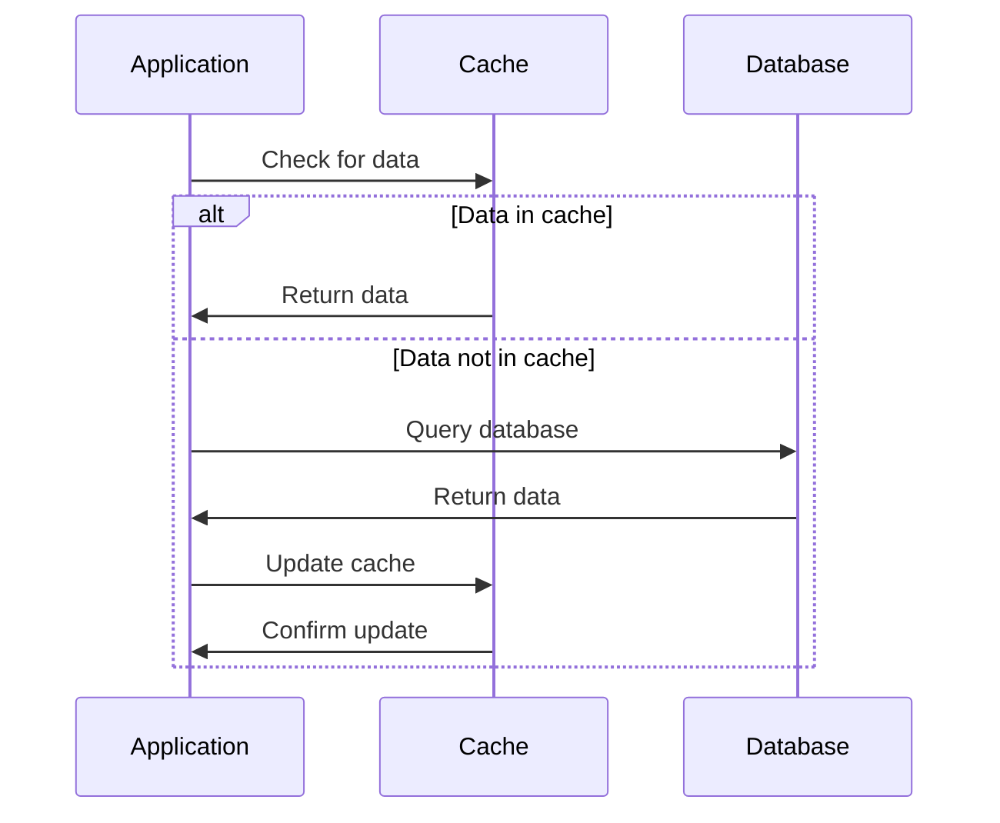
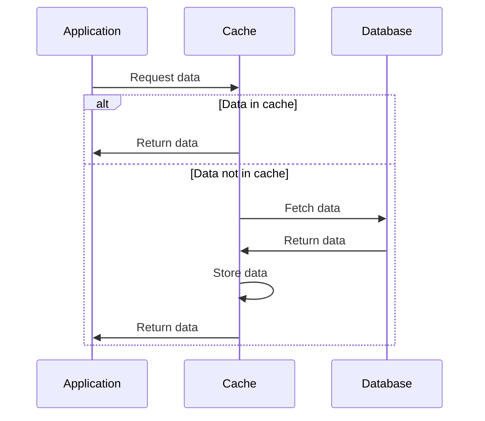
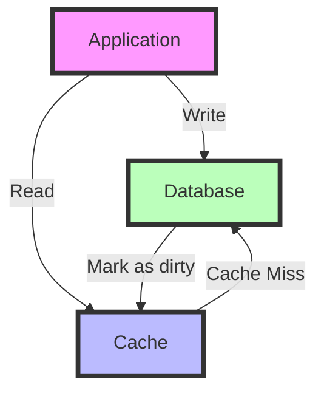
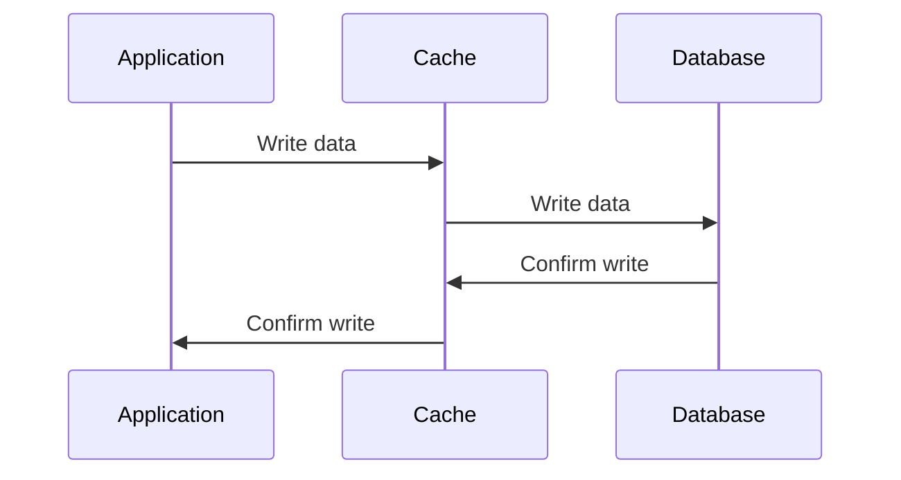
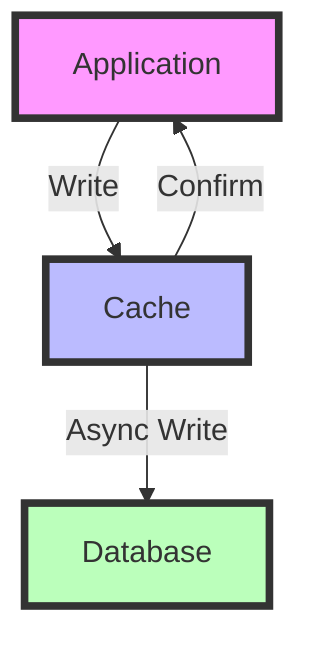

# Scale from 0 to Million Users

In this problem, we will try to scale a single application server so that it is able to handle million requests per second.

## 1. Single Server 🖥️

Initially, we start with a single server that handles everything: the application, database, and web server.


### Pros
- Simple to set up and manage
- Cost-effective for small-scale applications

### Cons
- Limited scalability
- Single point of failure
- Performance issues as user base grows

## 2. Application & DB Server Separation 🔀

Next, we separate the application and database into different servers to improve performance and scalability.


Here, we have a 2-tier architecture: 🎭

- Tier 1: Application Server (Presentation and Application Logic) 🖥️
- Tier 2: Database Server (Data Management) 🗄️

### Pros 🚀
- Improved performance
- Better resource allocation
- Easier to scale components independently
- Flexibility in the system design.

### Cons
- Increased complexity
- Higher infrastructure costs
- Potential network latency between servers

## 3. Load Balancer + Multiple App Servers ⚖️

To handle more users, we introduce a load balancer and multiple application servers.

## Load Balancing 🔀

Load balancing is the process of distributing network traffic across multiple servers to ensure that no single server becomes overloaded. This helps to improve the performance, availability, and scalability of a system, as well as prevent downtime and service disruptions. 🚀

In a load-balanced system, incoming requests are distributed among a group of servers that work together to handle the traffic. This can be achieved using a variety of algorithms, such as round-robin, least connections, and IP hash. Load balancers can also perform health checks on servers to ensure that they are available and functioning properly before sending traffic to them. 🔍

## Load Balancing algorithms 🍵

Let's explore soem common load balancing algorithms

### Static algorithms

1. **Round Robin 🔄**: Distributes requests sequentially to each server in the pool.

    ```mermaid
    graph LR
        A[Client] --> B[Load Balancer]
        B -->|Request 1| C[Server 1]
        B -->|Request 2| D[Server 2]
        B -->|Request 3| E[Server 3]
        B -->|Request 4| C
        style A fill:#f9d5e5,stroke:#333,stroke-width:2px
        style B fill:#eeac99,stroke:#333,stroke-width:2px
        style C fill:#e06377,stroke:#333,stroke-width:2px
        style D fill:#c83349,stroke:#333,stroke-width:2px
        style E fill:#5b9aa0,stroke:#333,stroke-width:2px
    ```

2. **Weighted Round Robin ⚖️**: Similar to Round Robin, but servers with higher capacity receive more requests.

    ```mermaid
    graph LR
        A[Client] --> B[Load Balancer]
        B -->|2 Requests| C[Server 1 Weight: 2]
        B -->|1 Request| D[Server 2 Weight: 1]
        B -->|3 Requests| E[Server 3 Weight: 3]
        style A fill:#f9d5e5,stroke:#333,stroke-width:2px
        style B fill:#eeac99,stroke:#333,stroke-width:2px
        style C fill:#e06377,stroke:#333,stroke-width:2px
        style D fill:#c83349,stroke:#333,stroke-width:2px
        style E fill:#5b9aa0,stroke:#333,stroke-width:2px
    ```

3. **Hashing 🔢**

    In load balancing using hashing, a hash function is used to map incoming requests to a particular server based on a key value, such as the client's **IP address or session ID**. This ensures that all requests from a particular client are sent to the same server, which can help to improve performance and reduce the likelihood of errors due to inconsistent data. 🔐

    However, it can also lead to uneven load distribution if the key values are not evenly distributed. To address this, some load balancing algorithms use a combination of hashing and other factors, such as server load and response time, to determine which server to send requests to. ⚖️

    

    *Fig: Distributing load using hash ([credit](https://afteracademy.com/))* 

    **Case 1: Scale down 📉**

    

    *Fig: In case of scale down, we need to redistribute load ([credit](https://afteracademy.com/))*

    Let's say server 4 fails, now requests with request ID between [61-80] will start failing. To fix this, we need to rebalance the requests among remaining servers.

    **Case 2: Scale up 📈**

    

    *Fig: In case of scale up, we need to redistribute load ([credit](https://afteracademy.com/))*

    In this scenario, the company adds another server to handle requests. Now to equally distribute the load, we have to rebalance all requests among 5 servers.

    In these two scenarios, we are to rebalance the load among all active servers which can cuase downtime. This is solving with the help of consistent hashing algorithm.

### Dynamic Algorithms

1. **Least Connection** 👥: Directs traffic to the server with the fewest active connections.
2. **Weighted Least Connection** ⚖️👥: Combines the Least Connection method with server weighting.
    
    It considers the ratio of active connections and weight of the server, to determine where to send next request.

3. **Least Response Time (TTFB)** ⏱️: Sends requests to the server with the lowest Time To First Byte (TTFB).

4. **Consistent Hashing 🔄**

    Consistent hashing is a technique used in load balancing that ensures that the distribution of requests among servers remains stable even **when servers are added or removed** from the system. 🛠️

    In consistent hashing, each server is assigned a unique identifier or "hash" value, which is used to map incoming requests to a particular server. The hash function used to generate these values ensures that each server is evenly distributed across the hash space, allowing for efficient and consistent load balancing even as the system scales up or down. 🌐

    When a new server is added to the system, only a small portion of the requests need to be remapped, as the majority of requests will still be directed to the same servers as before. This can help to **reduce the impact of adding or removing servers** on the system's performance and availability. 🔧

    However, consistent hashing can also introduce some challenges, such as "hot spots" where a single server receives a disproportionate amount of traffic, or the need to rebalance the system periodically to ensure that servers are evenly distributed. 🔥

    ### Working ⚙️

    In consistent hashing, a hash function is used to map each server to a point on a circle (usually using a 32-bit or 64-bit integer). The output of the hash function is a value between 0 and 2^32-1 or 2^64-1, represented as a point on the circle. 🔢

    Similarly, each object or request that needs to be mapped to a server is also hashed to a point on the same circle using the same hash function. 🎯

    To find which server should handle a particular request, the system looks for the first server that appears after the point representing the request on the circle **(in clockwise direction**). This server is responsible for handling the request. 🔄

    If a server is added to or removed from the system, only the requests that fall between the new server and the next server on the circle need to be remapped. This means that most of the requests will still be directed to the same servers as before, minimizing the impact of adding or removing servers on the system's overall load. 🔀

    In summary, consistent hashing works by mapping servers and requests to points on a circle using a hash function, and then using the circle to determine which server should handle each request. This allows for efficient and consistent load balancing even as the system scales up or down. 🌟

    

    *Fig: Consistent hashing using circular array representing servers and requests ([credit](https://afteracademy.com/))*

    ### Virtual servers 💻

    To handle the case of scale up and down, we use virtual servers. Using multiple hash functions for uniform distribution of load after adding or removing server from circular array.

    

    *Fig: Using virtual servers to handle scale up and down ([credit](https://afteracademy.com/))*

    By using virtual servers, we make sure: -

    - If a server is removed, it will we removed from multiple indexes on array. 🔽
    - If a server is added, it will be added at multiple indexes on array. 🔼

    This guarantee a uniform distribution of load. ⚖️

Each algorithm has its strengths and is suitable for different scenarios. Static algorithms are simpler but less adaptive, while dynamic algorithms offer better performance optimization at the cost of increased complexity. 🎯


*Fig: Added load balancer before application servers*

### Pros
- Improved availability and fault tolerance
- Better performance under high load
- Easier horizontal scaling

### Cons
- Increased complexity in configuration and management
- Need for session management across servers
- Higher infrastructure costs

## 4. Database Replication 🔄

To improve database performance and reliability, we implement database replication. Data is replicated among different nodes (each node represent a different machine), a group of such nodes is known as **cluster**.


The **Master-slave database 💾 architecture design pattern** is a common approach in distributed systems for improving performance, scalability, and reliability. Here's how it works: 

We have 1 master database node and several slave database nodes. The data is replicated among these slave databases.

#### Master Database 🧑‍🏫
- Handles all write operations (INSERT, UPDATE, DELETE).
- Can handle read operations, but typically offloads them to slaves.
- Changes are asynchronously replicated to slave databases.

#### Slave Databases 🧑‍🎓
- Receive and apply updates from the master database.
- Read operatioins are distributed among slave databases, reducing load on the master.
- Can be scaled horizontally to handle increased read traffic.

Let's talk about the failure scenarios, to understand it's fault tolerance.
- **Master Failure**: A slave can be promoted to become the new master.
- **Slave Failure**: Reduces read capabity but other slaves can handle the load.

### Pros 💹
- Improved read performance
- Better fault tolerance and data redundancy
- Load distribution for read operations

### Cons 📉
- Complexity in maintaining data consistency
- Potential replication lag
- Increased storage costs

## 5. Cache 💾
---

Introducing a caching layer to reduce database load and improve response times.

 Caching 🚀 is the process of storing frequently accessed data in a temporary storage location, such as a **cache**, to reduce the time and resources needed to retrieve it from its original source. This improves system performance and responsiveness, especially for data that's frequently accessed or requires significant processing. 💾

Caching 🔄 can be implemented at various system levels, including application, web server, and **database layers**. It can store diverse data types like static files, database queries, and API responses. Caching is particularly useful for **expensive database operations**, acting as a buffer before accessing the database. 🗃️


**Time-to-Live (TTL) ⏳** is a crucial concept in caching, determining how long data remains valid in the cache before needing refresh. This helps maintain data freshness and relevance. 🕒

Example: Redis 💡, an in-memory data structure store, is widely used as a database, cache, and message broker. It supports various data structures and provides features like persistence and high availability, making it an excellent choice for caching solutions. 🛠️

### Pros
- Faster data retrieval for frequently accessed data
- Reduced database load
- Improved application performance

### Cons 🚨
- Cache invalidation challenges 
- Maintaining data consistency across multiple cache instances challenges.
- Additional complexity in application logic

## Distributed Caching 🚀

Distributed caching is a technique used in distributed systems to store and manage frequently accessed data across multiple cache servers. It helps improve application performance, reduce database load, and enhance scalability. 🌟

### Why Use Distributed Caching? 🤔

- Improved Performance: Faster data retrieval compared to database queries 🏎️
- Reduced Database Load: Offloads frequent queries from the primary database 📊
- Enhanced Scalability: Easily add or remove cache nodes as needed 📈
- High Availability: Multiple cache nodes ensure continued operation if one fails 🛡️

### Caching Strategies 📚

### 1. Cache-Aside (Lazy Loading) 🐢

In this strategy, the cache is not updated during write operations. Instead, it's only updated when there's a cache miss during read operations.

Here's how it works:

1. Application checks the cache for requested data.
2. If data is found (cache hit), it's returned immediately.
3. If data is not found (cache miss), the application:

    a. **Application fetches data** from the database
    
    b. Updates the cache with this data
    
    c. Returns the data to the client

This approach might introduce temporary inconsistencies between cache and database.



**Pros:**

- Only requested data is cached, optimizing cache space 🎯
- Cache failures don't break the application, improving resilience 💪

**Cons:**

- Initial requests may be slow due to cache misses 🐌
- Risk of stale data if cache invalidation is not properly managed 🧀

### 2. Read-Through 📚

In this strategy, the cache sits between the application and the database. When a read request comes in, it's always directed to the cache first. Here's how it works:

1. Application requests data from the cache.
2. If the data is in the cache (cache hit), it's returned immediately.
3. If the data is not in the cache (cache miss):

    a. The **cache fetches the data** from the database

    b. The cache stores the fetched data

    c. The cache returns the data to the application

In Cache aside, it was application responsibility to update data in cache in case of cache miss, but here it is handled by cache itself.



**Pros:**

- Simplifies application logic as all reads go through the cache 🧠
- Ensures consistency between cache and database 🔄

**Cons:**

- Increased latency on cache misses due to additional hop through the cache ⏱️
- Cache becomes a potential single point of failure 🚧

### 3. Write-Around 🔄

In this strategy, write operations go directly to the database but mark cache as dirty. Later cache can determine if the data should be updated. Here's the process:

1. Application receives a write request.
2. Data is written directly to the database, bypassing the cache.
3. The cache is not updated immediately (mark dirty).
4. On subsequent reads, the cache may fetch the updated data from the database if needed.



**Pros:**

- Reduces cache churn for write-heavy workloads 📊
- Improves write performance by eliminating cache overhead ⚡

**Cons:**

- Higher read latency for recently updated data not yet in cache 🐢
- Potential for data inconsistency between cache and database if not managed properly 🔀

### 4. Write-Through 🚀

In this strategy, data is first written into the cache, and then immediately updated in the database. Here's the process:

1. Application receives write request.
2. Data is written to the cache.
3. The same data is then written to the database.
4. Write operation is confirmed only after both cache and database are updated.



**Pros:**

- Data in cache is always up-to-date, ensuring consistency 🆕
- Reduced risk of data loss as writes are immediately persisted 🛡️

**Cons:**

- Higher latency for write operations due to synchronous database update ⏳
- Cache churn for infrequently accessed data, potentially wasting cache space 🔄

### 5. Write-Behind (Write-Back) 🏎️

In this strategy, data is written to the cache immediately, but only **asynchronously updated** in the database. The process works as follows:

1. Application receives write request.
2. Data is written to the cache.
3. Write operation is confirmed to the application.
4. Data is asynchronously written to the database at a later time.



**Pros:**

- Low latency for write operations as database update is asynchronous ⚡
- Efficient for write-heavy workloads, reducing database load 📝

**Cons:**

- Risk of data loss if cache fails before database synchronization 😱
- Complexity in maintaining data consistency between cache and database 🧩

Choosing the right caching strategy depends on your specific use case, data access patterns, and consistency requirements. Often, a combination of strategies may be used for optimal performance. Consider factors such as read/write ratios, data volatility, and consistency needs when selecting a strategy. 🌈

----
## 6. Content Delivery Network (CDN) 🌐

Implementing a CDN to serve static content faster and reduce load on application servers.

A Content Delivery Network (CDN) is a geographically distributed network of proxy servers and their data centers. The primary purpose of a CDN is to deliver content to end-users with high availability and performance. 🌍🏎️

### Key Concepts of CDNs 🗝️

- **Caching, but not just caching:** While CDNs do cache content, not all caching systems are CDNs. CDNs are specifically designed for content delivery across vast geographic areas. 🗺️
- **Latency reduction:** CDNs solve the problem of network latency by serving content from nodes closer to the end-user. ⚡
- **Static and dynamic content:** CDN nodes primarily cache static data (images, videos, CSS, JavaScript), but modern CDNs can also handle dynamic content. 🖼️🎥


### How CDNs Work: An Example 🌟

Imagine a website's origin server is in USA, but it has users worldwide. Here's how a CDN helps:

1. A user in the Africa requests content from the website.
2. The request first goes to the nearest CDN node in the Europe. 🏙️
3. If the CDN node has the content cached, it serves it directly. ✅
4. If not, it requests the content from the origin server in USA.
5. The CDN node then caches this content for future requests. 💾


*Fig: CDN answering requests from CDN cache in case of no response from server*

In summary, CDNs are a crucial component of modern web infrastructure, enhancing user experience, security, and performance on a global scale. 🌐🚀

### Pros 📊
- **Performance:** Faster content delivery due to reduced distance between users and content. 🏎️
- **Security:** CDNs can provide DDoS protection and improve security with SSL/TLS certificates. 🛡️
- **Cost-cutting:** Reduces the load on origin servers, potentially lowering hosting costs. 💰
- **Reliability:** Improves availability by distributing content across multiple nodes. 🔄
- Improved user experience

### Cons
- Additional cost for CDN services
- Complexity in managing content updates
- Potential issues with content freshness

## 7. Multiple Data Centers 🏢🏢

Expanding to multiple data centers for improved availability and disaster recovery. Data is replicated among different data centers, data ceneters can be thought of as node clusters separated by vast geographical distance. Traffic is distributed among different centers based on geographical areas.


Managing data consistency across multiple data centers is a complex task, often involving trade-offs between consistency, availability, and partition tolerance (CAP theorem) 🔍

### Pros 💹
- **Redundancy**: Having data replicated across multiple data centers ensures that if one data center fails, the data is still accessible from other locations.
- **Performance**: Storing data closer to users in different geographic regions can reduce latency and improve access times.
- **Disaster recovery**: In case of a catastrophic event at one data center, having the data replicated elsewhere allows for quick recovery and business continuity.
- Improved global availability

### Cons 📉
- Significantly increased infrastructure costs (Redundant data)
- Complex data synchronization across data centers
- Challenges in maintaining consistency across locations

Following architecture designs are used while maintaing multiple data centers for your application.

### Active-Passive Architecture 🔵⚪

In an active-passive setup, one data center (the active site) handles all the traffic while the other (passive site) remains on standby, ready to take over if the active site fails. 🚦


*Fig: Active-passive Architecture*

This architecture is used with databases that don't natively support **multi-master replication** 🔒 (only one node is allowed to perform write operations)

Examples: Traditional relational databases like MySQL (without group replication), PostgreSQL (without multi-master extensions) 🐘

**Advantages:**

- Simple configuration and management 🛠️
- Clear separation of concerns 🧩
- Reduced risk of data conflicts 🔒

**Disadvantages:**

- Underutilization of resources in the passive site 💤
- Potential for longer downtime during failover ⏱️

**Example:** A financial institution using a primary data center for all transactions, with a secondary site ready for disaster recovery. 🏦

### Active-Active Architecture 🔵🔵

In an active-active configuration, all data centers actively handle traffic simultaneously, distributing the load and providing redundancy. 🔄


*Fig: Active-Active Architecture*

This architecture is used with databases that has multi-master support or conflict resolution mechanisms 🔀

**Examples**: Cassandra, CockroachDB, MongoDB (with sharding), MySQL (with group replication or Galera), PostgreSQL (with BDR) 🌟

**Advantages:**

- Better resource utilization 📈
- Improved performance and reduced latency 🚀
- Higher availability (99.999%) and fault tolerance 🛡️

**Disadvantages:**

- More complex to set up and manage 🧠
- Potential for data conflicts and synchronization issues 🔄
- Higher bandwidth requirements for inter-datacenter communication 🌐

**Example:** A global e-commerce platform using multiple data centers to serve customers in different regions with low latency. 🛍️

The choice between active-passive and active-active architectures depends on factors like application requirements, budget, geographical distribution of users, and the specific capabilities of your database system. 🤔

## 8. Message Queue 📨

Introducing a message queue for asynchronous processing and improved system decoupling.

Think of a message queue like a to-do list 📃 for your computer. When you have a big task that might take a while, instead of doing it right away, you write it down on your to-do list. This way, you can keep doing other things without getting stuck waiting for that big task to finish.

In the same way, message queues are mostly used for internal background tasks on the server, not for directly serving users. Here's how it works:

- When a user does something that needs a lot of work (like uploading a big video 📽️), the server quickly says "Got it!" to the user
- Then, instead of making the user wait, the server puts that big job on its to-do list (the message queue)
- The user can go do other things while waiting
- Meanwhile, other parts of the server (called workers 👷‍♀️) look at this to-do list and start working on these tasks one by one

This helps keep everything running smoothly 🧈, even when there's a lot going on. It's like having a team of helpers working on big tasks in the background while you keep talking to your users without making them wait.


Key components of messaing queue:

**1. Producer 🏭:** The application or service that creates messages and sends them to the message queue.

**2. Message Queue 📬:** A buffer that stores messages until they are processed by a consumer.

**3. Consumer/Subscriber (Workers) 👥:** The application or service that receives and processes messages from the queue.

Multipler workers can be set up to process messages in parallel, improving system's ability to handle high volume of tasks.

### Messaging Queue Models: Point-to-Point vs Pub-Sub

In messaging systems like Kafka and RabbitMQ, two primary models are used for message distribution: Point-to-Point and Publish-Subscribe (Pub-Sub). Let's explore each:

1. **Point-to-Point (P2P) Model 👉**

    In the Point-to-Point model:

    - Messages are sent from a single producer to a single consumer 1️⃣
    - Each message is consumed by only one receiver
    - Messages are typically deleted after being successfully processed
    - Useful for task distribution among workers

    Example: A queue of customer orders where each order should be processed by exactly one worker.

2. **Publish-Subscribe (Pub-Sub) Model 🚇**

    In the Publish-Subscribe model:

    - Messages are broadcast from a producer (publisher) to multiple consumers (subscribers) 🧑🏻‍🧑🏼‍🧒🏽
    - Each message can be consumed by multiple receivers
    - Messages are typically retained for a period to allow multiple consumers to access them
    - Useful for event broadcasting and parallel processing

    Example: A stream of stock price updates that multiple applications need to receive and process independently.

Let's look at some examples using RabbitMQ and Kafka:

### Kafka 🧩

Kafka is a widely used messaging queue, its uses a pull based approach to send messages.

When a message is published it can have it's value, topic, key and partition header values. Value and topic of the message are mandatory fields, while key and parition are not mandatory.

If partition is not given, we can use key hash to determine the partition of the message. If both key and partition are not given, partition is decided based on round robin method.


*Fig: A Simple Kafka example*

Let's explore the key components and concepts of Apache Kafka:

1. **Producer 🏭:** Producer publishes messages to Kafka topics in kafka cluster. 
    - It is responsible for publishing data to appropriate topics and partitions.

2. **Consumer 🍽️:** Subscribes to topics and processes the published messages. Consumers pull messages from Kafka brokers.

    It is responsible for reading data from topics and keeping track of consumed messages using offsets.

3. **Consumer Group 👥:** A set of consumers that work together to consume messages from one or more topics.

    - Multiple Consumer Groups can read from the same topic
    - Each message is delivered to only one consumer within each subscribed consumer group.
    

4. **Topic 📚:** Topic is the category or feed name to which messages are published. 

    - A topic is divided into multiple partitions distributed across multiple brokers.
    - A topic can have zero, one, or many consumers that subscribe to the data written to it.

5. **Partition 🍕:** Each topic is divided into partitions. Partitions allow for parallel processing and improved throughput. Messages within a partition are ordered.

    - Partition is the place where the actual messages reside or you can say it's the messaging queue. 
    - The messages are ordered using offset.
    - Each partition has multiple copies in different brokers. Original is known as leader and others are called copy.
    - Reading and writing happens from leader only. The changes are later synced with its copies asynchronously.

6. **Offset 📏:** A unique identifier of a message within a partition. It's a sequential number assigned to messages as they arrive in a partition.

7. **Broker 💻:** A Kafka server that stores data and serves client requests. Multiple brokers form a Kafka cluster.

    - A broker contains multiple partitions.

8. **Cluster 🌐:** A group of Kafka brokers working together to provide scalability and fault tolerance.

9. **ZooKeeper 🐘:** Used for managing and coordinating Kafka brokers. It maintains metadata about the Kafka cluster, though newer versions of Kafka are moving towards removing this dependency.


*Fig: Kafka Architecture [researchgate](https://www.researchgate.net/publication/326564203_KerA_Scalable_Data_Ingestion_for_Stream_Processing)*

In the above diagram, you can see kafka brokers has multiple partitions (leader and their replicas). Zookeper maintains the different brokers in the cluster. Partition contains the actual data, from where the messages are consumed.

#### Faul tolerance in Kafka 🛡️

Kafka's architecture is designed to handle failures gracefully:

**Broker failure** 
- Each partition is replicated across multiple brokers. If one broker fails, another can take over.

**Partition failure** 
- If the current partition leader fails ZooKeeper helps in electing a new leader.

**Consumer failure** 
- If a consumer in a group fails, Kafka automatically reassigns its partitions to other consumers in the group.
- Consumers can resume from where they left off using offsets, even after a failure.

**Not able to process message**

If a consumer is not able to process the message. It will retry 3-5 then add the message to failure queue or dead queue, where it can be handled later.


### Rabbit MQ 📊

Rabbit MQ is another popular messaging queue. It is a push based approach unlike kafka.


*Fig: RabbitMQ example*

- The Producer sends messages to the Exchange
- The Exchange routes messages to different queues based on the routing key
- Consumers process messages from their respective queues
- If the process is unsuccessful it again put back into the queue, this is known as **Requeue**.

### Exchange 🚀

In systems like RabbitMQ, an exchange is responsible for routing messages to different queues based on rules.

- **Queue 📦:** The actual buffer where messages are stored.

- **Binding 🔗:** The relationship between an exchange and a queue.

- **Routing Key 🔑:** A message attribute the exchange looks at when deciding how to route the message.

- **Binding Key 🗝️:** The "filter" on a queue binding. The exchange will compare the routing key to the binding key when deciding where to send messages.

#### Types of Exchanges 🔄

**1. Direct Exchange 🎯:** Delivers messages to queues based on an exact match between routing key and binding key.

**2. Fanout Exchange 📢:** Broadcasts all messages to all bound queues, ignoring routing keys.

**3. Topic Exchange 🌐:** Routes messages to queues based on wildcard matches between the routing key and the binding key pattern.

Both RabbitMQ and Kafka are powerful message queue systems, but they have different use cases:

**RabbitMQ 🐰:** Great for complex routing scenarios and when you need guaranteed message delivery.

**Kafka 🍃:** Excels in high-throughput scenarios and when you need to replay messages or store them for a long time.

By using message queues, you can create more resilient, scalable, and decoupled systems! 🚀💪

### Pros 🦾
- Improved system reliability (because queue provides retry capability) and fault tolerance
- Better handling of traffic spikes 🚦 (Asynchronous - large jobs can be done later)
- Decoupling of system components

### Cons 🚧
- Increased system complexity
- Potential message processing delays
- Need for careful queue management

## 9. Database Scaling 📊

Implementing database sharding for horizontal scaling of the database layer.

### Database Scaling 📊

There are two main types of database scaling:

- **1. Vertical Scaling (Scale Up) 🏗️:** Increasing the resources (CPU, RAM, storage) of a single server.
- **2. Horizontal Scaling (Scale Out) 🌐:** Adding more servers to distribute the load.

While vertical scaling is simpler, it has limits and can be expensive. Horizontal scaling is generally preferred for large-scale systems as it offers better scalability and cost-effectiveness. 💰

### Database Sharding for Horizontal Scaling 🧩

Sharding involves partitioning data across multiple database instances, where each instance (shard 🍰) contains a subset of the total data. 

#### Types of Sharding 🔀

- **1. Horizontal Sharding:** Rows of a table are distributed across multiple databases.
- **2. Vertical Sharding:** Different tables or columns are distributed across multiple databases.

Consistent hashing can be used in horizontal scaling too. Here's a visual representation of horizontal vs vertical sharding:


*Fig: Horizontal and vertical sharding*


### Pros
- Improved database performance and scalability
- Better handling of large datasets
- Potential for more efficient queries

### Cons
- **Increased complexity** in data management and querying
- **Join Operations:** Joins across shards can be slow and complex. 🐢
- **Potential for Data Inconsistency:** Maintaining consistency across shards requires careful design. 🔄
- **Increased Hardware and Maintenance Costs:** More servers mean higher costs. 💸
- Potential need for application-level changes

Despite these challenges, sharding remains a powerful tool for scaling databases in large systems. The key is to carefully consider your specific needs and implement sharding strategically. 🔑

#### Difference between database replication and database sharding:

- **Data Distribution:** Replication duplicates all data, while sharding partitions data.
- **Write Performance:** Sharding can improve write performance, while replication doesn't.
- **Complexity:** Sharding is generally more complex to implement and manage.
- **Query Complexity:** Queries in a sharded system can be more complex, especially for operations across multiple shards.

By implementing these steps, you can scale a single application server to support millions of users. Each step addresses specific scalability challenges, but also introduces new complexities. The key is to implement these solutions incrementally based on your application's growth and specific requirements. 🚀

## References 👏

1. [AfterAcademy](https://afteracademy.com/)
2. [Concept && Coding](https://www.youtube.com/watch?v=rExh5cPMZcI&list=PL6W8uoQQ2c63W58rpNFDwdrBnq5G3EfT7&index=6&pp=iAQB)