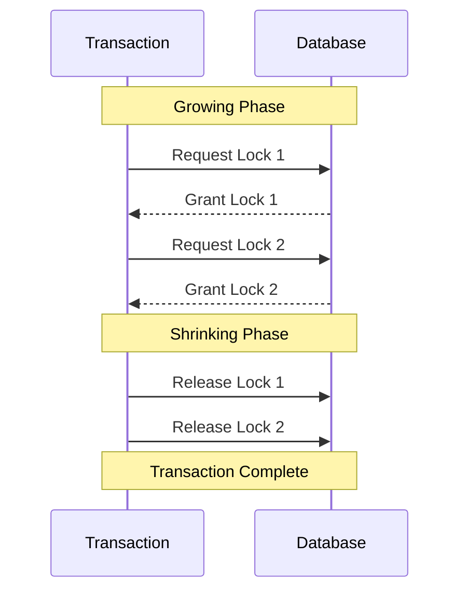
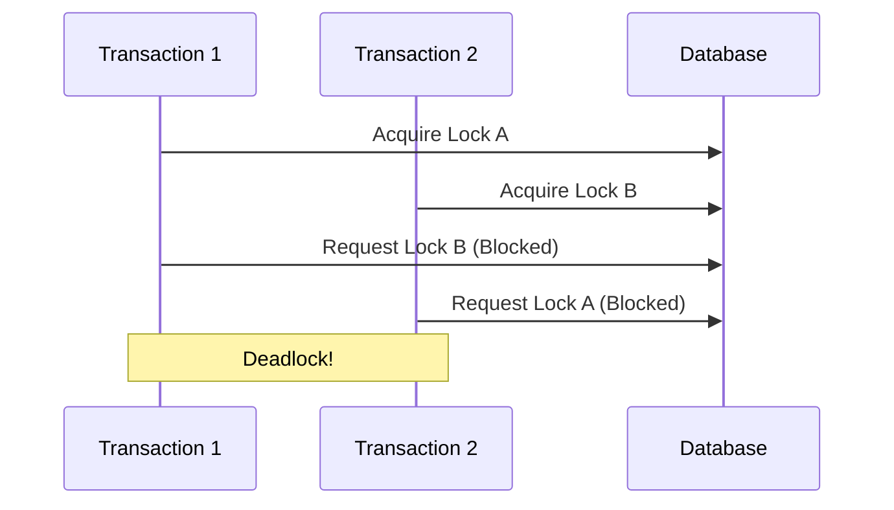
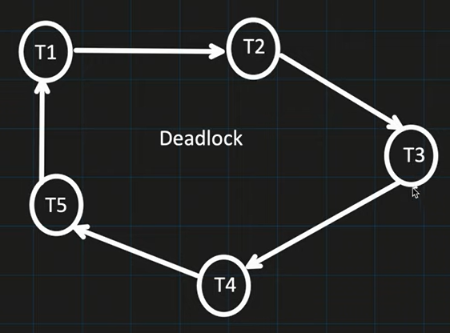
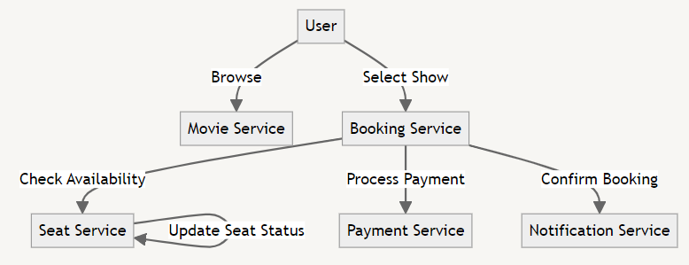
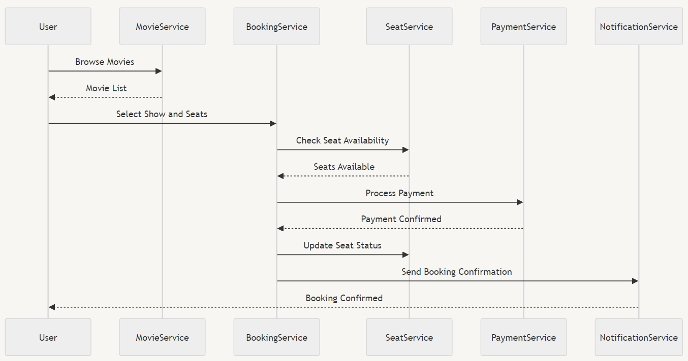

# Low Level Design of BookMyShow 🍿

Let's start by understanding the requirements of a movie ticket booking system.

- Uesr registration and authentication
- Brose movies and shows
- Book tickets with seat selection 
- Payment processing 💳
- Handle concurrent bookings

Our ticket booking system will have following components: 🏗️

- User Service: Handles user registration and authentication
- Movie Service: Manages movie and show information 🎬
- Booking Service: Handles ticket booking and seat selection 💺
- Payment Service: Processes payments
- Notification Service: Sends booking confirmations and updates

## Classes

We will only implmenet the functionalities of Movie service and Booking service.

```python
class movie {
    # features of any movie
    id, title, description, duration 
}  

class movieService {
    # fetch movie from database
    getMovie(id) (movie, error)

    # list all movies available in database
    listMovies() (movie[], error)
}

class booking {
    # features of any booking by user
    id, userId, showId, seats[], status
}

class bookingService {
    # book the given seats if available
    bookSeats(userId, showId, seatNumbers[])
}

```

# Concurrency Handling 🔄

Before we look at how concurrency is handled. First we will check what problems could arise if concurrency is not handled properly.

1. **Dirty Read 💩**

    If Transaction A is reading the data which is writing by Transaction B and not yet even committed. If transaction B does the rollback, then whatever data read by Transaction A is known as dirty read.

2. **Non-Repeatable Read 🔁**

    If suppose Transaction A, reads the same row several times and there is a chance that it reads different value.

3. **Phantom Read 👻**

    If suppose Transaction A, executes same query several times and there is a chance that the rows returned are different.

Shared lock is used for reading and Exclusive lock is used for Writing. These locking mechanism helps us in avoiding the above above problems.

| Lock Type | Another Shared Lock | Another Exclusive Lock |
| --- | --- | --- |
| Have Shared Lock | Yes | No |
| Have Exclusive Lock | No | No |

For our problem of booking system, we will use Optimistic concurrency control (OCC) in the database transactions.

### Optimistic Concurrency control (OCC)

- Isolation level used is below Repeatable Read i.e. Read committed.
- It has much higher concurrency than Pessimistic concurrency control.
- Also there is no change of deadlock with OCC.
- In case of conflic, overhead of transaction rollback and retry logic is implemented.

| Isolation Level 📊 | Locking Strategy 🔐 | Dirty Read Possible | Non-Repeatable Read Possible | Phantom Read Possible |
| --- | --- | --- | --- | --- |
| Read Uncommitted  (highest concurrency) | Read: No Lock acquired & Write: No Lock acquired | Yes | Yes | Yes |
| Read Committed | Read: Shared Lock acquired and Released as soon as Read is done & Write: Exclusive Lock acquired and keep till the end of the transaction | No | Yes | Yes |
| Repeatable Read | Read: Shared Lock acquired and Released only at the end of the Transaction & Write: Exclusive Lock acquired and Released only at the end of the Transaction | No | No | Yes |
| Serializable  (Least concurrency) | Same as Repeatable Read Locking Strategy & Write: Apply range Lock and lock is released only at the end of the transaction | No | No | No |

From above table, we can check what types of locking mechanism is used by Read committed Isolation level.

## 2 Phase Locking

Two-Phase Locking (2PL) is a concurrency control protocol used in database management systems to ensure serializability of transactions. It divides the execution of a transaction into two phases: growing phase and shrinking phase. 🔒🔓

1. Growing Phase
    1. Txn request for the lock by Lock manager.
    2. Lock Manager either grant or denied the lock request
2. Shrinking Phase
    1. Txn can not acquire any new locks
    2. Txn is only allowed to release the lock which is taken previously.

#### Types of Two-Phase Locking 🔢

- **1. Basic 2PL:** Locks can be acquired at any time, but cannot be released until all locks have been acquired.
- **2. Conservative 2PL:** All locks are acquired before the transaction begins execution.
- **3. Strict 2PL:** All locks are held until the transaction commits or aborts.

### 1. Basic Two-Phase Locking Process 🔄



#### Advantages of 2PL ✅

- Ensures serializability of transactions 📊
- Prevents conflicts between concurrent transactions 🚫
- Maintains data consistency and integrity 🛡️

#### Disadvantages of 2PL ❌

- Can lead to deadlocks if not implemented carefully 🔄
- May reduce concurrency and system performance 🐢
- Increases transaction execution time due to lock management overhead ⏱️

### Deadlock Scenario in 2PL 💥



In this scenario, Transaction 1 holds Lock A and waits for Lock B, while Transaction 2 holds Lock B and waits for Lock A, resulting in a deadlock. 🔒🔄🔒

#### 1. Deadlock prevention

Violate any one condition from Mutual exclusion, hold and wait, no preemption, circular wait.

1. **Timestamp-based Deadlock Prevention:**
    
    This approach falls under deadlock prevention strategies, where **preemption is allowed** by high-priority processes. It uses transaction timestamps to determine priority:
    
    - **Wait-Die (Non-preemptive):** If an older (higher priority) transaction requests a resource held by a younger transaction, it waits. If a younger transaction requests a resource held by an older one, it's aborted ("dies").

    - **Wound-Wait (Preemptive):** If an older transaction requests a resource held by a younger one, the younger transaction is aborted ("wounded"). If a younger transaction requests a resource held by an older one, it waits.
    
    These methods prevent deadlocks by ensuring that circular wait conditions cannot occur, as transactions are either allowed to wait or are aborted based on their age.
        
#### 2. Deadlock Avoidance
Banker’s algorithm, avoid going into a bad state.

#### 3. Deadlock Detection and Recovery:

1. Timeout

    In this strategy, schedular find out that txn is waiting for too long for the lock and simply assumes it is in a deadlock and thus abort the transaction. 

2. Direct graph called Wait-for-graph (WFH)

    
    
    Schedular looks for cycle in the WFG and try to identify the deadlock.
    
    When deadlock is identified, TXN is chosen from the WFG that need to aborted (known as victim). Scheduler check below things to identify the victim:
    
    - The amount of effort txn has put till now
    - The amount of effort required to finish the txn
    - The cost of Aborting the txn (cost generally means how many updates has been done that need to be rollback)
    - The number of cycles that contains the transaction.

#### 4. Deadlock Ignorance

### 2. Conservative 2PL (static 2PL):

Avoid deadlock by acquiring all locks in starting only.

Disadvantages:

- Less concurrency
- Extra overhead for scheduler to know all the Read and Write operations of txn before starting the operation.

### 3. Strict Two-Phase Locking 🔐



```mermaid
gantt
    title Strict 2PL Timeline
    dateFormat  s
    axisFormat %S
    section Transaction
    Acquire Locks      :a1, 0, 2s
    Execute            :a2, after a1, 3s
    Commit             :a3, after a2, 1s
    Release Locks      :a4, after a3, 1s
```

In Strict 2PL, all locks are held until the transaction commits, providing stronger isolation but potentially reducing concurrency. 🔒

Deadlock might occur.

## Flow Chart 




## Sequene Diagram 🔢


*Sequence Diagram for bookMyShow sytem*

Let's explain the sequene diagram for the bookMyShow system:

1. User 🙋: Initiates the process by browsing movies
2. MovieService: Responds with a list of available movies
3. User: Selects a show and seats
4. BookingService 🎟️: Receives the user's selection
5. SeatService: Checks seat availability upon BookingService's request
6. BookingService: Receives seat availability confirmation
7. PaymentService: Processes the payment for the booking
8. BookingService: Receives payment confirmation
9. SeatService: Updates the seat status (booked)
10. NotificationService 📨: Sends booking confirmation to the user
11. User 🙋: Receives the booking confirmation
