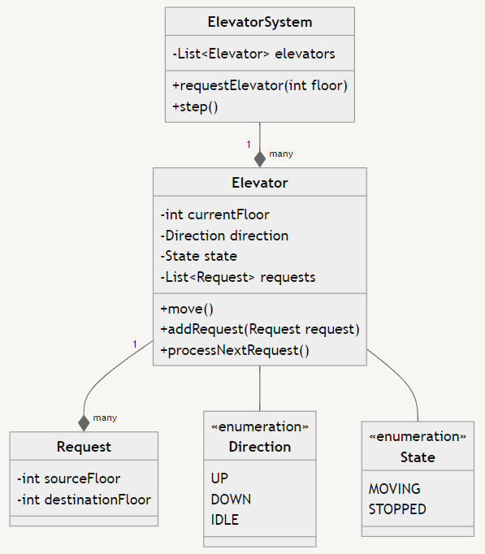
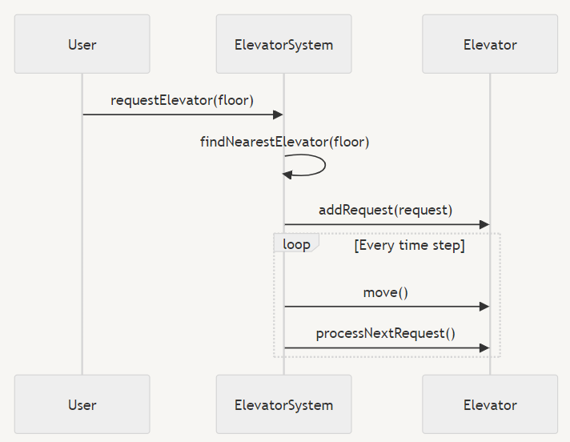

# Low Level Design: Elevator System 🛗

Our today's question is to design a Elevator system. with following requirements: 📋

- Multiple elevators in a building 🏢
- Users can request elevators from any floor 🔢
- Elevators can move up and down ⬆️⬇️
- Elevators have a maximum capacity 🧍‍♂️🧍‍♀️
- System should be efficient in handling requests ⚡

# Example

Let's understand our approach with an example. Let's say, a elevator system is their with 1 elevator. He is at 9th floor, wants to go to 3rd floor. The elevator is at 3rd floor.

Let's walk through this scenario step-by-step to illustrate how the elevator system would handle this request:

1. You're on the 9th floor and press the button to go down. This creates a new Request object with source_floor = 9 and destination_floor = None (since the system doesn't know your final destination yet).
2. The ElevatorSystem receives this request and finds the nearest available elevator, which is currently at the 2nd floor.
3. The selected elevator adds this request to its queue. Its direction is set to UP since it needs to go up to reach you.
4. The elevator starts moving up, incrementing its current_floor in each step until it reaches the 9th floor.
5. When the elevator reaches the 9th floor, it stops (state = STOPPED) and opens its doors.
6. You enter the elevator and press the button for the 3rd floor. This creates a new Request object with source_floor = 9 and destination_floor = 3.
7. The elevator adds this new request to its queue, updates its direction to DOWN, and closes its doors.
8. The elevator starts moving down, decrementing its current_floor in each step until it reaches the 3rd floor.
9. When the elevator reaches the 3rd floor, it stops again, opens its doors, and you exit.

# UML Diagram

Let's see what classes we would require:

```python
class ElevatorSystem{
    list of elevators
    requestElevator(floor)  # user request a elevator at given floor
    step()       # next state of time
}

class Elevator {
    currentFloor, direction (up, down, idle), state(moving, stopped)
    List of request  # contains the requests assigned
    move()  # go to next floor
    addRequest(request)
    processNextRequest()
}

class Request {
    source and destination floor
}
```



# Sequence Diagram




