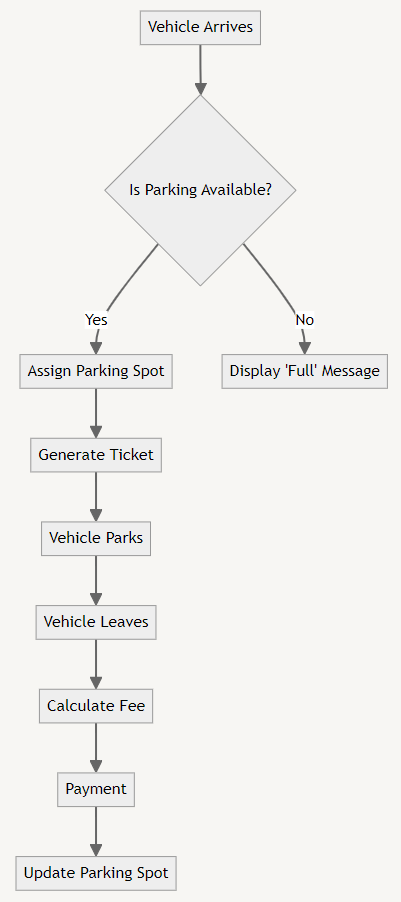

# Parking Lot 🅿️🚗

Q: Create a LLD of parking lot

## Requirements 📋

We need to consider following requirements while designing the parking system:
- Multiple floors in the parking lot 🏢
- Different types of vehicles (car, bike, bus) 🚗🏍️🚌
- Multiple entry and exit points ⬅️➡️
- Parking spots of different sizes 🔲🔳
- Pricing based on vehicle type and duration ⏱️💰

# Core Classes

```python
Vehicle class {
    licensePlate, vehicleType
}

Floor class {
    floorNumber
    parkingSpots list
    isParkingAvailable(vehicleType)
} 

parkingSpot class {
    id, vehicleType, isOccupied
    occup()
    vacate()
}

Ticket class {
    id, vehicleType, spot, entryTime
    calculateFee()
}

EntryPoint class {
    id
}
ExitPoint class {
    id
}

ParkingLot class {
    list of floors, entryPoints, exitPoint
    parkVehicle(vehicle)
    removeVehicle(Ticket)
}
```

Let's check the UML for the above classes and requirements:


# Parking Process Flow 🔄

Check the flow chart for parking a car in the parking lot:



# Troubleshooting

## How to Import method from file

1. Direct import: If the file you want to import is in the same directory, you can simply use: 
    
    `from parking_lot import Ticket`
2. Importing from subdirectory: If the file is in a subdirectory, you can use dot notation: 

    `from subdir.parking_lot import Ticket`

## How to import datetime

You can import datetime in two ways:
```python
import datetime
# to call a method
datetime.datetime.now()

# or
from datetime import datetime
datetime.now()
```

